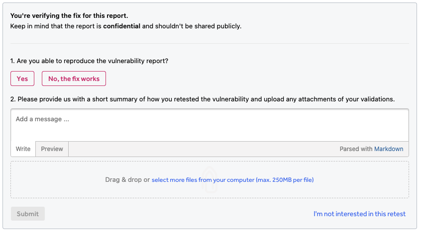

### Retesting Pentests

After the report has been submitted the customer will typically triage, remediate and then request a retest. Customers can request a retest at any point during the testing period and have an additional 60 days after the test period ends to request a retest.

### Customer Requests a Retest
After a report has been triaged, customers can elect to have pentesters retest their vulnerabilities to verify the fixes through the action picker.

### Original Reporter Responds to Request
- The original reporter that submitted the vulnerability will be invited to take part in the retest. They will see the request in their Hacker Dashboard.
  - Note: There is no specific notification letting you know you have been assigned and need to complete a retest, but there is a state change notification that the report has moved to the retesting state.

- Submit your findings in the Retest findings form at the bottom of the report.
- You can also decline to participate in the retest
- Click “I’m not interested in this retest.” This will un-assign you and the retest will be opened up to other hackers to claim. It will show up as “opted out” in the “Historic Retests” section of the Hacker Dashboard > Retesting.
  - Note: If you have declined to participate they cannot claim that retest again.

The “hours remaining” for you to complete the retest will count down from 24 hours but the retest never actually expires for the original reporter.
In the Hacker Dashboard > Retesting UI it appears that the retest has expired (“0 hours remaining”) but that is not actually the case. You can click on the card and complete the Retest findings flow in the report.
This means the retest request is never unassigned from the original reporter and never opens up to the other pentest team members to claim and complete and it appears to be expired for the original reporter

### Customer Accepts/Rejects the Retest

After you submit your findings, the customer will be prompted to either Approve & Resolve or Reject the retest.

### Customer, Pentesters, and H1 View Retests in Overview

All users can see a summary of the retest time window and reports to be retested in the Pentest Phases section.

### When the Retest Period Ends
The Submit Report buttons are removed in **HackerDashboard > My Pentests** and the Pentest Overview when the retesting period ends.
