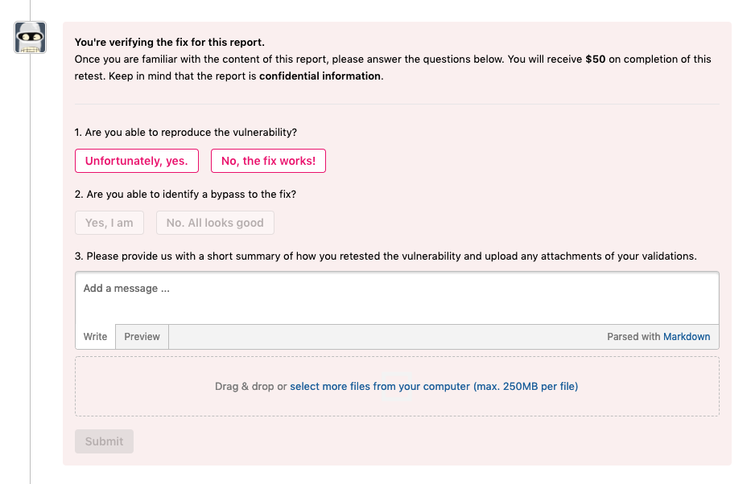

As programs receive vulnerability reports and work on deploying fixes, they need proof that their vulnerabilities have actually been fixed. Asking hackers to verify whether a vulnerability has been fixed is a good way to secure the protection of data. Programs can elect to invite you and other hackers to retest your vulnerabilities to verify fixes.  

><i>There’s currently no effect to reputation for participating in the retest. Although there’s no time limit, we recommend you to complete the retest within 24 hours after accepting the invitation.</i>

If you’re invited to retest a vulnerability, you’ll receive an invitation in your email to retest the report.

If you're the original reporter of the report, you'll also receive an email asking you to participate in retesting your report.

To participate in the retest:
1. Click <b>View retest invitation</b> in your email.
2. <b>Accept</b> or <b>Reject</b> your invitation for retesting. <i>Note: The invitation is only valid for 24 hours.</i>

3. Familiarize yourself with the contents of the report and check to see that the vulnerability has been fixed.
4. Click the <b>answer these questions</b> link in the report banner or just scroll to the bottom of the report to access the questionnaire.

5. Answer these questions in the questionnaire:
   * Are you able to reproduce the vulnerability?
   * Are you able to identify a bypass to the fix?

6. Submit a new report if you found a new vulnerability by clicking on the <b>submit a new report</b> link, and enter the report ID number in the <b>Report ID</b> field.

7. Provide a short summary of how you retested the vulnerability and upload any attachments of your validations.

8. Click <b>Submit</b>.
9. Click <b>Yes!</b> to finalize your submission.

Upon completion, you'll be awarded with a $50 bounty.
