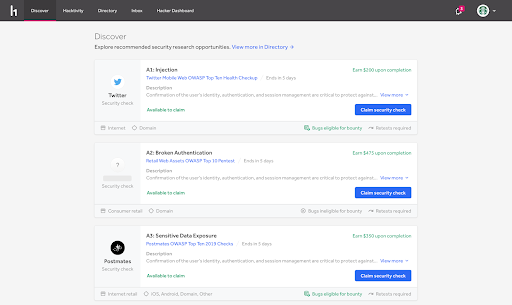
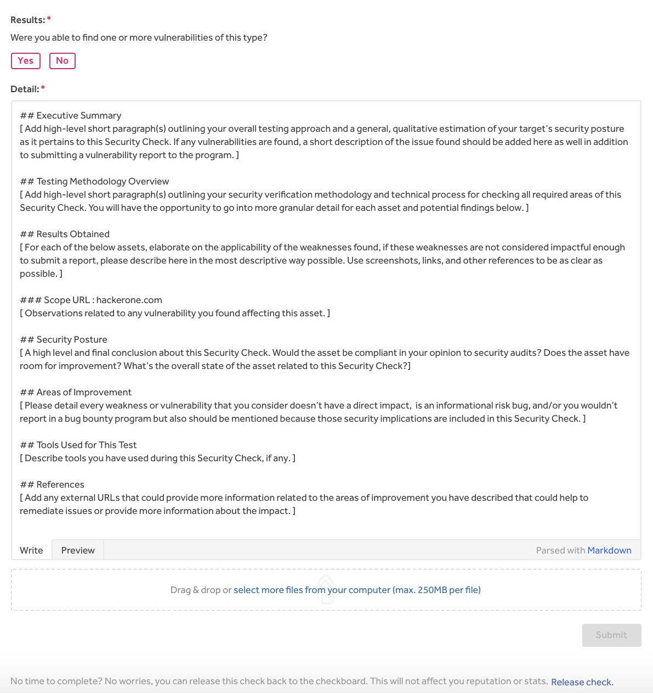
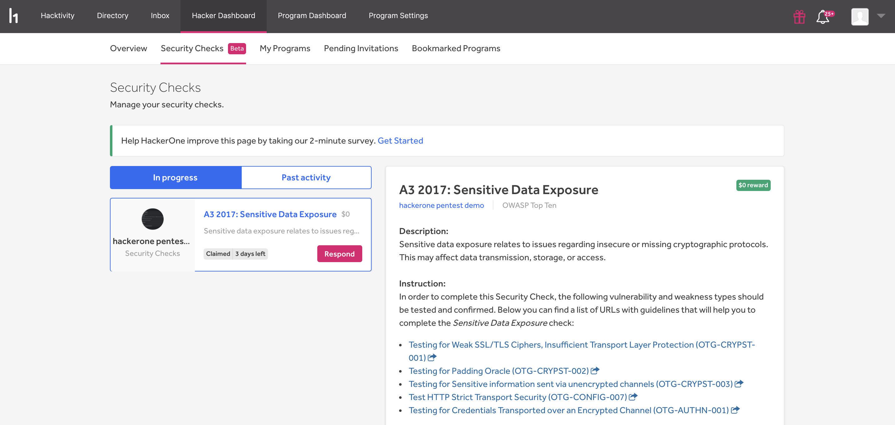
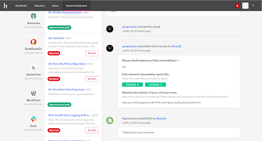
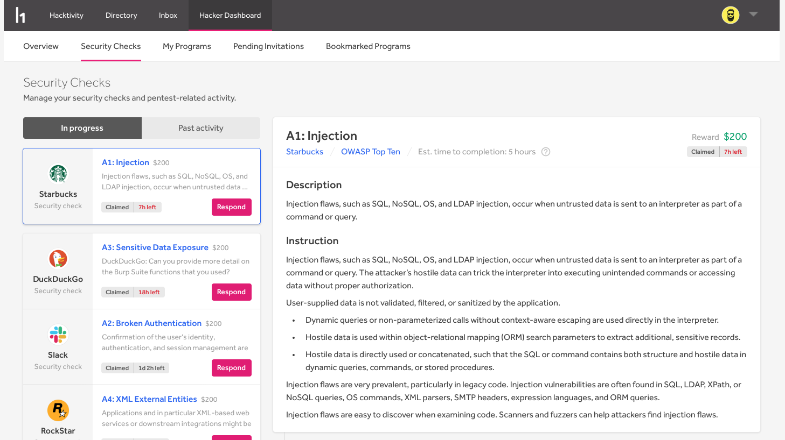
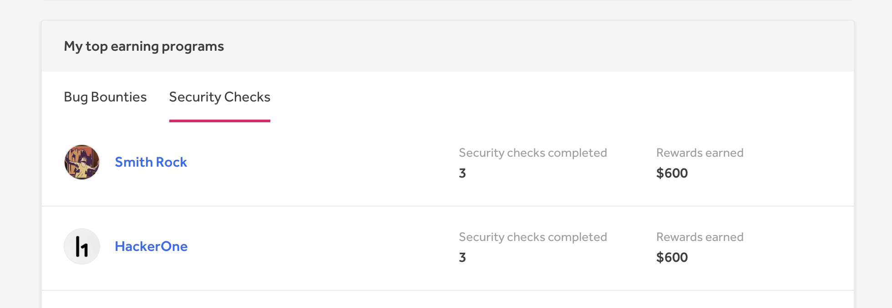
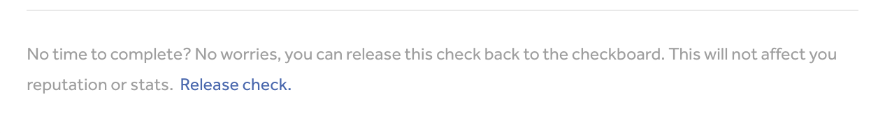
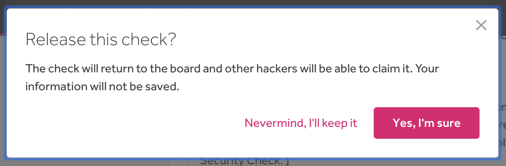

Checklists are a way for organizations to meet compliance requirements by enlisting hackers to check for specific vulnerabilities on the OWASP top 10 list.  Organizations that opt-in to using checklists will receive a compliance report that they can submit to certify their status among independent and industry compliance frameworks.  

> **Note:** This feature is in beta and only accessible to select hackers.

### How it works
To participate in a security check:

1. Click on the **Discover** tab to explore what security research opportunities are available.

2. Review the description, instructions, and scope for the security checks you’re interested in.
3. Click **Claim security check** when you’ve found a security check you want to work on.
<ul><li> You can claim one check per program  at a time (once you’ve submitted results, you can claim another check for that program). Once you’ve claimed a check, you’ll have 72 hours to complete it. For each security check, you must test all assets in scope for the relevant vulnerability type.</ul>

4. Go to a program’s **Security Checks** tab on their security page. Note: The **Security checks** tab is only available if the program has opted into compliance.
5. Submit your findings by filling out the submission form.

6. *(Optional)* Submit a report and link it to your results if you find vulnerabilities during your check.

7. Click **Submit**.

Once you’ve submitted your results, HackerOne will review your findings.  If your findings aren’t approved, your check will be marked as *Rejected*. If your check is rejected, you can reclaim the security check under **Hacker Dashboard > Security Checks**.

If your check is approved, you’ll automatically be paid the reward amount.

> **Note:** Duplicate vulnerabilities aren't rewarded with a bounty.

### Managing Security Checks

You can manage your claimed security checks on the **Security Checks** tab under your Hacker Dashboard.

You can also keep track of your Security Check rewards on your Hacker Dashboard under the **My top earning programs** section.

### Releasing a Security Check
If you decide that you no longer want to complete a security check, you can release the check by clicking **Release check** at the bottom of the security check submission page. Keep in mind that once you release the check, other hackers will be able to claim the check and any work you’ve done won’t be saved.

