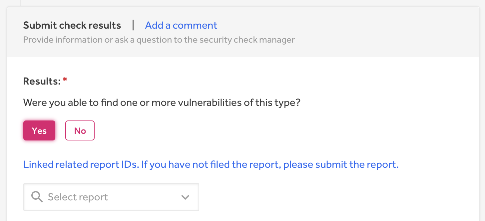

Checklists are a way for organizations to meet compliance requirements by enlisting hackers to check for specific vulnerabilities on the OWASP top 10 list.  Organizations that opt-in to using checklists will receive a compliance report that they can submit to certify their status among independent and industry compliance frameworks.  

> **Note:** This feature is in beta and only accessible to select hackers.

### How it works
To participate in a security check:

1. Go to a program’s **Security Checks** tab on their security page. The security checks tab is only available if the program has opted into compliance.

2. Click **View Details** for the task that you’re interested in on the checklist.
3. Review the description, instruction, and scope for the task.
4. Select **Claim this check** if you’re interested in completing the task.  
     * You can claim 1 check per program  at a time. After you've submitted your results, you can claim another check for that same program. Once you’ve claimed a check, you’ll have 72 hours to complete it. For each security check, you must test all assets in scope for the relevant vulnerability type.

5. Select **Submit results** on the Security Checks page of the program when you’re ready to submit your findings.

6. Input your findings in the required fields on the submission form.

7. *(Optional)* Submit a report and link it to your results if you find vulnerabilities during your check.

8. Click **Submit**.

Once you’ve submitted your results, HackerOne will review your findings.  If your findings aren’t approved, your check will be marked as *Rejected*. If your check is rejected, you can reclaim the security check under **Hacker Dashboard > Security Checks**. 

If your check is approved, you’ll automatically be paid the reward amount.

### Managing Security Checks

You can manage your claimed security checks on the Security Checks tab under your Hacker Dashboard.

You can also keep track of your Security Check rewards on your Hacker Dashboard.

### Releasing a Security Check
If you decide that you no longer want to complete a security check, you can release the check by clicking **Release check** at the bottom of the security check submission page. Keep in mind that once you release the check, other hackers will be able to claim the check and any work you’ve done won’t be saved.

