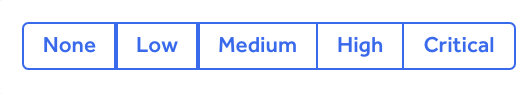
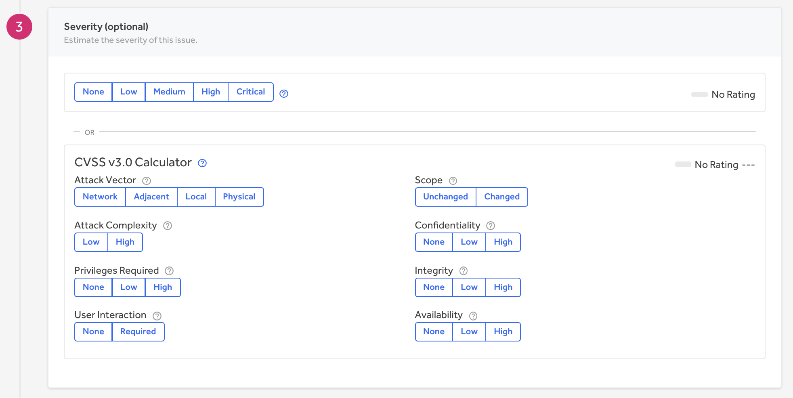

Reports are marked with a severity rating to show how severe the vulnerability is on the report submission form. On HackerOne, severity is particularly useful for structuring bounty ranges and is used when offering bounty recommendations. The severity level can be marked as:

HackerOne also utilizes the Common Vulnerability Scoring System (CVSS) - an industry standard calculator used to determine the severity of a bug. The CVSS enables there to be a common language around the severity of bugs.

>**Note:** It's optional for you to submit a severity rating. You can either choose a severity level based on your own judgment of the vulnerability, or you can use the CVSS calculator to give more information about the vulnerability and calculate an exact CVSS score.

The CVSS Calculator provides a way to capture the principal characteristics of a vulnerability and produces a numerical score reflecting its severity. The numerical score can then be translated into a qualitative representation to help properly assess and prioritize inbound vulnerabilities. 

There are 8 metrics defined for CVSS v3. The first 5 are about the attack method itself, while the latter three are dependent on how your program assesses impact - the direct consequence of a successful exploit. These are the different components to the CVSS Calculator:

Option | Detail
------ | -------
Attack Vector | How exploitable the vulnerability is. The score increases the more remote an attacker can be in order to exploit the vulnerability.
Attack Complexity | The conditions beyond the attacker's control that must exist in order to exploit the vulnerability.
Privilege Required | The level of privileges an attacker must possess before successfully exploiting the vulnerability. The severity increases as fewer privileges are required.
User Interaction | Whether the vulnerability can be exploited solely at the will of the attacker or whether a separate user (or user-initiated process) must participate in some matter.  
Scope | Whether a successful attack impacts a component other than the vulnerable component.
Confidentiality | The impact of the bug as it relates to confidential information being accessed.
Integrity | Whether the data can be modified due to the vulnerability.
Availability | Whether functionality can be rendered inaccessible. The impact to the availability of the impacted component.  

You can read more details about CVSS [here](https://www.first.org/cvss/user-guide).

If the program has a custom methodology for determining severity, it should be described on their Security Page.

### Effects to the CVSS v.3 Calculator on HackerOne
There are cases where the CVSS rating on HackerOne is vastly different from the CVSS calculator on [first.org](https://www.first.org/cvss/calculator/3.0). The discrepancy in severity ratings isn’t a bug!

The CVSS calculator on first.org gives 3 different scores. The different scores are the:
* Base score
* Temporal score
* Environmental score

The CVSS score on HackerOne will be different from the CVSS scores on first.org because the score on HackerOne factors in <b>BOTH the environmental score and the base score</b> of the asset, whereas the scores on first.org are all separate.

<i>For example, you may find that the severity score for an asset on HackerOne is 4.3, whereas the base score on first.org is 5.4 and the environmental score is 5.4. The score on HackerOne is different because the environmental score is calculated into the base score, whereas on first.org, the environmental score is listed separately from the base score.</i>

#### How the Calculation Works
HackerOne doesn’t randomly put the environmental score and the base score together to get a total CVSS rating. Whatever value is selected for each metric of the [environmental score](/organizations/environmental-score.html) (confidentiality, integrity, availability), a numeric modifier is applied to that metric in the CVSS calculator. (<i>Note: The CVSS calculator also contains metrics from the environmental score.</i>)

><i>For example, when calculating your environmental score for the asset `test.com`, you set the confidentiality to be High. When either you or the program calculate the severity using the CVSS calculator on HackerOne, the 1.5 modifier for the Confidentiality metric is applied to the Confidentiality component in the CVSS calculator, which will give you a different score from the base score on first.org.</i>

The following table shows what modifier is applied. The same table is used for all 3 metrics. Note that choosing a metric value of Medium or not choosing any value at all will have no effect on the base score.

Metric Value | Modifier Value | Details
------------ | -------------- | --------
High | 1.5 | Loss of Confidentiality/Integrity/Availability is likely to have a catastrophic, adverse effect on the organization or individuals associated with the organization.
Medium | 1 | Loss of Confidentiality/Integrity/Availability is likely to have a serious adverse effect on the organization or individuals associated with the organization.
Low | 0.5 | Loss of Confidentiality/Integrity/Availability is likely to have only a limited adverse effect on the organization or individuals associated with the organization.
None | 0 | Loss of Confidentiality/Integrity/Availability is likely to have no adverse effect on the organization or individuals associated with organization.

### Severity Caps
When a program sets an environmental score for an asset, it will cap the CVSS severity rating when you calculate the severity for the asset in the submission report. The maximum severity you can set for the asset is shown in the <b>Maximum severity</b> field.

For example: If a program sets all 3 environmental score requirements to be None/Low for the asset `test.com`, the maximum severity will be set to None. This means that you now can’t set the CVSS score for `test.com` to be Critical or High when submitting a report, even though you selected all of the highest ratings on the CVSS calculator.
