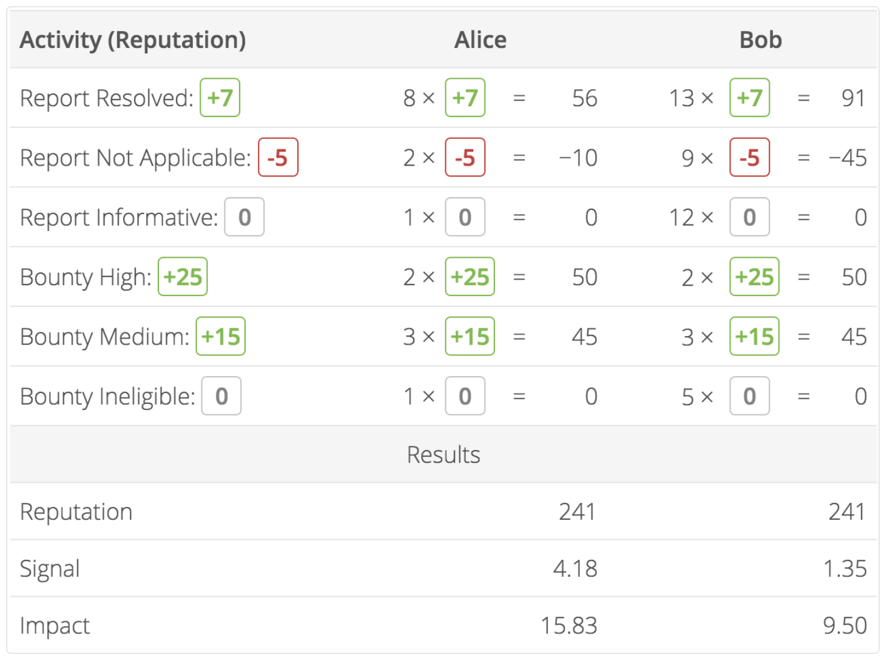
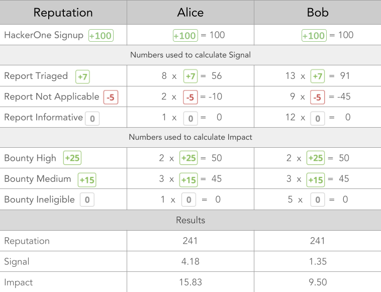

Signal provides a means of identifying hackers who have had consistently valid reports while Impact highlights those with the greatest severity. HackerOne displays a hacker's percentile rank for their Signal and Impact relative to other hackers on the platform. Understanding both Signal and Impact will help you understand your performance relative to other hackers.

### Signal and Impact Facts
Question  | Signal | Impact
-- | ------ | -------
What is it? | Average Reputation per report. As Reputation is gained or lost each time a report is closed, Signal is an aggregate representation of report validity. It corresponds to Reputation changes for triage states ranging from "Spam" to "Resolved." | Average Reputation per bounty. As Reputation is gained based on the relative size of the awarded bounty, Impact is an aggregate representation of report severity. It corresponds to Reputation gains calculated by bounty levels awarded.
What's the measured scale? | -10 to 7 | 0 to 50
Are there any caveats to calculations? | <li>Only calculated when there are more than 3 closed reports or 3 bounties respectively  <li>Self-closed and duplicate reports don't affect Signal | <li>Only calculated when there are more than 3 closed reports or 3 bounties respectively <li>Self-closed and duplicate reports don't affect Impact</li><li>Only calculated for reports submitted to programs that offer bounties

### Calculation Example

Alice and Bob have the exact same amount of Reputation (241 points). But Alice has a higher Signal (4.18 > 1.35), which indicates having a better track record of submitting valid reports. Alice, also has higher Impact (15.83 > 9.5) and therefore, a higher chance of submitting an important report.

This is valuable information for both of them. Alice will see that she is doing quite well with her current trajectory, while Bob will see that others are more accurate about their reports and can adjust his reporting processes accordingly..
