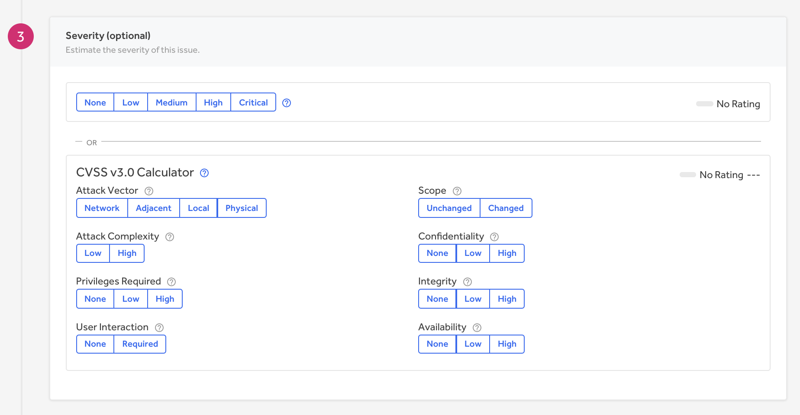
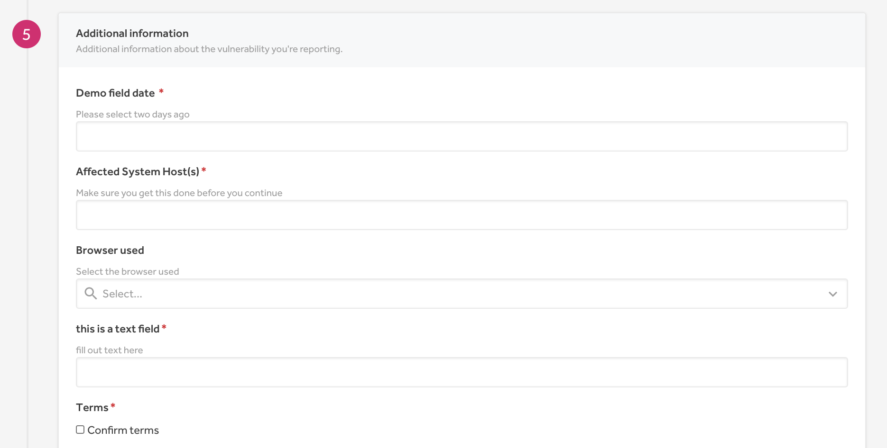

You can submit your found vulnerabilities to programs by submitting reports.

In order to submit reports:
1. Go to a program's security page.

2. Click the pink **Submit Report** button.
3. Select the asset type of the vulnerability on the **Submit Vulnerability Report** form.

4. Select the weakness or the type of potential issue you've discovered.

5. *(Optional)* Select the severity of the vulnerability. You can use the CVSS calculator to determine the severity.

6. Write up your proof of concept. State:
     * What the vulnerability is.
     * The steps to reproduce the vulnerability.
     * What kind of impact an attacker can make if they were to exploit the vulnerability.

7. Enter any additional information the program asks for in the **Additional information** section. These are custom fields that the program created so that they can collect the specific information they need to better manage and understand the vulnerability. Some fields will be required and some will be optional. *(This section only appears for programs that have enabled [custom fields](/organizations/custom-fields.html).)*

8. *(Optional)* Attach screenshots, demo videos, or any other helpful material. Don't share videos by adding a link to them in the report. You can only include videos if you attach the file directly to the report. This is to ensure the vulnerability isn't accessible to others before being disclosed.

9. Review your report details in the preview window. You won't be able to edit your details after submitting the report.  

10. Click **Submit Report**.

After you've submitted your report, you must wait for programs to respond to your submission.

### Related Pages

[Restricted From Submissions](/hackers/restricted-from-submissions.html)
