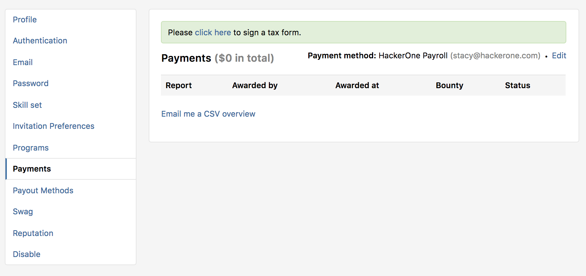
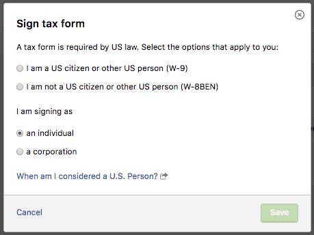
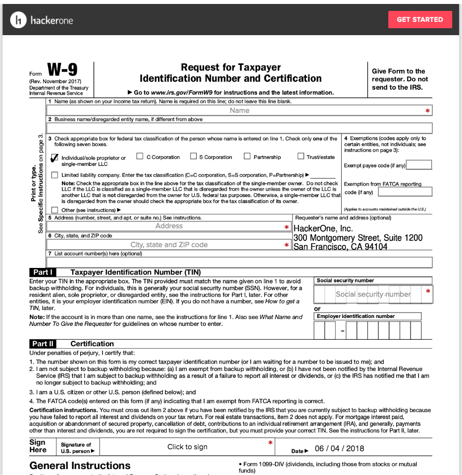

Tax forms are required to receive any kind of monetary award.

To sign your tax form:
1. Go to your profile's **Settings > Payments**.

2. Select **click here** on the green banner.

3. Fill out the fields on the **Sign tax form** window that pops open.

4. Click **Save**.

5. You'll be redirected to the Payments homepage where you can click the link in the yellow banner to sign your tax forms.

6. If you make a mistake, you have the ability to start over without involving Support. On the **Settings > Payments page**, you will have an opportunity to abandon an in-progress tax form, and you will receive confirmation through your email that this has occurred.

You can refer to these links for instructions on how to fill out your respective tax form. Please note for American citizens living internationally that the instructions will not tell you how to fill out your W-9. Please use commas in the "city/state/zip" box to format your international address as: "City, Postal Code, Country."
* W-8BEN: https://www.irs.gov/pub/irs-pdf/iw8ben.pdf
* W-8BEN-E: https://www.irs.gov/pub/irs-pdf/iw8bene.pdf
* W-9: https://www.irs.gov/pub/irs-pdf/iw9.pdf
