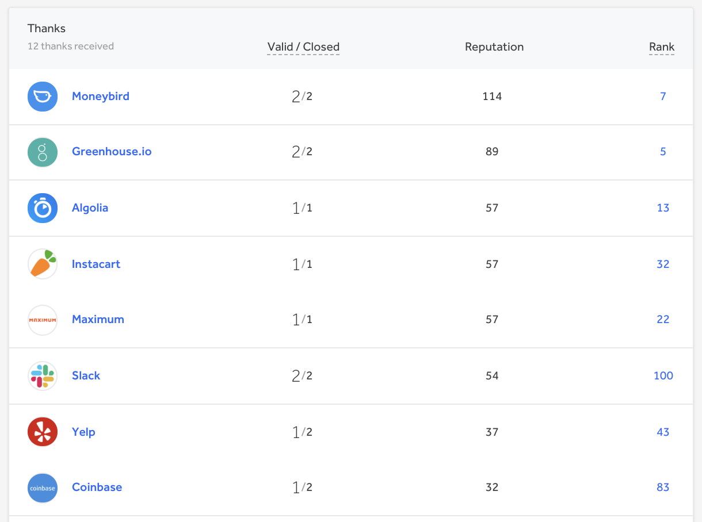

Your Thanks section lists out all of the programs you’ve submitted valid reports to. Every hacker has their own Thanks section where the programs you’ve participated in are listed by your reputation gained for each program. The section is automatically updated after a report is resolved and reputation is gained.

### Program Thanks Page
Your profile will also show up on the Thanks page of the programs you’ve submitted reports to that are triaged or resolved. The program Thanks page lists all of the hackers that have submitted triaged and resolved reports by order of reputation gained.  

