<style>
.contents {
  margin-left: 1.45rem;
  margin-right: 1.45rem;
  border-radius: 0.3em;
  width: 60%;
}
</style>

HackerOne supports markdown syntax on reports, profiles, and security pages.

### Headers

Markdown Input:

```
A First Level Header
=====================

A Second Level Header
---------------------

### Header 3
```

Output:


### Blockquotes

Markdown Input:

```
>text in blockquote
>more text in blockquote
```

Output:


<br>

### Text emphasis

Markdown Input:

```
*This text is italicized*
**This text is bold**
~~This text is deleted~~
==This text is highlighted==
```

Output:


### Lists

#### Unordered Lists

Markdown Input:

```
* Candy.
* Gum.
* Juice.
```

this:

```
+ Candy.
+ Gum.
+ Juice.
```

and this:

```
- Candy
- Gum.
- Juice.
```

all produce the same output:

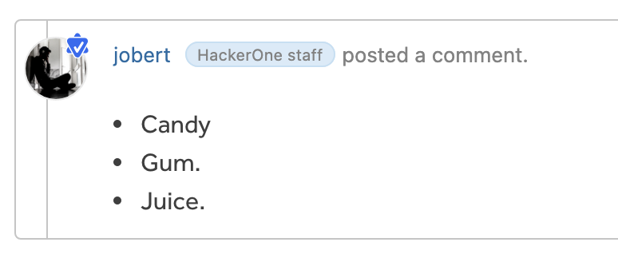

#### Numbered Lists

Markdown Input:

```
1. Red
2. Green
3. Blue
```

and this:

```
1. Red
1. Green
1. Blue
```

Output:

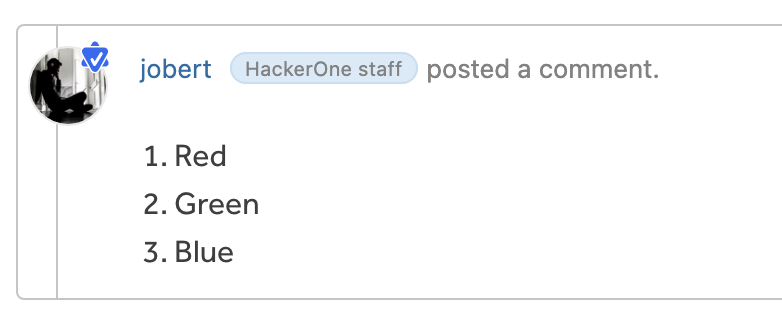

If you put blank lines between items, you’ll get `<p>` tags for the list item text. You can create multi-paragraph list items by indenting the paragraphs by 4 spaces or 1 tab:

```
* A list item.

  With multiple paragraphs.

* Another item in the list.
```

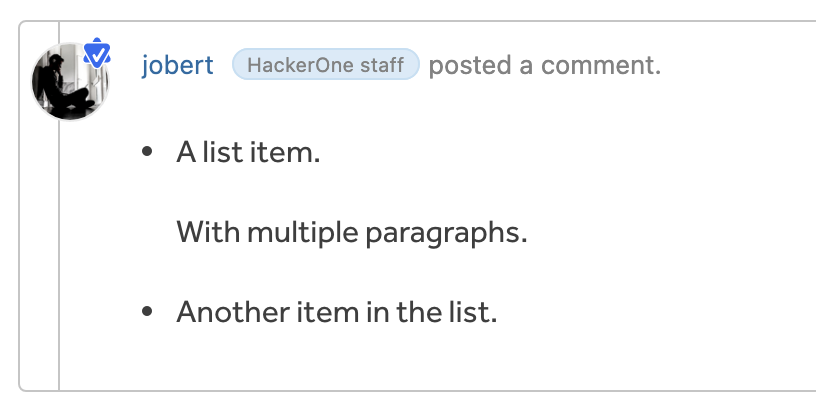

### Links

Markdown supports two styles for creating links: *inline* and *reference*. With both styles, you use square brackets to delimit the text you want to turn into a link.

Inline-style links use parentheses immediately after the link text. For example:

Markdown Input:
```
This is an [example link](http://example.com/).
```

Output:


Reference-style links allow you to refer to your links by names, which you define elsewhere in your document:

Markdown Input:

```
I get 10 times more traffic from [Google][1] than from
[Yahoo][2] or [MSN][3].

[1]: http://google.com/
[2]: http://search.yahoo.com/
[3]: http://search.msn.com/
```

Output:

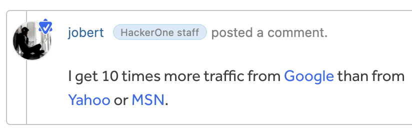

Link names may contain letters, numbers and spaces, but are not case sensitive:

Markdown Input:

```
I start my morning with a cup of coffee and
[The New York Times][NY Times].

[ny times]: http://www.nytimes.com/
```

Output:

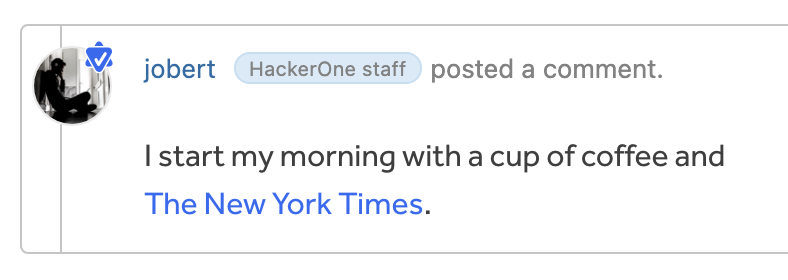

<br>

Links to section headings can be made as well. Every heading will get an ID based on the heading content and will be prefixed with `user-content-`. A link can be made to a heading using the following markdown:

```
# Table of contents
* [Introduction](#user-content-introduction)
* [Another section](#user-content-another-section)
* [Credits](#user-content-credits)

# Introduction
Text would go here.

# Another section
Some more text would go here.

# Credits
And the credits would go here.
```

#### Email Links
You don't need to use markdown to create a `mailto:` link. Simply enter the email as is and it will automatically be converted to a `mailto:` link.

### Code

In a regular paragraph, you can create code span by wrapping text in back tick quotes. Any ampersands (&) and angle brackets (< or >) will automatically be translated into HTML entities. This makes it easy to use Markdown to write about HTML example code.

Markdown Input:

```
The text has sample `code`
```

Output:

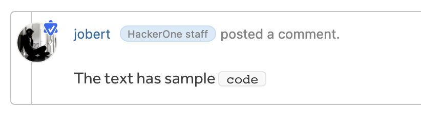

To specify an entire block of pre-formatted code, wrap the text within 3 back tick quotes \`\`\`. Just like with code spans, &, <, and > characters will be escaped automatically.

Markdown Input:

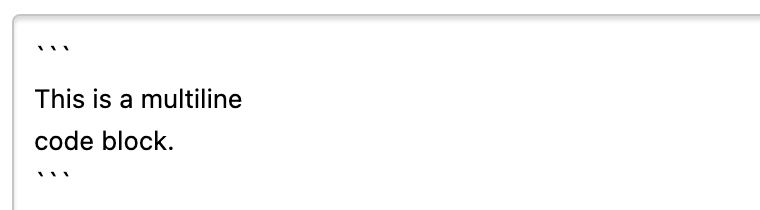

Output:

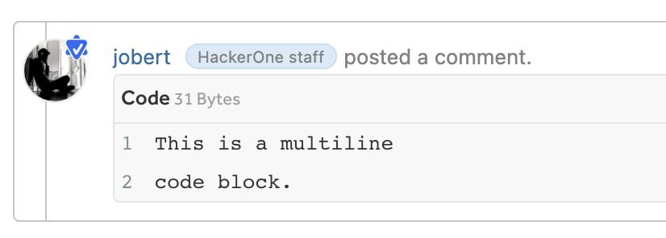

To use syntax highlighting, specify the content type after the three opening back tick quotes.

Markdown Input:


Output:

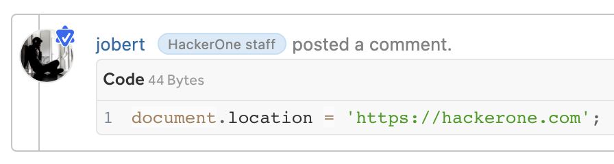

### User mentions
You can mention a user by prefixing username with '@' symbol

Markdown Input:

```
@demo-member reported the issue.
```

Output:

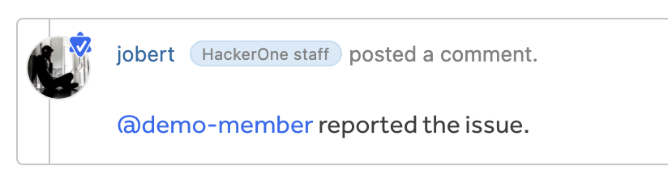


<br>

### Report reference

You can reference a report by prefixing report id with '#' symbol
```
#105887 is a publicly disclosed bug.
```

Output:


<br>

### Auto-linked references

CVE IDs, CWE IDs, and CAPEC IDs are automatically linked to MITRE:

```
CVE-2011-0242 could perhaps be categorized as CWE-79 of CAPEC-63.
```

Output:


### Attachment references

You can reference an attachment while writing reports, comments in reports and report summary. You can do this by writing 'F' followed by attachment id (F). The attachment id is displayed before the attachment name once the upload is successful.

Example: Consider a user is creating a report and uploads an attachment. Once the attachment is uploaded successfully, you will see the reference id with the attachment name.
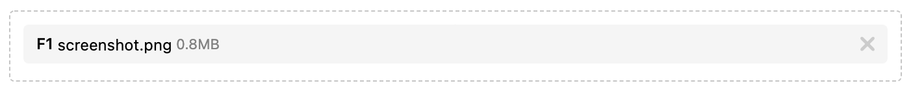

Now you can reference the attachment in the report by writing 'F1' and the attachment is referenced in the report as shown below.
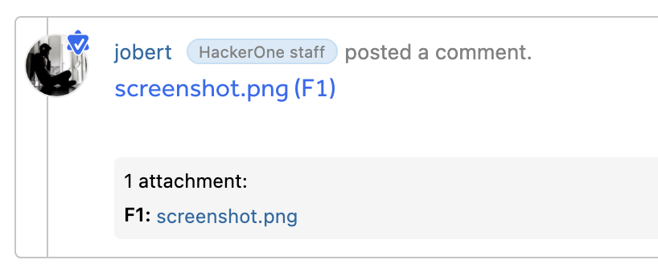

### Inline images and video

You can inline images and videos in the report description, comments and report summary by writing the attachment reference id within curly braces (as in {F:id}).

Example: For the above attachment, the markdown:

```
{F1}
```

will render the following:

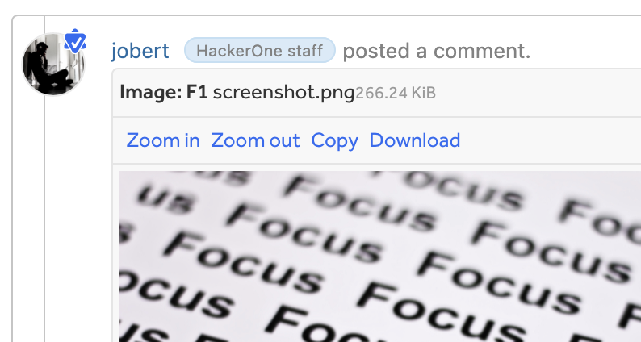
