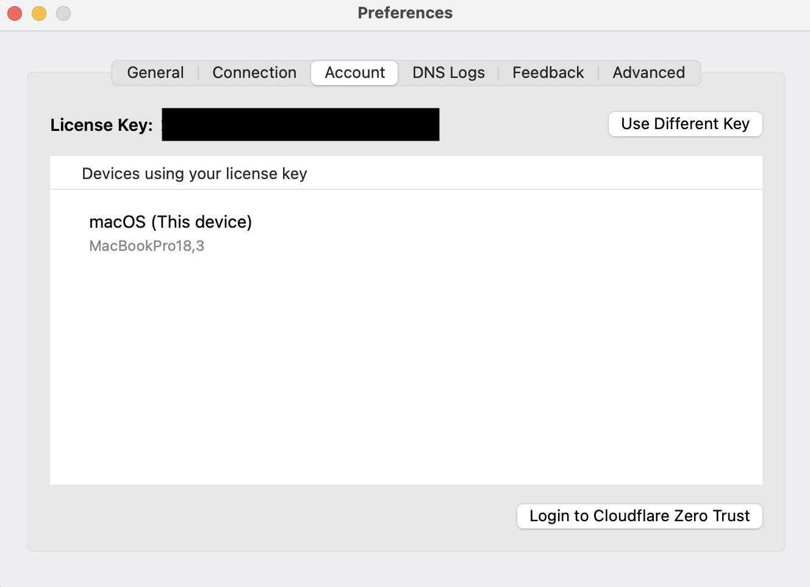
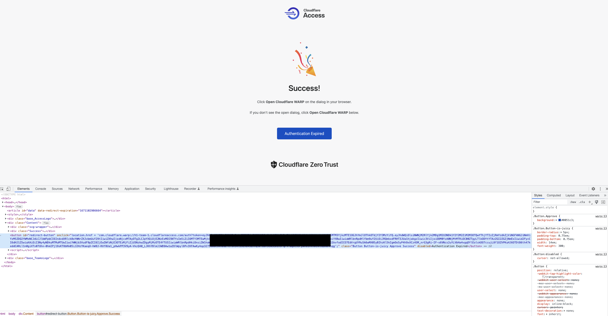

These guides assume you already have the WARP Client installed, if you haven't please go to: [Warp Client Install](/hackers/warp-client-install.html)

### macOS
1. Go to account preferences in the client.
Click "account" tab


2. Fill in the team domain:


3. Login to the WARP authentication website (pops-up automatically)


4. Authentication succesfull, register client into program
Click the "Open Cloudflare WARP" button


5. Client changed
The client should now display "Zero Trust" instead of "WARP"


### Linux
1. To connect for the very first time you must register first warp in your system. Register the client
```console
warp-cli register
```
**Note:** (Repeat in case of API error)

2. Convert WARP to Zero Trust, by logging into the team domain
```console
warp-cli teams-enroll [team-name]
```

3. Navigate to the domain page, add your whitelisted e-mail address, get the one-pin and connect
```console
A browser window should open at the following URL:
https://[team-name].cloudflareaccess.com/warp 
If the browser fails to open, please visit the URL above directly in your browser.
```

3a. CLI only login
Alternatively if you have CLI only access you can:
```console
warp-cli teams-enroll [team-name]
```
After this open the URL listed in the output on you local machine, or via terminal based browser.
Then within 30 seconds of authenticating. Copy the token and use it in terminal:


```console
warp-cli teams-enroll-token com.cloudflare.warp://h1-team-4.cloudflareaccess.com/auth?token=eyJhbGciOiJSU...
```
If the timer runs out before you enter the token you will get the following error:
```console
Error: Invalid JWT provided.
```
4. Connect the WARP Client
```console
warp-cli connect
warp-cli status -> Must show "Status update: Connected"
warp-cli account -> will show if connecting to account was successful
```