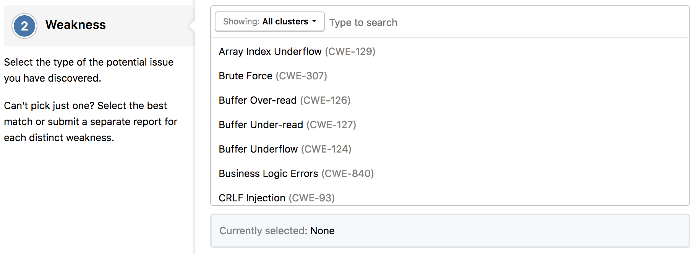
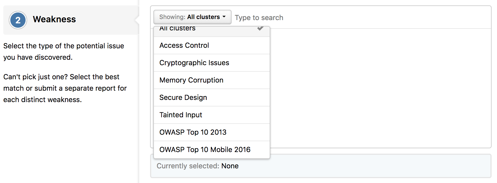

A weakness is a type of mistake in software that introduces vulnerabilities within that software. The term applies to mistakes regardless of whether they occur in implementation, design, or other phases of the software development life cycle.

A cluster is a set of weaknesses. They map to external groupings that are widely used and/or commonly referred in the security industry, for easier navigation and browsing within weaknesses.

Each vulnerability report can be labeled with a weakness, either by the hacker at the time of report submission, or by the team at any later point in time. HackerOne adopts a subset of Common Weakness Enumeration (CWE) weaknesses for report classification.

Programs can enable, disable, or hide each weakness for their program's submissions. Disabling or hiding certain weaknesses can prevent you from submitting vulnerability reports that exploit a weakness that is out of scope by setting weaknesses to different states.

When you submit a report, you must select the type of weakness for the vulnerability you've found.

You can filter the options by various clusters.

