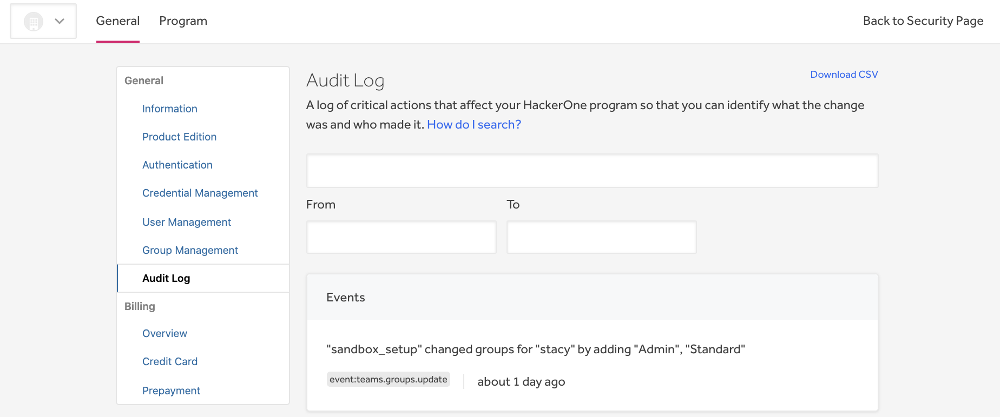

Audit logs enable you to view all changes and actions done on your program so that you can review critical changes, find suspect actions, and investigate incidents for your program on HackerOne. Each log includes these details:
* The user that performed the action
* A description of the action that was performed
* The name of the event
* The user agent
* The date and time of the action

To access your audit log, go to **Program Settings > General > Audit Log**.

You can also access the audit log via the API. See this article from the HackerOne API documentation to learn more: https://api.hackerone.com/customer-resources/#programs-get-audit-log

> **Note:** You must be an administrator of your program in order to access this feature.

## Searching the program audit log
To search your audit entries, you can construct search queries using a variety of quantifiers and filters.

You can search your audit log by:
* Event
* User
* Date

**Note:** Cases aren’t sensitive when searching results.

### Search based on the event
Each time an action is made on your program, the action is tagged with a corresponding event name. You can search based on the event name to filter your results. To search for specific events, use the event qualifier in your query. For example: `event:teams.api_users.create`

These are the event names that you can use to search:

Event Name | Details
--------- | ------------
`teams.agile_accelerator_integration.delete` | Triggered when a new Agile Accelerator connection is created for your program.
`teams.agile_accelerator_integration.update` | Triggered when a new Agile Accelerator connection is updated for your program.
`teams.api_users.create` | Triggered when a new API token is created.
`teams.api_users.destroy` | Triggered when an existing API token is destroyed.
`teams.audit_log_items.export` | Triggered when a member creates an export of your program audit log.
`teams.bounties.create` | Triggered when a new bounty is awarded.
`teams.groups.create` | Triggered when an admin creates a new team member group with permissions and members.
`teams.groups.update` | Triggered when an admin updates the name and/or permissions of an existing member group. Also triggered when members are added to or removed from this group.
`teams.groups.destroy` | Triggered when an admin destroys an existing team member group.
`teams.invitations.members.create` | Triggered when a new member joins your program through an invitation.
`teams.invitations.report_participants.create` | Triggered when a new participant joins a report through an invitation
`teams.jira_integration.create` | Triggered when a new JIRA OAuth connection is created for your program.
`teams.jira_integration.update` | Triggered when the configuration of your program’s JIRA integration is updated.
`teams.jira_integration.verify` | Triggered when your program’s JIRA OAuth connection is verified.
`teams.jira_integration.destroy` | Triggered when your program’s JIRA integration is destroyed.
`teams.members.destroy` | Triggered when an admin or your SAML provisioner removes a member from your program. Also triggered when a member removes themselves from your program.
`teams.phabricator_integration.update` | Triggered when the configuration of your program’s Phabricator integration is updated.
`teams.phabricator_integration.destroy` | Triggered when your program’s Phabricator integration is destroyed.
`teams.reports.escalate` |  Triggered when you escalate a report to Jira or Phabricator. Events won't be created for the Slack and AgileAccelerator integration.  
`teams.reports.export` | Triggered when a member exports one or more of your program’s vulnerability reports.
`teams.reports.export_lifetime` | Triggered when a member exports all of your program’s vulnerability reports.
`teams.report.reassign` | Triggered when a report is reassigned to another team.
`teams.saml_settings.update` | Triggered when your program’s SAML provider settings are updated.
`teams.slack_integration.create` | Triggered when a new Slack integration is created for your program.
`teams.slack_integration.destroy` | Triggered when an existing Slack integration is destroyed.
`teams.slack_pipeline.create` | Triggered when a new pipeline is created to one of your Slack channels.
`teams.slack_pipeline.destroy` | Triggered when an existing Slack pipeline is destroyed.
`teams.update` | Triggered when your program attributes are updated.

### Search based on the user
You can also search your audit log based on the user that performed the event. To search based on the user, use the user qualifier. For example:
* `user:@hackbot` finds all events performed by hackbot.
* `user:@hackbot user:data_migration` finds all events performed by both hackbot and system user data_migration.

You can also use asterisks as a wildcard to broaden your search results to a defined subset of all possible characters. For example:
* `user:@h*t` finds all events performed by users that have a username that starts with h and ends in t.

Events can also be performed by the internal system on behalf of a user. You can search by these system users:

System User | Details
----------- | ------------
`atlassian_uninstaller` | Initiated to destroy your program’s bidirectional integration to the JIRA cloud application.
`data_migration` | Initiated when an event is performed through data migration.
`product_edition_downgrader` | Initiated when an event is performed during a product edition downgrade. This includes destroying API tokens, Phabricator integration, and JIRA integration.
`saml_jit_provisioner` | Initiated when a member is added to or removed from your program, or when a member’s team member groups are updated through SAML Just-In-Time Provisioning.
`sandbox_setup` | Initiated when setting up a sandboxed program.
`slack_api_error` | Initiated when slack integration is destroyed due to an API error.
