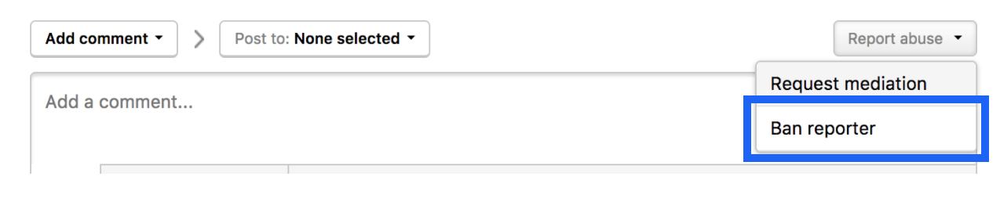

If a hacker’s behavior is out of sync with what is outlined on your Security Page, or if they’ve violated part of the [HackerOne Code of Conduct](https://hackerone.com/disclosure-guidelines), you can take action to ban hackers from participating in your program. You can ban hackers from both private and public programs.

To ban a hacker:
1. Open the report submitted by the hacker in your inbox.
2. Click <b>Report abuse</b> above the comments section. 
3. Select <b>Ban reporter</b>.

An email will be sent to the hacker telling them that they can no longer submit reports to the program. The hacker won’t be able to send future reports for the program, but they can still comment on past reports.

A notification email will also be sent to the HackerOne support team stating that the user was banned.  

### Unbanning Hackers
You can choose to unban hackers and invite them to your program again. To request to have a banned hacker participate in your program again, [contact HackerOne](https://support.hackerone.com) with your request, and we’ll be able to invite the hacker for you.  
