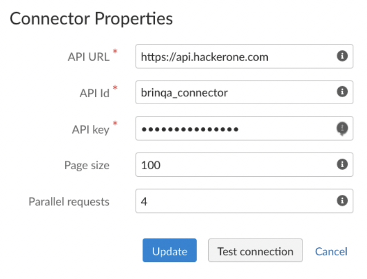
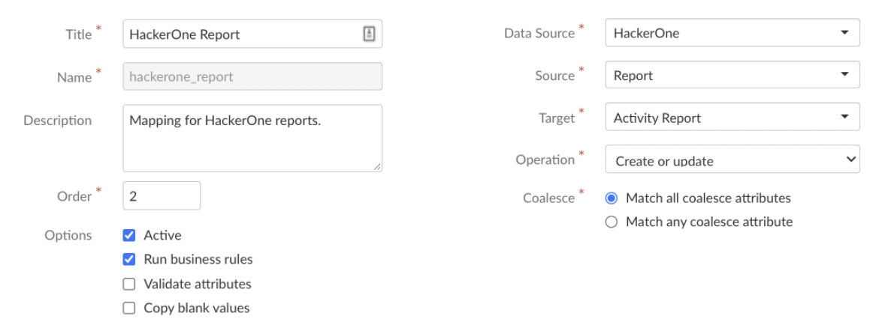
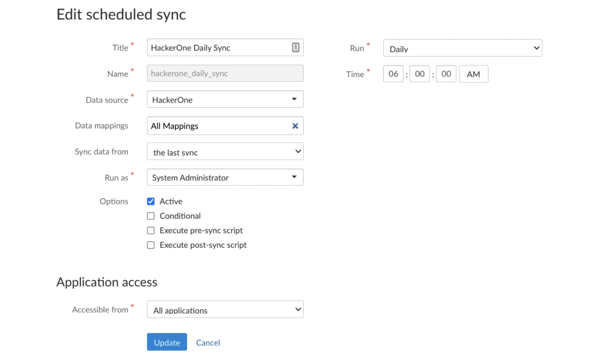

With the Brinqa integration, you can push all of your HackerOne submissions to Brinqa so that you can track all of your vulnerability reports on Brinqa.

The HackerOne connector requires an API ID and API Key to authenticate. Directions for creating these can be found [here](/organizations/api-tokens.html).

Once you have created your API ID and API Key, you can begin setting up the integration with Brinqa.

1. Log in to your Brinqa account
2. Navigate to data sources
3. Create a new connector by selecting the HackerOne connector.
4. Enter the API ID and Key from HackerOne in the Connector Properties
5. Click Update

Once you have the connection set up, you can begin configuring any custom data mapping you would like to have. HackerOne data will be synced to Brinqa’s “Activity Report” by default. Use the Attribute Mappings table to add or remove attributes from the Brinqa mapping.

You can also set up a sync schedule and choose which data will apply.

Within Brinqa, navigate to the data sources and create a new connector by selecting the HackerOne connector.

### How the Integration Works
Once you’ve set up the HackerOne connector and configured the integration, data will be automatically pulled from HackerOne using the schedule you configured. All reports in the New and Triaged states will be imported in the Brinqa platform as open issues. This integration will not push any updates made in the Brinqa platform back to HackerOne. When you delete the connector, all data imported by the connector will also be deleted.
