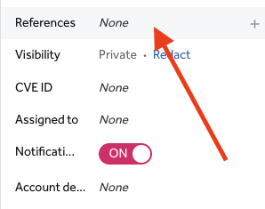
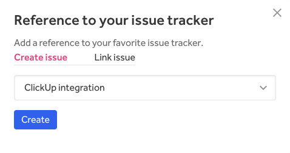
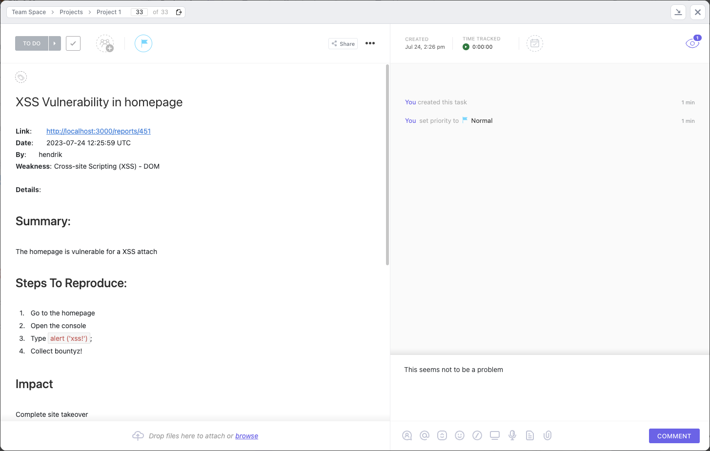
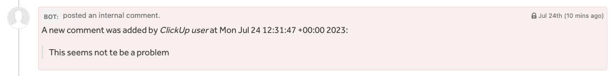
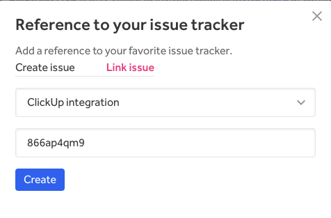
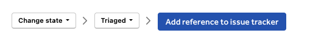
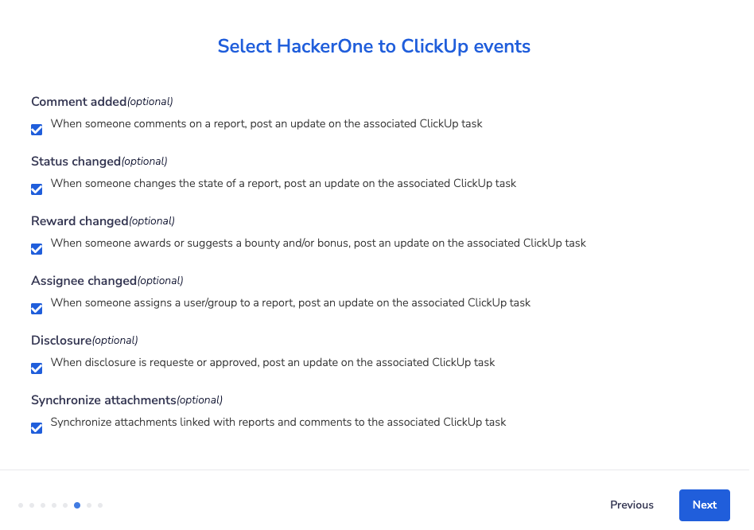
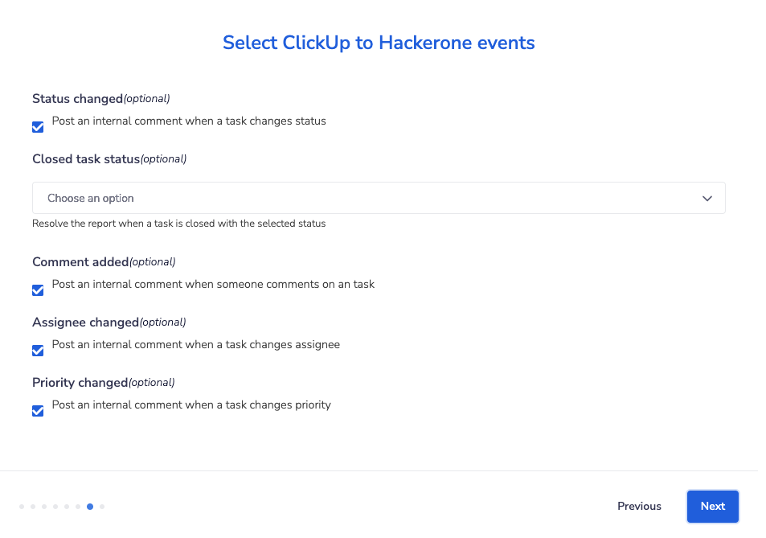

HackerOne offers a bidirectional ClickUp integration that syncs information between your HackerOne report and the ClickUp task. This means that ClickUp users can sync specific workflows from ClickUp to HackerOne and vice versa, from HackerOne to ClickUp. This integration helps your development and security teams stay aligned and contributes to a better workflow to process security vulnerabilities as it minimizes the back and forth between ClickUp and HackerOne.

### Creating a ClickUp task
You can create new ClickUp tasks for reports you receive on HackerOne.

To create a new ClickUp task from your HackerOne report:
1. Go to the HackerOne report in your inbox that you want to create a new ClickUp task for.
2. Click on <i>References</i>.

3. Select the ClickUp integration that you want the report to escalate to in the dropdown.
4. Click **Create**.

5. Add comments or change the state of the report in ClickUp.

When you perform an action on the ClickUp report such as adding a comment or changing the status of the report, Hackbot will generate an internal comment on the HackerOne report to reflect the changes.

### Linking HackerOne Reports to Existing ClickUp Tasks
You can link your HackerOne reports to existing ClickUp tasks.

To link your reports:
1. Go to the HackerOne report in your inbox that you want to link to ClickUp.
2. Click **References** in the report sidebar.

3. Select <i>Link issue</i> and enter the ClickUp task ID in the **Reference ID** field.
4. Click **Create**.

The HackerOne report will now be linked to the ClickUp task, and all activities that are performed on the report will be synced to the corresponding task.

There's also another way you can link your HackerOne reports to ClickUp. You can:
1. Go to the bottom of your HackerOne report.
2. Select **Change state > Triaged** in the action picker
3. Click **Add reference to issue tracker**.

4. Enter the ClickUp task id in the **Reference ID** field.
5. Click **Create**.

### Syncing updates from HackerOne to ClickUp

With the ClickUp integration you can sync these report updates to ClickUp:
- Report Comments
- State changes
- Rewards
- Assignee changes
- Public disclosure

All updates on a report are synced as a comment to ClickUp. Additionally, all actions are configurable and can be toggled from the ClickUp integration settings page.

If you've configured your own [custom fields](/organizations/custom-fields.html), you can use them in the ClickUp integration. All custom fields automatically appear as available variables that you can use to set up the field mapping between HackerOne and ClickUp.

### Syncing updates from ClickUp to HackerOne

To make sure your security team stays up to date with the changes that happen in ClickUp, you can sync back activities from ClickUp to the HackerOne report. All updates from ClickUp will be reflected in HackerOne as an internal comment on the associated report.

We currently support these activities from ClickUp to HackerOne:
- Comments
- State changes
- Assignee changes
- Priority changes

You can choose which events you want to synchronize from ClickUp as each of the activities can be toggled individually.

### Automatically resolving a HackerOne report

You can set your integration to automatically close a HackerOne report as <i>Resolved</i> when a ClickUp task closes. This enables the hacker to be notified right away when the ClickUp task that's linked to the report is closed. In the **Select ClickUp to HackerOne events** section of the integration setup, select the ClickUp task status that will trigger the closure of the HackerOne report.

### HackerOne Severity to ClickUp Priority Mapping

You can map HackerOne severity ratings to the ClickUp priority fields when configuring your integration. This enables the right priority to be set when escalating a report to ClickUp.

### Installing the ClickUp integration

See the [ClickUp Setup](clickup-setup.html) page.
