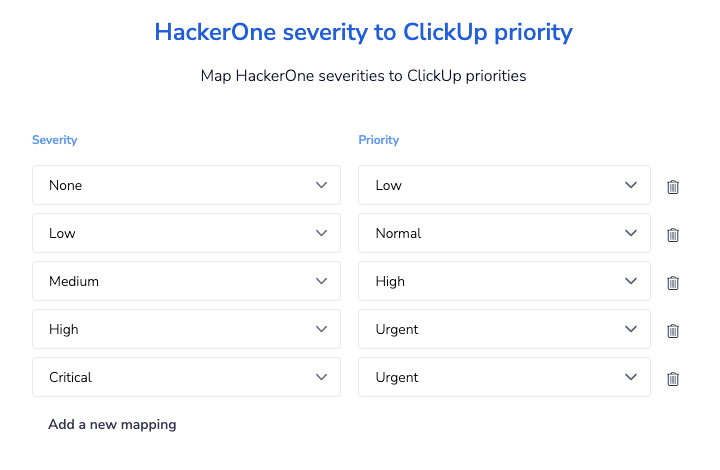
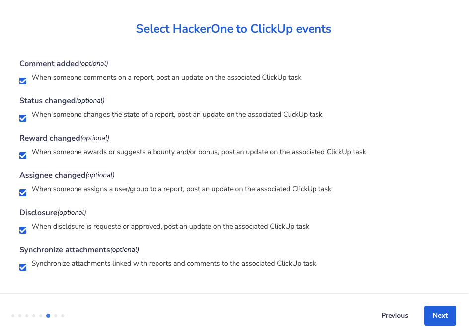

You can integrate with ClickUp in order to sync information between your HackerOne report and your ClickUp task.

To integrate with ClickUp:

1. Go to **Program Settings > Program > Integrations.**
2. Click the **Connect with ClickUp link.**

3. Click the **Set up new integration** button.
4. Enter **Name** and **Description** for your new integration and click **Next.**

5. Navigate to the ClickUp API settings of ClickUp by going to **Settings > ClickUp API** and click **Create an App**

6. Enter the following information on the Create an App window and click **Create App.**

   Fields | Details
   ------ | -------
   Application Name | HackerOne
   Redirect URL(s) | `hackerone.integration-authentication.com`

7. You will be provided with a Client ID and a Client Secret.

8. Navigate back to HackerOne and click **Add a new account** in the ClickUp authentication window. 
9. Enter your ClickUp Client Id and the Client Secret from step 7 in the **Create a new authentication window** and click **Create.**

10. A window with all your workspaces will popup. Select the workspace with the list you want to escalate the reports to and click **Connect Workspace.**

11. Click **Next** to finalize the setup between HackerOne and your ClickUp instance.
12. Configure which ClickUp Team, Space, Folder and List  you'd like to escalate HackerOne reports to in the **ClickUp Team, Space, Folder and List** window and click **Next.**

> **Note**: only lists that belong to a folder are currently supported.

13. Select the HackerOne fields you want to map to the corresponding ClickUp fields. As alternative, enter any text using [integration variables](/organizations/integration-variables.html). If you have custom fields configured in ClickUp they also can be mapped to HackerOne fields. Finally you can configure the labels that are being applied to every new task. Click **Next**.

> **Note**: only Text and Textarea custom field types are supported.

> **Note**: alternatively you can manually set the mapping to a single field or combination of fields from the [integration variables](/organizations/integration-variables.html). For example: `{{triage_summary}} \\ Link: {{report_link}} \\ Date: {{submission_date}} \\ Reporter: {{reporter_name}} \\ Weakness: {{weakness}}` Would create a combination of the triage summare, a link to the report the submission date, the reporter name and the weakness of their report and map that to a single field.

14. *(Optional)* Select ClickUp Priorities you want to map to the corresponding HackerOne Severities. This enables the right priority to be set when escalating a HackerOne report to ClickUp.

15. *(Optional)* Select which actions in HackerOne you'd like to post to ClickUp in the **Select HackerOne to ClickUp events** window. You can choose from:

Option | Detail
------ | -------
Comment added | When someone comments on a report, post an update on the associated ClickUp task.
State changed | When someone changes the state of a report, post an update on the associated ClickUp task.
Reward changed | When someone awards or suggests a bounty and/or bonus, post an update on the associated ClickUp task.
Assignee changed | When someone assigns a user/group to a report, post an update on the associated ClickUp task.
Disclosure | When disclosure is requested or a report becomes public, post an update on the associated ClickUp task.
Synchronize attachments | Synchronize attachments linked with reports and comments to the associated ClickUp task.

16. *(Optional)* Select which ClickUp actions you'd like to post onto HackerOne in the **Select ClickUp to HackerOne events** window. You can choose from:

Option | Detail
------ | -------
Status changed | Post an internal comment when an task changes status.
Closed task status | Resolve the report when an task is closed with the selected status.
Comment added | Post an internal comment when someone comments on an task.
Assignee changed | Post an internal comment when an task changes assignee.
Priority changed | Post an internal comment when an task changes priority.

17. (Optional) Once you complete this integration, a ClickUp webhook will be automatically created in your ClickUp instance. If there is no webhook created, you can use this Webhook URL to create a webhook manually with the taskCommentPosted, taskPriorityUpdated, taskStatusUpdated and TaskAssigneeUpdated events.

18. Click **Finish**. Once the screen disappears, click **Enable** to enable the integration.

You're all set! Now that you've finished setting up the ClickUp integration, you can [create ClickUp tasks](/organizations/clickup-integration.html#creating-a-ClickUp-task) right from your HackerOne report.

### Multiple integrations

If you have multiple HackerOne programs, you can integrate them to the same ClickUp instance. Steps 5-7 can be omitted for each subsequent program you need to add an integration for.

*Note: You can omit steps 5-7 for your other programs because an App has already been created when integrating with your first program, and only 1 App is needed to set up a ClickUp integration.*

### Multiple ClickUp instances per program
This feature is available for **Enterprise programs only**. If you want to integrate the same program to multiple ClickUp instances, you can follow all the steps above for each integration.
