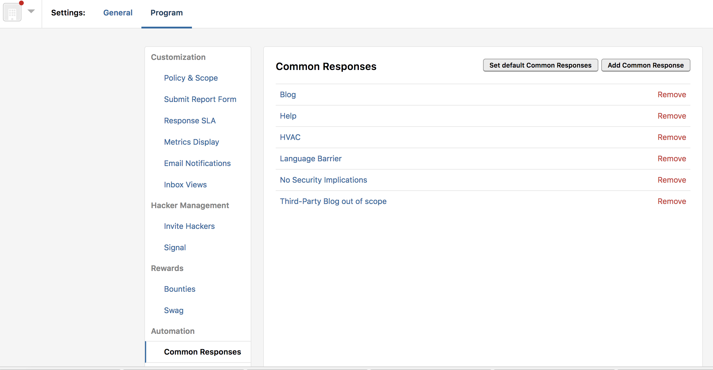
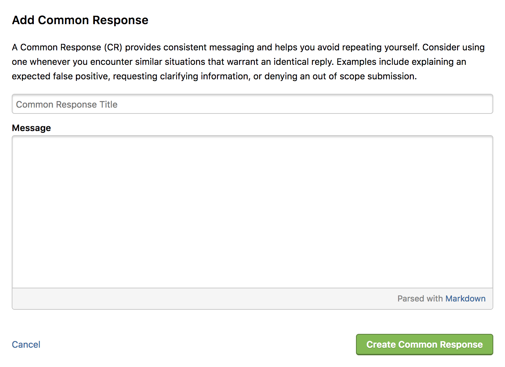

Common responses provide consistent messaging across the platform and prevent you from having to write out the same message again and again. When you select an action for a report, you can have a common response pre-populate for that specific action.

### Set Up a Default Common Response
To set a default common response:
1. Go to <b>Settings > Program > Automation > Common Responses</b>.
2. You'll find a pre-populated list of responses that HackerOne finds useful.
3. Click the <b>Set default Common Responses</b> button.
4. In the <b>Default Common Responses</b> window, select the default response message from the drop-down next to the action.
5. Click <b>Save</b>.

The default common response will automatically populate when you select the action for the report.

### Add Your Own Common Response
You can write your own common response. To add a new common response:
1. Go to **Settings > Program > Automation > Common Responses**.
2. Select the **Add Common Response** button.
3. Type the title of your response in the **Common Response Title** field. This title will show up in the list of common responses to choose from.
4. Type the message of your response in the **Message** field.
5. Click **Create Common Response**.

Your common response will display in the list of common responses to choose from when you set up a default common response.

### Edit a Common Response
To edit a common response:
1. Go to **Settings > Program > Automation > Common Responses**.
2. Click the title of the response you want to edit.
3. Edit the title and the message.
4. Click **Update Common Response**.
