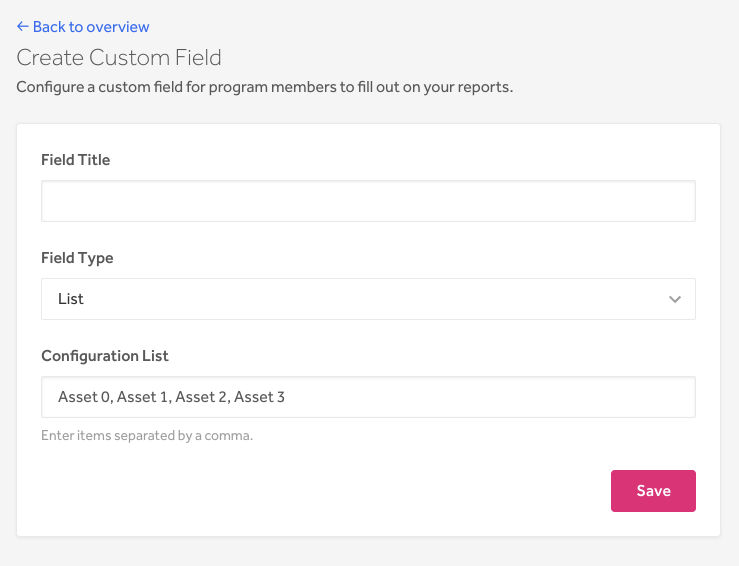
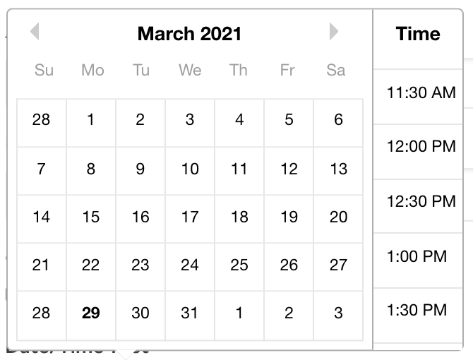
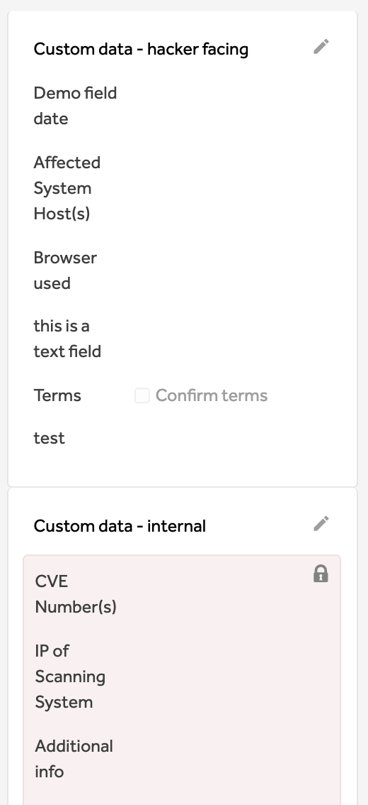
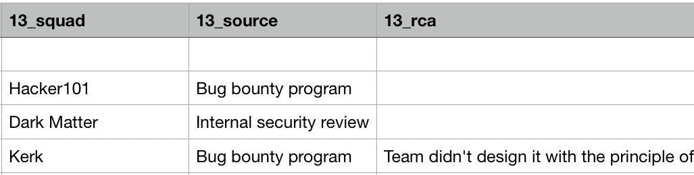
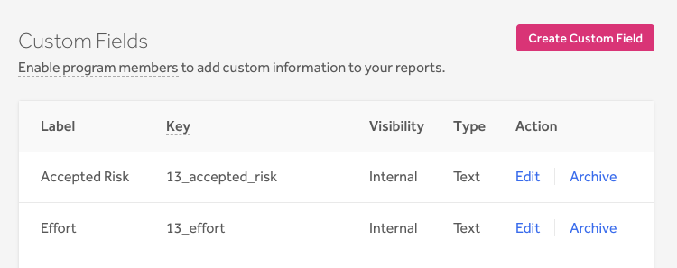
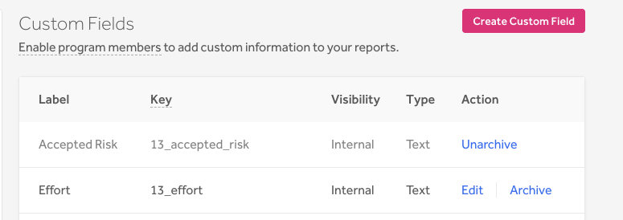
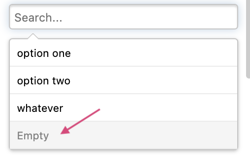

Program administrators can configure custom fields to add data to their reports. This enables your program members to add additional information to your reports to help you better manage and analyze your internal data by the categories that you define to be important, such as by business unit or by root cause analysis.

Administrators can also create hacker facing custom fields to require specific information from hackers regarding the vulnerability and how they found it. This can help speed up the remediation process as it’ll minimize the back-and-forth between the hacker and the program in getting necessary information.

> This feature is only available to Enterprise programs.

### Create a custom field

> **Note:** You must be an administrator of the program in order to add a custom field.

To create a custom field:
1. Go to **Program > Customization > Custom Fields**.
2. Click **Add Custom Field**.
3. Enter the **Field Title** on the **Create Custom Field** page.
4. Choose the type of field you’d like for the Select type. You can choose from:

Option | Details
------ | --------
Text | This option enables you to create an editable text field.
List | This option enables you to create a drop-down list that you can select from when editing your custom field.  Enter your option items in the **Configuration List** field separated by a comma.  
Checkbox | This option enables you to create a clickable checkbox option so that hackers or program members can select if the vulnerability meets the criteria the field is labeled with.  
Date/Time | This option enables you to create a clickable calendar and time field so that hackers or program members can input the correct date and time of their findings.   

5. Select the **Visibility** type you’d like for the custom field. You can choose from:

Option | Details
------ | --------
Internal | Only the internal members of your program will be able to see the custom field.
Hacker facing | The field will appear on the report for the hacker to complete.

6. *(Optional. Only displays for hacker facing custom fields.)* Select the checkbox to indicate that you’d like to mark the field as required on the report.
7. *(Optional. Only displays for hacker facing custom fields.)* Enter the helper text you’d like to use to help guide hackers in filling out the custom field.
8. *(Optional)* Enter a regular expression in the Validation via regular expression field. This is make sure that all inputs for the field are valid. [Learn more about using regular expressions to validate the input](https://www.regular-expressions.info/).
9. *(Optional)* Enter the error message that you would like to display when the validation fails.
10. Click **Save**.

All of your reports will now have a Custom Fields section on the right-hand side that will show both your created internal and hacker facing custom fields. Hackers can add the details corresponding to each hacker facing custom field, and your internal program members can add information for the internal custom fields.

### Fill in a value for a custom field
To fill in a value for a Custom Field to your report:
1. Go the report you want to add custom field details to.
2. Click the pencil icon to edit the custom fields section.
3. Enter the information you want to add for each custom field.
4. Click **Save**.

The information you input will now be tied to your field labels.

When you export your reports as a CSV file, the custom field and the information associated with it will also be included in the export. Each custom field will be exported with an associated key. The key for each field is comprised of: `<team_id>_<custom_field_attribute_label>`.

The image below shows an example of an exported report with the custom field labels of `squad`, `source`, and `rca` in the header of each column.

### Edit a custom field
You can edit your custom fields to change the name of the field label.

To edit the title of a custom field:
1. Go to **Program > Customization > Custom Fields**.
2. Click **Edit** for the custom field label you want to edit.
3. Enter the new title.
4. (*Optional*) Change the **Field Type** from *Text* to *List*. You can only change the field type from *Text* to *List*. You can’t change a *List type* to a *Text type*.
5. Click **Save**.

When you edit a custom field, the key associated with the field will also change.

### Archive custom fields
You can archive custom fields that you no longer want to use. We don’t enable you to permanently delete custom fields as a precaution to prevent data loss.

To archive a custom field:
1. Go to **Program > Customization > Custom Fields**.
2. Click **Archive** next to the custom field you want to archive.

The archived field can no longer be added to new reports. Current and past reports with the archived field will remain on the report and won’t disappear. You can, however, edit the field within the report.  

You can unarchive an archived custom field by clicking **Unarchive** next to the archived custom field.

### Filter reports by custom field
You can filter your inbox reports by the custom fields you created as each custom field you create will be added into your inbox filter.

To filter your inbox by custom fields:
1. Go to your inbox.
2. Click **Show filters**.
3. Scroll down to the **Custom fields** filters.
4. Select the custom fields you want to filter by.

To filter by **Text types** for reports that don't have the custom field set, click in the custom field input box and press the **Return** key on your keyboard without entering a value.

To filter by **List types** for reports that don't have the custom field set, click on the custom field and select the *Empty* option.

