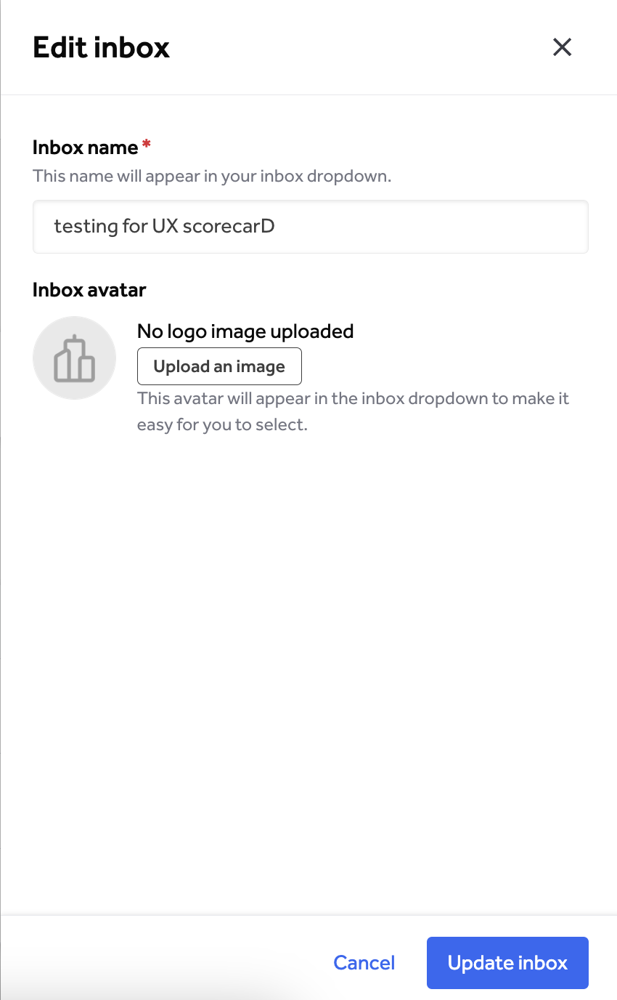

Editing a custom inbox allows you to update the details such as name, avatar and access to the custom inbox.

From the Inboxes overview page under organization settings, click on the inbox, or select edit inbox from the actions dropdown. The inbox details page will open.

To edit the inbox details:
1. Select the edit icon. A panel will open on the right hand side to allow you to edit inbox name and avatar.
2. Select **Update inbox** to apply the changes.

><i>Tip: Updating a custom inbox's details will also update it in the inbox picker for groups with access to it. Notify your team of significant changes not easily recognizable from the previous version.</i>

To edit access:
1. Select **Manage groups for this inbox**. A panel will open on the right hand side to allow you to change group access.
   * You can also remove groups from the inbox detail page.
2. On this page, you can remove or add groups to the inbox.
3. Select **Update inbox groups** to apply the changes.

