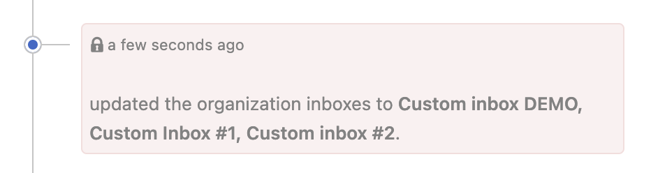

Once a custom inbox is created, users granted report permissions within that inbox gain the ability to assign reports.

1. Open the relevant report in the engagement inbox.
2. You will now see a new section for Inboxes in the metadata sidebar. Select the edit option.

3. In the dropdown, you will see options for allocating the report to custom inboxes. Select the relevant inboxes for the report.

4. Click on **Update inboxes** to apply the allocation.
5. The report has been allocated and the activity was logged in this report.

Reports can be removed from custom inboxes in the same way.

## Additional notes:
1. Allocating a report to a custom inbox does not remove it from the engagement inbox.
2. You can assign a report to different custom inboxes from within a custom inbox, provided the user has access to the Engagement inbox and Report permission for that specific inbox.
