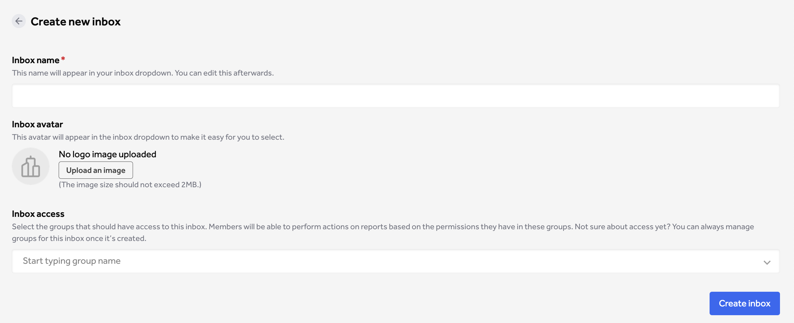

><i>Tip: Before creating a new custom inbox, [create the relevant groups](/organizations/groups.html) for the custom inbox. Use naming conventions that make it easy to map to your workflows and teams.</i>

1. Go to **Inboxes** in **Organization Settings**

2. Add inbox name. Make this recognizable for your team to make it easier to manage report allocation.

3. Upload an inbox avatar. You can always upload and change this later.

4. Select the group you want to have access to this inbox.
    * If you set up your groups ahead of time, you can easily add them here by typing their name.
    * If groups still need to be set up, you can keep this field empty and create the groups after the inbox. 

Once created, the inbox will be visible on your [Inboxes Overview page](/organizations/custom-inboxes-overview.html). From here, you can update the details and access for this inbox.

Groups with access can see this inbox in their inbox dropdown under **Inbox** in the main navigation.

Tip: Organization admins do not get access to inboxes by default, even when they create it. If you need access to the inbox, ensure you are part of the groups with access to it.

><i>Tip: Organization admins do not get access to inboxes by default, even when they create it. If you need access to the inbox, ensure you are part of the groups with access to it.</i>