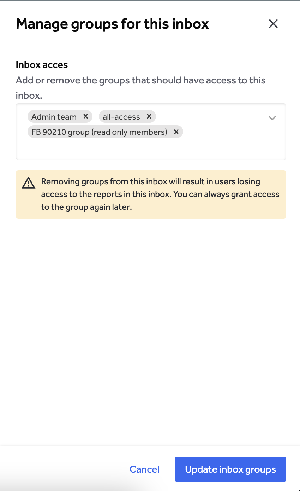
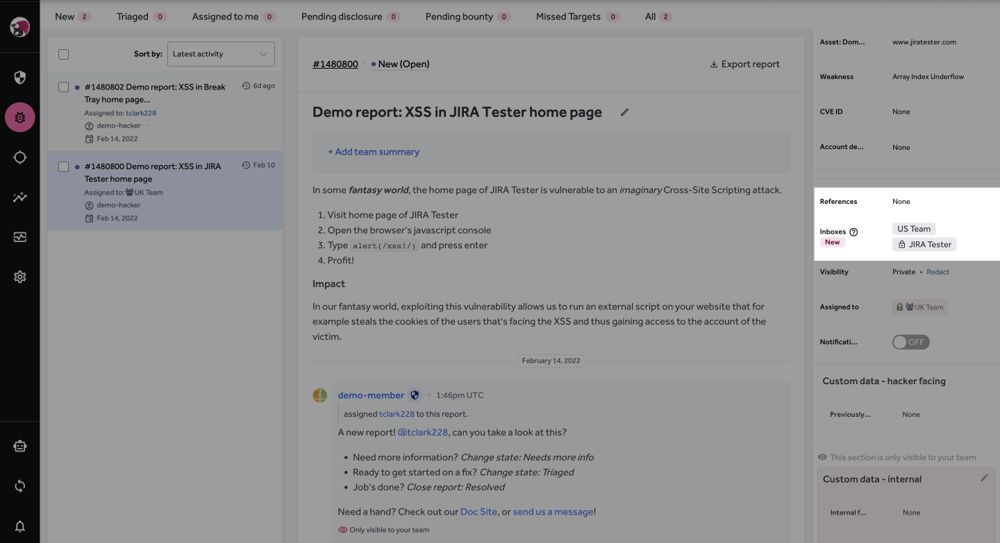
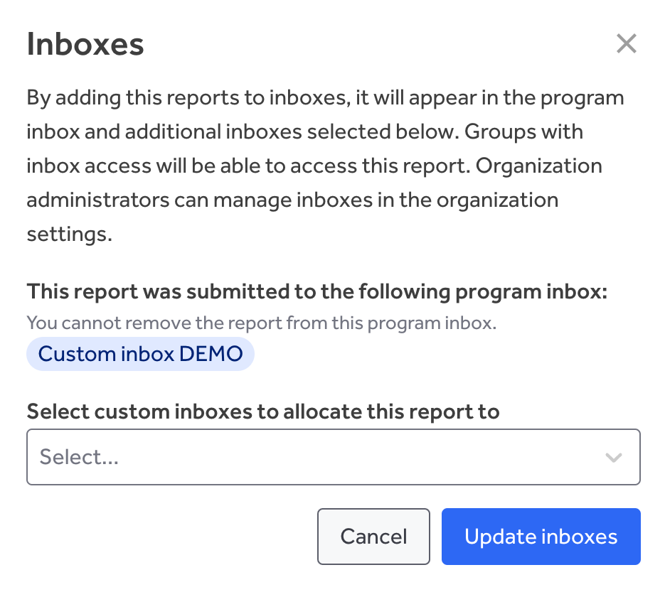

><i>Custom inboxes are available to Enterprise customers only.</i>

Custom inboxes allow you to separate report access based on your teams, assets, or business units. Organization administrators can create additional inboxes to support their organization structures and workflow needs.

As custom inboxes are not connected to an engagement, they can provide access to a subset of reports without granting access to the engagements themselves.

### Overview
In the inbox overview found under organization settings, the organization admin can see all inboxes connected to their organization. These will include engagement inboxes and custom inboxes.

From this page, you can search for an inbox, manage custom inboxes, and create new custom inboxes.

### Creating a Custom Inbox
><i>Tip: Before creating a new custom inbox, [create the relevant groups](/organizations/groups.html) for the custom inbox. Use naming conventions that make it easy to map to your workflows and teams.</i>

1. Go to **Inboxes** in **Organization Settings**.

2. Add inbox name. Make this recognizable for your team to make it easier to manage report allocation.

3. Upload an inbox avatar. You can always upload and change this later.

4. Select the group you want to have access to this inbox.
    * If you set up your groups ahead of time, you can easily add them here by typing their name.
    * If groups still need to be set up, you can keep this field empty and create the groups after the inbox. 

Once created, the inbox will be visible on your Inboxes Overview. From here, you can update the details and access for this inbox.

Groups with access can see this inbox in their inbox dropdown under **Inbox** in the main navigation.

Tip: Organization admins do not get access to inboxes by default, even when they create it. If you need access to the inbox, ensure you are part of the groups with access to it.

><i>Tip: Organization admins do not get access to inboxes by default, even when they create it. If you need access to the inbox, ensure you are part of the groups with access to it.</i>

### Editing Custom Inboxes
Editing a custom inbox allows you to update the details such as name, avatar and access to the custom inbox.

From the Inboxes overview page under organization settings, click on the inbox, or select edit inbox from the actions dropdown. The inbox details page will open.

To edit the inbox details:
1. Select the edit icon. A panel will open on the right hand side to allow you to edit inbox name and avatar.
2. Select **Update inbox** to apply the changes.

><i>Tip: Updating a custom inbox's details will also update it in the inbox picker for groups with access to it. Notify your team of significant changes not easily recognizable from the previous version.</i>

To edit access:
1. Select **Manage groups for this inbox**. A panel will open on the right hand side to allow you to change group access.
   * You can also remove groups from the inbox detail page.
2. On this page, you can remove or add groups to the inbox.
3. Select **Update inbox groups** to apply the changes.

### Allocating Reports
Once a custom inbox is created, users granted report permissions within that inbox gain the ability to assign reports.

1. Open the relevant report in the engagement inbox.
2. You will now see a new section for Inboxes in the metadata sidebar. Select the edit option.

3. In the dropdown, you will see options for allocating the report to custom inboxes. Select the relevant inboxes for the report.

4. Click on **Update inboxes** to apply the allocation.
5. The report has been allocated and the activity was logged in this report.

Reports can be removed from custom inboxes in the same way.

#### Additional notes:
1. Allocating a report to a custom inbox does not remove it from the engagement inbox.
2. You can assign a report to different custom inboxes from within a custom inbox, provided the user has access to the Engagement inbox and Report permission for that specific inbox.

### Delete a Custom Inbox
You can remove a custom inbox if you no longer need it.

><i>Tip: Bear in mind that removing an inbox will revoke access to the reports for the groups that had access before.</i>

You can remove an inbox from two places:

1. Select **Remove inbox** from the action picker in the inbox overview.
2. Select the inbox you want to remove by clicking on the inbox link in the inbox overview and selecting the delete icon.

Both options will prompt you to review the impacts of deleting a custom inbox.
Remove the inbox by clicking **Remove inbox** in the modal.

Removing an inbox will:
* Remove access for groups that had access to the inbox
* Remove the Inbox tag from reports that were allocated to that inbox (you will not be able to filter on this inbox anymore)
