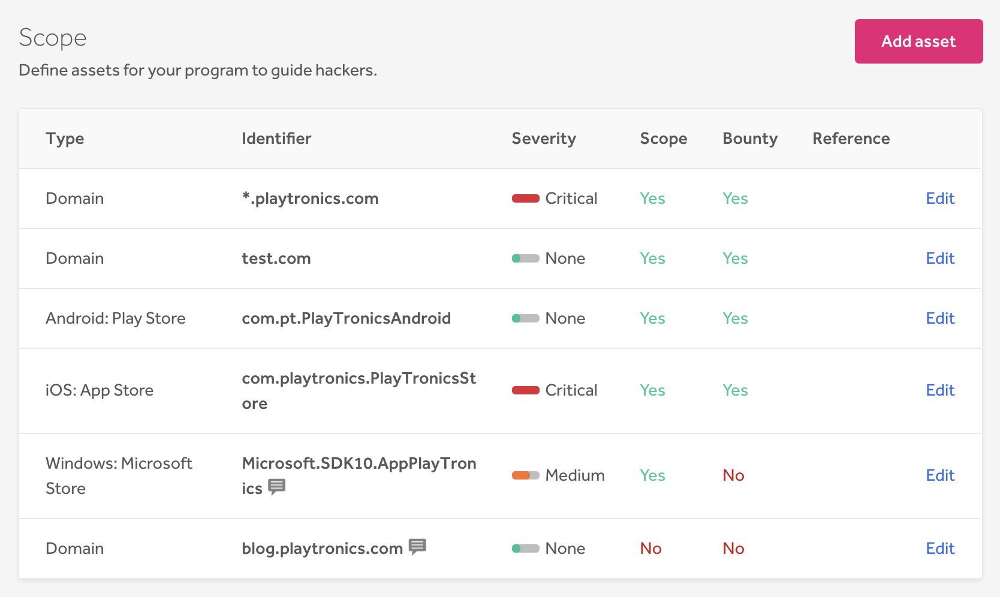

Your Scope is a collection of assets you want hackers to hack on. When assets are listed, hackers are required to select the applicable asset for each report. Any special requirements will now be explicitly attached to the particular asset in question.

### To Create and Edit your Scope
To view and edit your existing scope:
1. Go to the Scope section in **Program Settings** > **Program** > **Scope**.

2. Click on **Add asset**. It will bring you to this page:

3. Fill out the different fields. For each asset, you can fill out:

Option | Details
----- | -----
Types | The asset type.  You can choose from these options: CIDR, Domain, iOS: App Store, iOS: Testflight, iOS: .ipa, Android: Play Store, Android: .apk, Windows: Microsoft Store, Source Code, Executable, Hardware/loT, Other.
Identifier | How hackers will know that they are at the correct asset that you specified.
Eligibility for Submission | Whether you want hackers to submit to reports about this asset. If you select "no", hackers will see the asset on a report form with a red warning and won't be able to submit reports marked for this asset.
Eligibility for Bounty | Whether you intend on providing bounties for this asset or not. If you have a mixed Bug Bounty - Vulnerability Disclosure program, you'll want to explicitly mark the assets you will or will not pay for. This is also surfaced to hackers on both your team profile and the report submission form.
[Environmental Score](environmental-score.html) | These metrics determine the [severity](severity.html) of the vulnerability for the asset. You can adjust the severity of each vulnerability submission based on the environment by specifying the maximum impact to Confidentiality, Integrity, or Availability of that asset's data.
Asset Labels | Add specific labels to the different categories pertaining to the asset. You can add asset labels to these fields: Coding Language, Framework,  Cloud and Infrastructure, Database, Content Management System, Country, Spoken Language, Cryptocurrency.   The labeled descriptors provide more granular data about the program and the assets associated with it. This helps with matching the right hackers to your program.
Instruction | If you have any detail descriptions or comments on the asset, this field will surface that on both your program profile page and your report submission form.

4. Click **Save**.

### Why Should I Define My Scope?
* **Defining assets clearly helps you communicate with hackers easily.**
  * For an asset you don't want reports to, list it as out of scope. Hackers can't submit to that asset and will see a red warning when they select that asset.
  * For an asset that you won't pay bounties for, communicate this up front by setting the bounty eligibility to false. When hackers are submitting, they will receive warning that this is not a paid asset. <i>This is only applicable to Bug Bounty Programs</i>.
* **Setting asset importance will help you set better priorities via better report severity.**
  * When you set the Environmental Score of your asset, we automatically limit the severity of the report based on the risk profile of the asset. For example, it might be impossible for you to have a "Critical" vulnerability in a static marketing asset.
* **Your reports will be tagged by the selected asset.**
  * You can sort through your reports by asset, such as differentiating the reports for your mobile app vs. your web app.
  * Do data analysis per domain - Is it time to switch your marketing site provider, because all your vulnerabilities stem from that area? Is one particular engineering team responsible for 90% of your Cross-Site Scripting vulnerabilities?

### Tutorial Video
<iframe id="ytplayer" type="text/html" width="640" height="360" src="https://www.youtube-nocookie.com/embed/H2ZcSP04Vzw" frameborder="0" allowfullscreen></iframe>