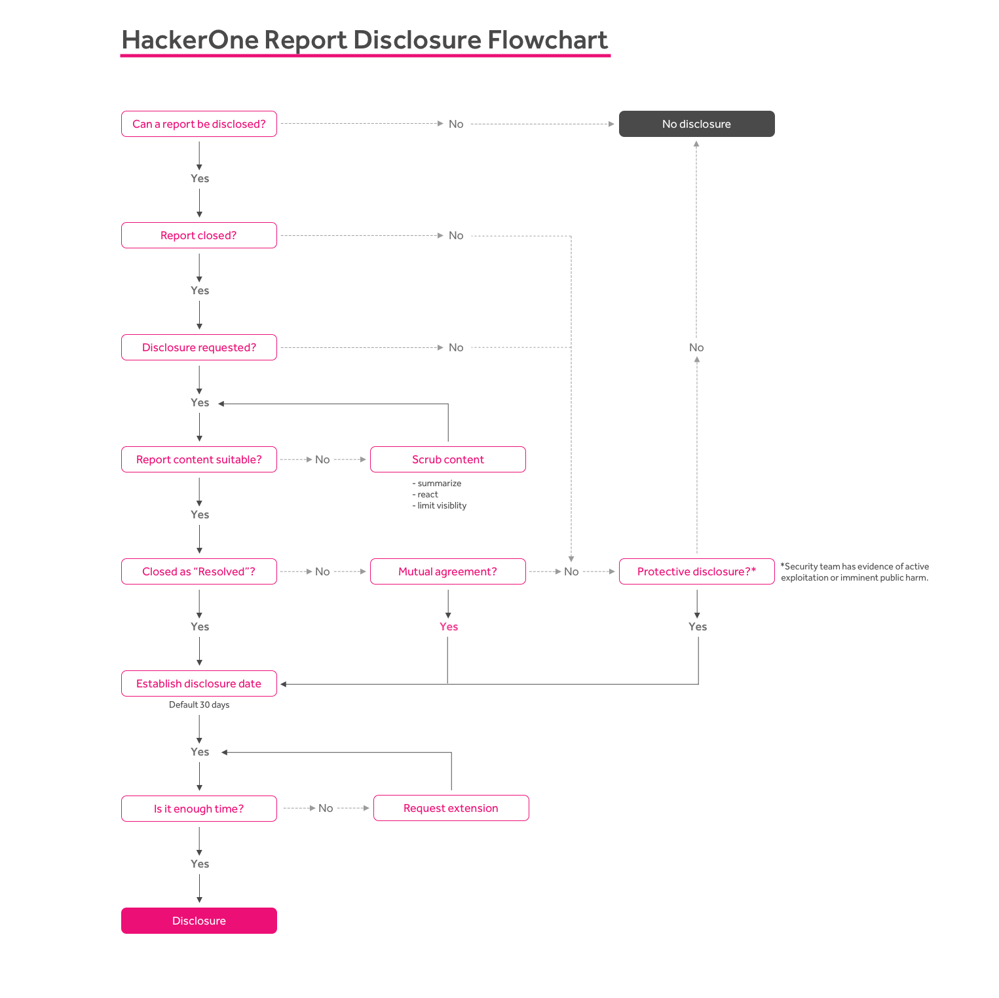

Disclosure enables you to be transparent about the security vulnerabilities found for your program. HackerOne's disclosure process balances transparency with control over what information is shared with the public.  

Programs can choose from 3 disclosure settings:

Option | Details
------ | -------
Disclosure | The hacker or your security team can request disclosure for any closed report in your program. If the admin of your program agrees to disclosure, the contents of the report will be made public. Upon requesting disclosure, if the report is neither approved or denied, reports in the Resolved state will automatically default to disclosure where the contents of the report will be auto-disclosed within 30 days.   *This is the default setting for all verified programs*.  Note: Reports must be in the Resolved state to default to disclosure. Any other [report state](/organizations/report-states.html) requires mutual agreement.
Disclosure Requiring Mutual Agreement | The hacker can request disclosure for any closed report in your program. If your program security team agrees to disclosure, the contents of the report will be made public. If the security team doesn't take any action, the contents of the report will remain private.   *You must request to opt-in to this option.*
Disclosure Disabled | Disclosure isn't allowed for any report.   *Only available for private programs.*

### Requesting Disclosure

Both hackers and program members can request for disclosure. To request for disclosure:
1. Go to the report you want to disclose.
2. Make sure the report is closed.
3. Select **Request disclosure** in the action picker at the bottom of the report.

4. Select whether you want to disclose the **Full** report or a **Limited** version.

Option | Details
------ | -------
Full | Upon disclosure, the full contents of the report are visible including the:<li>Vulnerability information</li><li>Summary</li><li>Timeline (this includes comments and attachments)</li> *Note: Internal comments are kept hidden.*  
Limited | Only the summary and timeline of the activity are visible. All comments and attachments are hidden. Limited disclosure allows for greater control over sensitive or extraneous information.   Hackers still have the ability to add a hacker summary to the report unless the report is [locked](locking-reports.html).

5. *(Optional)* Enter a comment to describe your reasons for disclosure.

6. Click **Post**.    

After disclosure has been requested, the admin of the of the program can choose to publicly disclose the report. They can select **Disclose** to disclose the report, and they can also change the disclosure options to Full or Limited.

### Canceling Disclosure Requests

You can cancel your disclosure request if you later decide to not disclose your report. You can also cancel disclosure requests from hackers asking you for disclosure.

To cancel a disclosure request:
1. Go to the report that has been requested for disclosure.
2. Select **Cancel disclosure request** in the action picker at the bottom of the report.

3. Enter a comment explaining why you are canceling the disclosure request.
4. Click **Post**.

### Disclosure for Private Programs

If you’re running a private program, you can enable hackers to disclose a report within your private program. Upon disclosure, contents of the report will only be visible to participants in your private program. This enables hackers to share their vulnerability findings with other hackers in the program, and can also increase awareness for other hackers as they can better see what vulnerabilities have already been found for your program.  

To enable disclosure for private programs:
1. Go to **Settings > Program > Customization > Disclosure**.

2. Select **Yes** to enable hackers to disclose reports in your private program.

Hackers and other members in your program can request for disclosure following the same steps above in the Requesting Disclosure section above.

When choosing to disclose the Full or Limited report, the options will only be specific to disclosing within your private program:

Option | Details
------ | -------
Full | Upon disclosure, the full contents of the report will be visible to participants in your private program.
Limited | Only the summary and timeline of activity will be visible to participants in your private program.

This diagram illustrates HackerOne's disclosure process:

For more information, please read the full [HackerOne Disclosure Guidelines](https://hackerone.com/disclosure-guidelines). If disclosure was accidentally initiated or you have concerns about this process, please [submit a support request](https://support.hackerone.com).

### Hacker Interactions with Disclosed Reports
After reports have been disclosed, hackers can still add their own report summary in the *hacker summary* section. Hackers can only edit the hacker summary portion of the report as they won't be able to edit the official program report summary.

Locking reports will prevent hackers from being able to add or edit their hacker summary. If a hacker already provided a summary for the report, you can't remove it from the report.
