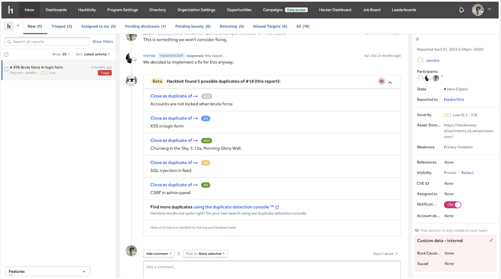
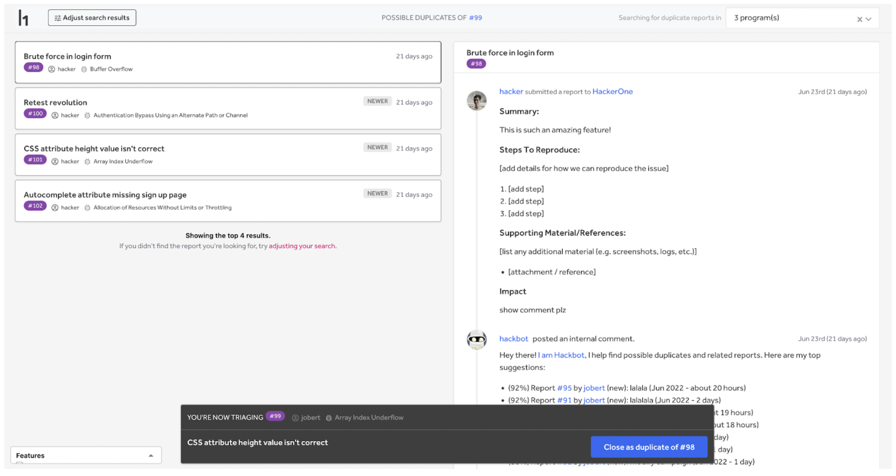
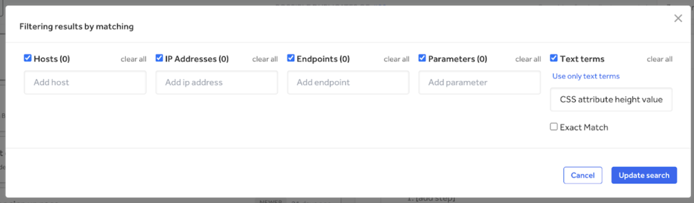

Duplicate Detection is a console that streamlines the detection of duplicate reports across programs using Elasticsearch. While inbox search allows you to search all reports in the selected program, with this console you can search reports across all programs that you have access to, whether they are Bounty, Response, Challenge, Pentest, Child/Sibling programs, etc.

You can open the duplicate detection console by clicking on the button in the metadata sidebar or the hackbot menu at the bottom of the report.

This will open the console in a new tab in your browser. The console automatically searches on title, vulnerability information and comments, and prepopulates:
* Host
* IP
* Endpoint
* Parameters
* Text term, i.e. “Report title”

From there, you can quickly mark and close reports as duplicates by clicking the blue button at the bottom of the screen.

You can adjust the search and results by clicking **Adjust search results** in the top left corner. A box will pop up with all the filter options available to you.

Click **update search** to see the new results.
