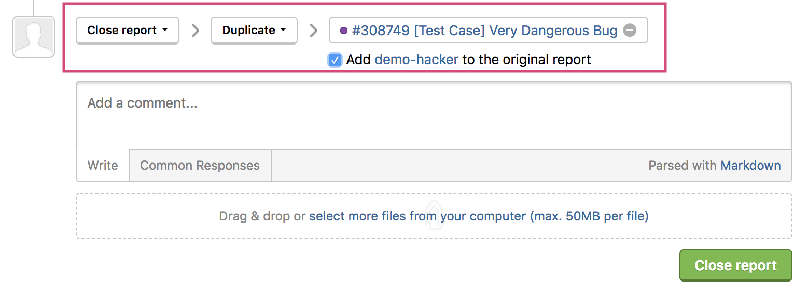

When a hacker reports a vulnerability that has already been reported, it's considered a duplicate report. Marking a report as a *duplicate* enables you to choose from taking these 2 options:

Option | Details
------ | -------
1 | Add the second hacker as an external participant on the original report.   This means the second hacker will be able to view the contents of the original report. They can see all and comments and activity on the report that the original hacker sees. They can also comment on the report as well. This applies for any subsequent hackers (3rd, 4th, etc.) that submit the same duplicate report and are added to the original report.
2 | Don't add the hacker as an external participant on the original report.   Instead, you can let the hacker know that their submitted vulnerability is a duplicate, and you can list the original report number in the comments sections.

### Adding a Hacker to the Original Report
To add the hacker to the original report:
1. Go to the bottom of the report above the comment box.
2. Change the action picker to **Close report > Duplicate**.
3. Enter the original report number in the **Search report** field and select the report from the selection list.
4. A checkbox stating **Add *hacker name* to the original report** will show under the **Search report** field.
5. Select the checkbox to add the hacker to the report.

It's up to your program to determine if you are comfortable with sharing the original report with the hacker that submitted the duplicate report. It's recommended to tie the second report to the original report to provide accountability and to account for Reputation gain or loss for the hacker.
