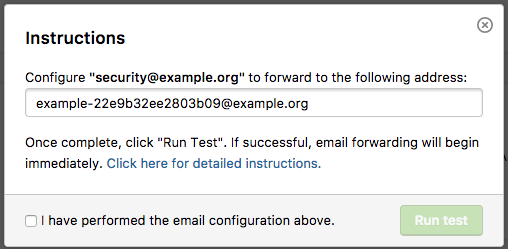

You can set up emails to be forwarded to your HackerOne inbox to enable report management directly through HackerOne. Hackers that discover these specific email addresses will be able to submit reports directly to your program. Upon sending reports through the email, they'll also automatically get invited to your program.

><i>Note: This feature isn't available until your program is launched and not in sandbox mode.</i>

### How Does it Work?
When a hacker discovers a vulnerability and sends their finding in an email to security@example.org:
1. Their emails are forwarded to HackerOne's inbox and saved as report drafts.
2. The hacker will receive an auto-response email notifying them that your program uses the HackerOne platform to coordinate vulnerabilities. They can click the **Submit Vulnerability Report** link.

3. The link will prompt the hacker to create a HackerOne account if they don't already have one, or to log in to their existing account.

4. After the hacker signs in to the account, the **Submit Vulnerability Report** button will be available for them to click. Upon clicking this button, the hacker is automatically invited into your program. The button will take them to the report submissions page, where they can claim the report draft and submit a valid HackerOne report to your program.

5. You will then be notified of a new vulnerability submitted by the hacker in your inbox where you can use the platform tools to comment, triage, and pay bounties.

### Setup

To set up email forwarding in HackerOne:
1. Go to **Settings > Program > Hacker Management > Email Forwarding**.
2. Click on **Add email address**.
3. Enter the email address the vulnerability reports should be sent to. A common example is: security@example.org.

4. The inbox address that your email will be configured to will automatically generate. Upon configuration, emails sent to security@example.org will be forwarded to the inbox address given.

> **Note:** Please make sure you've configured email forwarding for your email provider. Don't know how to set up email forwarding for your email provider? Check out these resources for: <li>[Microsoft Outlook 365](https://support.office.com/en-US/article/Forward-email-to-another-email-account-1ED4EE1E-74F8-4F53-A174-86B748FF6A0E) <li>[Microsoft Exchange Server](https://technet.microsoft.com/en-us/library/dd351134(v=exchg.141).aspx) <li>[G Suite (formerly Google Apps)](https://support.google.com/a/answer/4524505)

5. Click **Run test** to ensure that forwarding is set up correctly.

><i>Note: You can add multiple email addresses to forward to the same inbox.</i>

### Setup Issues
If you're running into problems setting up email forwarding using the steps above, it could be because several security checks that are inherent to the email protocol could be violated and are preventing the email from being successfully processed by HackerOne.

Here are some common problems and solutions users run into when setting up email forwarding:

Issue | Solution
----- | --------
You're using Gmail as an email provider and the confirmation code hasn't been entered. | In setting up email forwarding for Gmail, you need to enter a confirmation code that is sent to the email address you want to forward emails to. Because you don't have access to the inbox generated by HackerOne, you'll need to contact HackerOne to get the confirmation code to finalize the setup in your Gmail account.
You manually created a forwarding rule yourself instead following [these setup instructions](email-forwarding.html#set-up). When you manually create your own forwarding rule, this creates a new email object that doesn't contain the *H1-Forwarding-Nonce* header that HackerOne requires to verify the setup. | Please follow the setup instructions [above](email-forwarding.html#set-up) and also be sure to follow the instructions for the forwarding functionality of your email provider.
The *To* field is incorrect. This causes SPF and DKIM checks to fail, which means that HackerOne won't receive the forwarded email. | Make sure the *To* field matches the one you entered in step 3 [above](email-forwarding.html#set-up), and be sure to follow the instructions for the forwarding functionality of your email provider.

Here's an example of what your email headers should look like when email forwarding is set up correctly:

Header | Value
------ | ------
To | security@example.com
From | "Reporter" <example@reporter.com>
Return-Path | example@reporter.com
Delivered-To | security@example.com
Received-SPF | pass(*)
DKIM-Signature | v=1; a=rsa-sha256; q=dns/txt; c=relaxed/simple; s=hsbnp7p3ensaochzwyq5wwmceodymuwv;d=server.com; t=12738181; h=Date:From:To:Message-1 D:Subject:Mime-Version:Content-Type:Content-Transfer-Encoding:Feedback-ID; bh=2jh40/jnKOZNNY68AJSDID8IUovd714123JJzgOVWqFX4Q=; b=JASIOSD+89jYRJsmqDIEA621Xkz1cpHba6xikYasjid8JJoc KAidKMZ/O1VV/+LBI19tGajKAID882Lx8/CSAXMMiKlamK+ac+rOfqQKDIA88INOL /FBpVYM4nLOLLIPOPwxNrlvPWoouHw9kdDq171/dUs YO7E=
X-Forwarded-To | security-9beOakdka99397e@forwarding.hackerone.com
X-Forwarded-For | security@example.com security-9beOakdka 99397e@forwarding.hackerone.com
H1-Forwarding-Nonce | 2a032918391e46cf7687e62ec42423ea3
