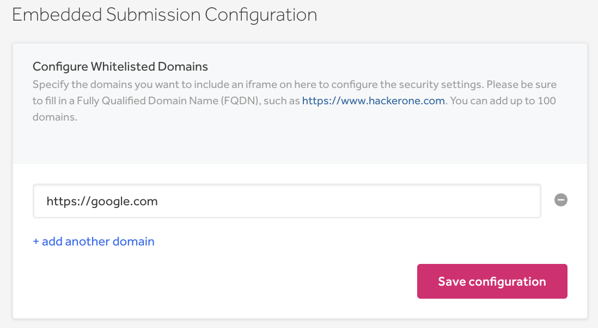
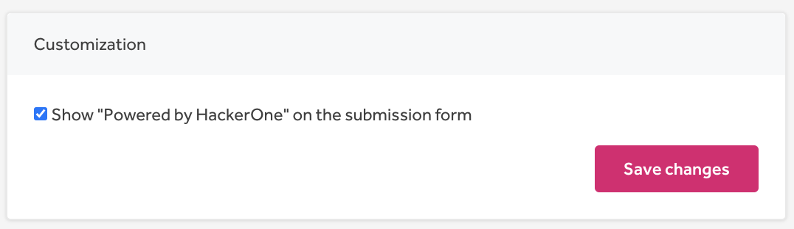
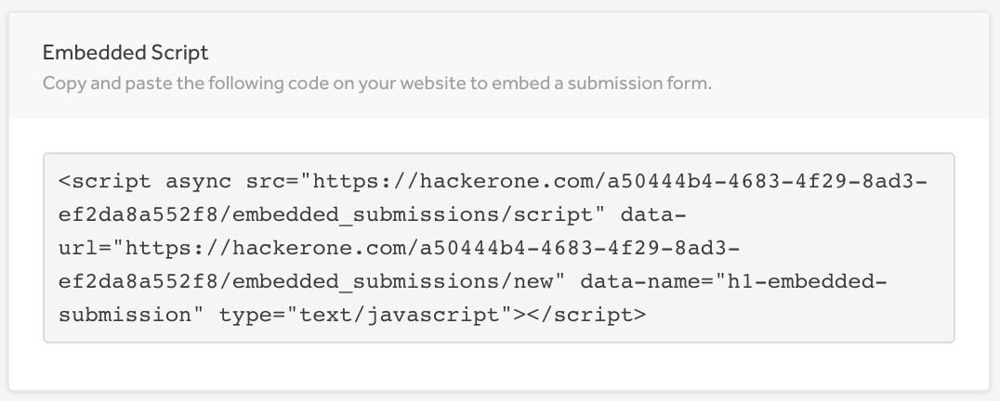
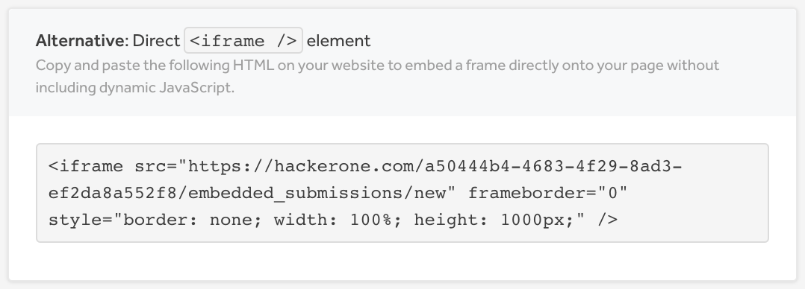
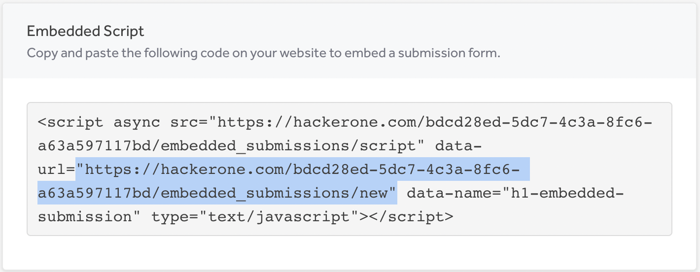

You can embed the HackerOne report submission form onto your own website. This enables hackers to submit reports without having to create an account on HackerOne. This also provides hackers with an easy way to submit security vulnerabilities without having to search for the VDP or security policy. With embedded submissions, anyone can submit a report to the program and hackers also have the option to anonymously submit reports.

If you have [signal requirements](signal-requirements.html) set up for your program, please note that the embedded submission form bypasses all signal requirements that have already been set up. Hackers who don't meet signal requirements will still be able to submit vulnerabilities to your program through the embedded submission form.

> **Note:** If you’re running a private program and want to configure an embedded submission form, any hacker will be able to submit vulnerabilities to your program as long as they have access to the embedded submission form even if they’re not explicitly invited to your program. If you choose to have an embedded submission form, your program will no longer be strictly private.

### Set Up an Embedded Submission Form  
To have an embedded submission form on your website:
1. Go to **Program Settings > Program > Embedded Submission Form**.

2. Identify the domains where you want the submission form to be embedded on the <b>Embedded Submission Configuration</b> form. You must add a Fully Qualified Domain Name (FQDN). You can add up to 100 domains.

3. Customize the look of your submission form to match the style of your website. You can change these settings:

Option | Details
------ | -------
Show “Powered by HackerOne” on the submission form | The checkbox is selected by default to show that the form is powered by HackerOne. You can deselect the checkbox to hide the HackerOne logo from the form.
Typeface | Select the type of font you want the form to appear in.
Link Color | Select the color of the links on the form.
Accent Color | Select the color of the form design.
Accent Text Color | Select the text color within the design accents.
Button Color | Select the color of the button on the form.
Button Text Color | Select the text color within the button.

> **Note:** Customization settings are only for Enterprise programs.

4. *(Optional)* Click **Preview form** to see how your form will look.

5. Click **Save changes**.

6. Copy and paste the script tag to your website. The script tag is used to include a JavaScript file served by HackerOne to generate the iframe necessary to embed the report submission page.  As the script tag is replaced by the iframe, you can insert the tag wherever you want the iframe to be included.

><i>Note: The url within the script contains a UUID (e.g. 25ab901d-7cea-481b-8ac2-c16b7d10d577). This UUID is used by the embedded page to grant users access to submit reports to your program. Any user with access to the UUID will be able to submit reports. It’s important that you're careful with disclosing this UUID if you want to restrict access to submissions.</i>

Alternatively, if you don’t want to include dynamic JavaScript, you can copy and paste the `<iframe />` element on your website to embed a frame directly.

Or you can paste the '<"https://hackerone.com/...UUID.../embedded_submissions/new">' portion of code as a url. You can point to the link on your website, or you can set up a security@ email with an auto response pointing to the link.

### How it Works
Once the integration has been set up, the HackerOne report submission form can be accessed directly on your site. Hackers don't need to access your HackerOne policy page to submit reports, but they can access the report form right from your site.

When hackers submit reports through the embedded form, the form automatically detects if a hacker is signed in to HackerOne and allows them to submit a report. If a hacker isn’t a member or signed in, they can provide their email in the email field to receive status updates on their report.  

Anonymous submissions will always remain anonymous and can’t be claimed later for reputation or bounties. If an email address is provided, HackerOne will be able to check if an account exists with that email on HackerOne and send the hacker an email to claim the report or to create an account to claim the report.

> It's recommended that you include a short description of how embedded submissions work on your submission form page so that hackers can understand the submission process. Alternatively, you can include a link to your policy page or directory page that explains your policy on submitting vulnerabilities.  
