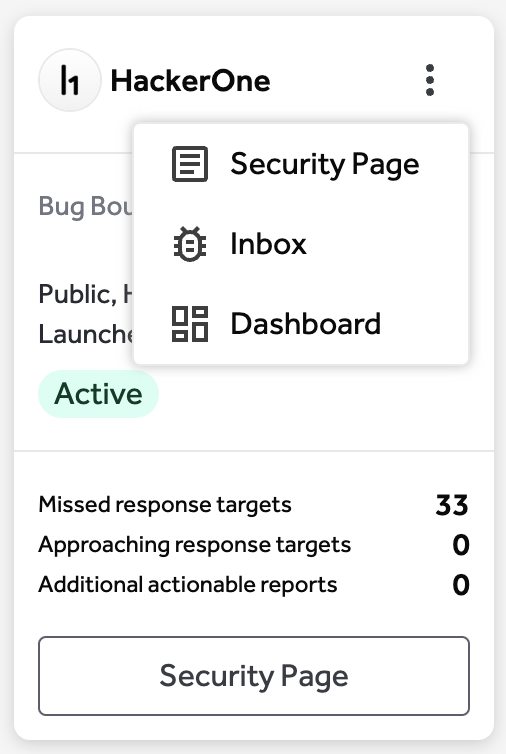

The Engagements page is where customers land on the site and can find all the ways to engage with hackers. This includes any programs they are currently running as well as education on what other engagements they could run.

The engagement types are:
* Bounty
* Response
* Pentest
* Challenge
* Campaign (run on top of a bounty program)
* Asset Discovery (run on top of the H1 Assets product)

The Engagements page is also how you will navigate to all of your programs. While on the Engagements page, click on any card to be taken to the specific pages of that program. On each card, you can also quickly access any sub-pages with one click. 

