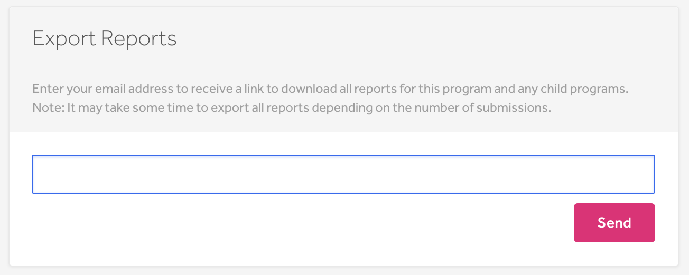
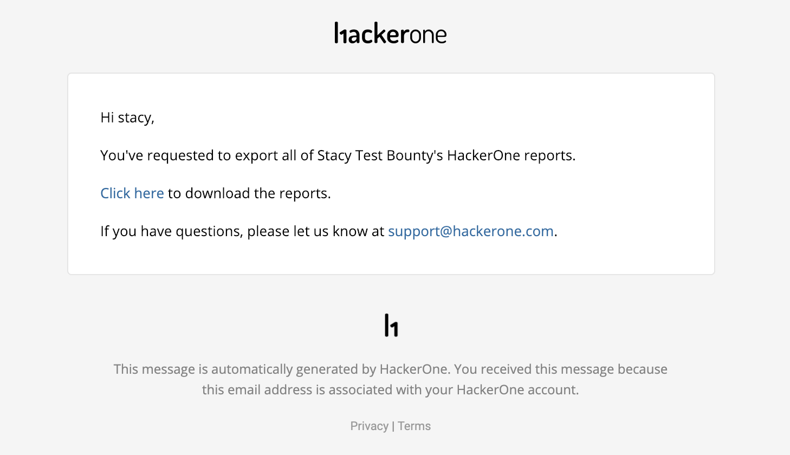
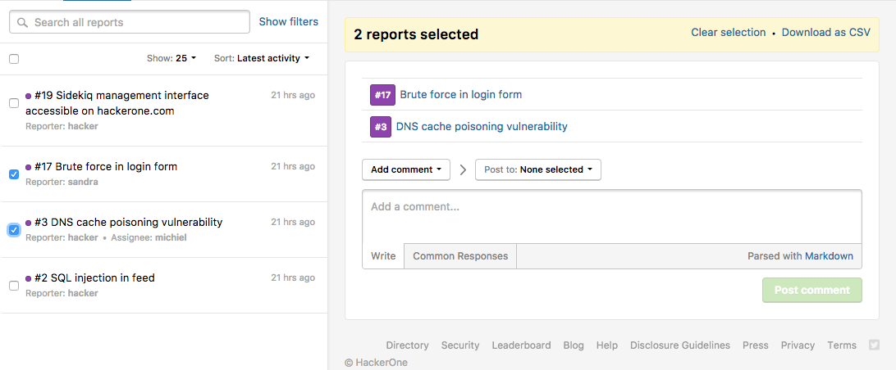

You can export your reports as:
* .csv files
* .md files
* .zip files
* .pdf files

You can also export reports through utilizing the API. See these articles from the HackerOne API documentation to learn more:
* https://api.hackerone.com/#reports-get-report
* https://api.hackerone.com/#reports-get-all-reports

### Export All Reports to a .csv File
You can export all vulnerability reports (or select/filtered reports) within your program. This enables you to keep and run analytics on your program's vulnerability report data in an organized spreadsheet. You can also export reports for any [child programs](parent-child-programs.html) associated with your program as well. *The .csv file doesn't include the comments from the reports.*

To export all of your reports:
1. Go to your program's **Program Settings > Program > Automation > Export Reports**.

2. Enter your email address in the field.
3. Click **Send**.
4. Click the link you receive in your email to download your reports as a .csv file.

Depending on the number of reports in your program, it'll take about 5-10 minutes to export all of your reports. Only users given access to the download link will be able to export the reports.

The downloaded file provides the:

* Report ID
* Title
* Severity rating
* Severity score
* State
* Sub-state
* Weakness
* Time the report was reported
* Time of first response
* Time of triage time
* Time the report was closed
* Time the hacker was awarded with the award
* Security member assigned to the report
* Hacker that submitted the report
* Bounty
* Bonus
* Whether the report is public or private
* Reference
* Reference URL
* Structured scope

### Export Select Reports to a .csv File  
To export select reports to a .csv file:
1. Go to your **Inbox**.
1. Select the checkbox of the reports you'd like to export. You can select as many reports as you'd like.
2. Click the **Download as CSV** link to download the selected reports.

### Export to .md, .zip, or .pdf Files
To export reports as .md or .zip files:
1. Go to your **Inbox** and open the report you want to export.
2. Click **Export** within the report.

3. Select the type of file you want to export the report as. You can choose from:

Option | Details
------ | -------
View raw text | You can copy and paste details of the report in markdown. Select the **include internal activities** checkbox if you want to include internal activities in the file.
Export as .zip | You can download the complete report including the attachments as a zip archive. Select the **include internal activities** checkbox if you want to include internal activities in the file.
Export as .pdf | You can download the complete report as a PDF. You can choose from these options to include in your PDF:  <ul><li>Full timeline (Includes the report metadata and timeline as well as all internal activities)<li>Reporter timeline (Includes the report metadata and timeline without internal activities)<li>Triage summary (Only includes the triage summary and metadata)</ul>
