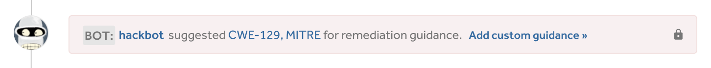

Hackbot is HackerOne’s free automated service that provides in-context guidance by suggesting key features and actions on the platform in order to save you time and effort.

For example, Hackbot can:
* Identify and notify you of potential duplicates and related reports to help you associate and close reports more quickly
* Identify out of scope domains and suggest a pre-submission trigger that'll warn hackers in the act of submitting a report for the out of scope domain
* Suggest remediation guidance

All Hackbot suggestions are visible only to your security team as internal comments, and they will not require any action on your behalf.

### Edit Hackbot Settings
To edit your Hackbot settings:
1. Go to **Program Settings > Program > Automation > Hackbot**.
2. Make sure the Hackbot settings you want are **ON** and those you don't want are **OFF**. You can click on the slider for each setting to toggle the feature on or off. We offer these Hackbot options:

Option | Details
------- | -------
Review reporter | Hackbot will give you the option to add a review for a hacker.  
Same comment twice | Hackbot will notify you when you've entered a duplicate comment.
Suggest trigger on bad host | Hackbot will suggest creating a trigger if a report contains a host that has appeared in more than 80% of *N/A* reports.
Suggest integration on triage | Hackbot will suggest using an integration when the report is triaged.
Suggest pay bounty on triage | Hackbot will suggest when you should pay a bounty when the report is triaged.
Suggest needs more info state | Hackbot will suggest when a report should be moved to the *Needs more info* state.
Suggest triggers | Hackbot will suggest you to create a common response when comments are repeated.
Suggest remediation | Hackbot will suggest remediation guidance from MITRE based on the report weakness.

We love adding new functionality to Hackbot to make your life easier and more efficient, so [let us know](https://support.hackerone.com) if you have any suggestions on how we can make it better.
