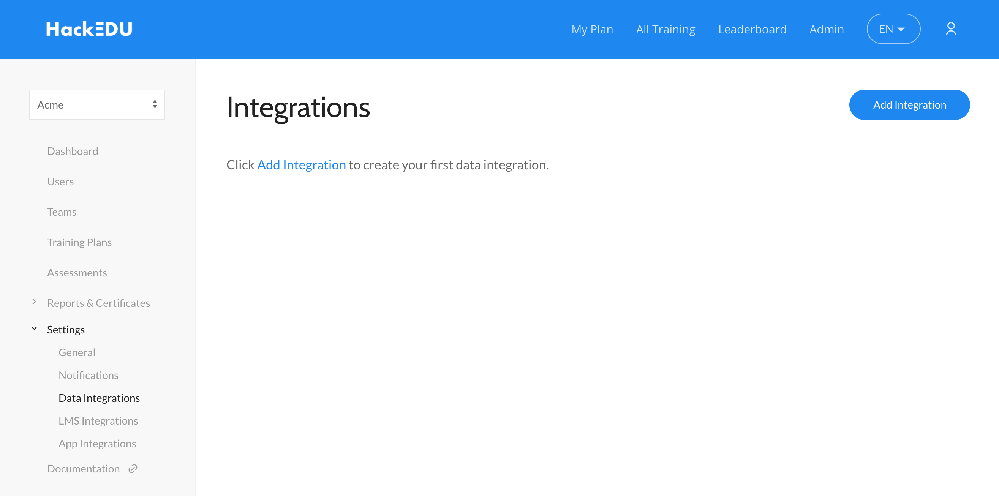
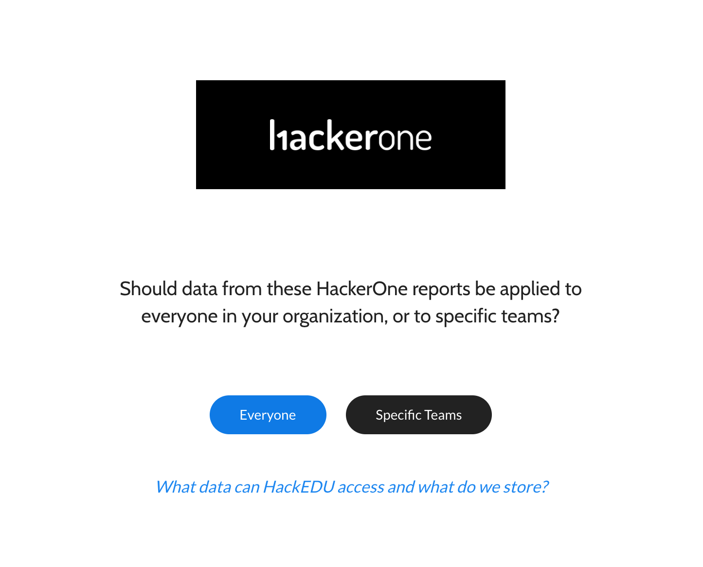
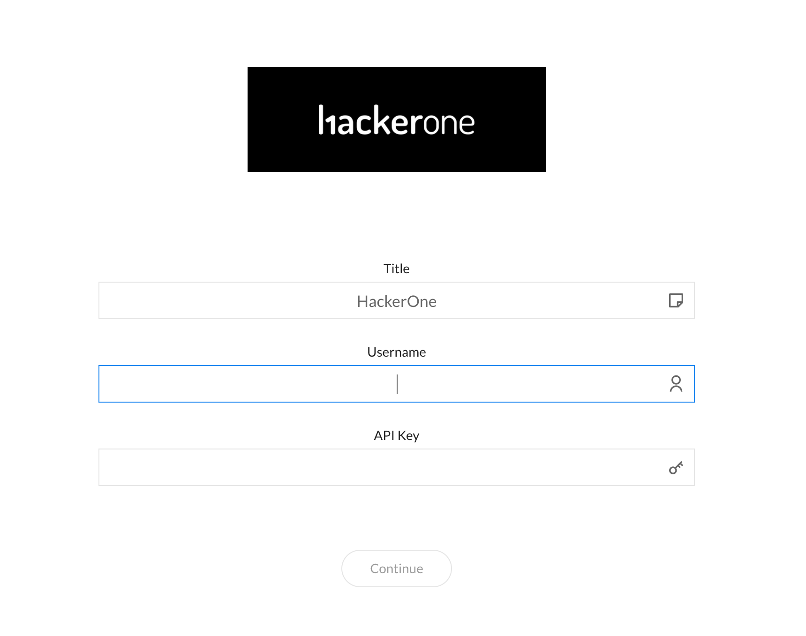
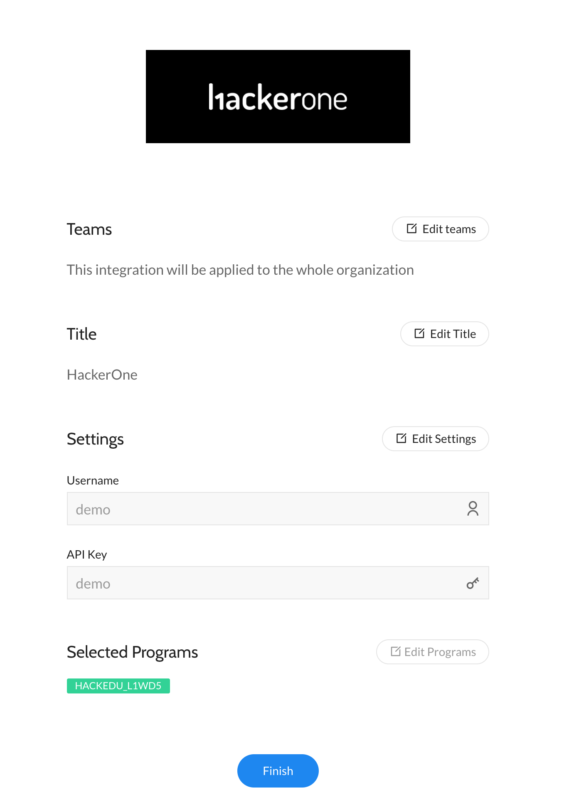
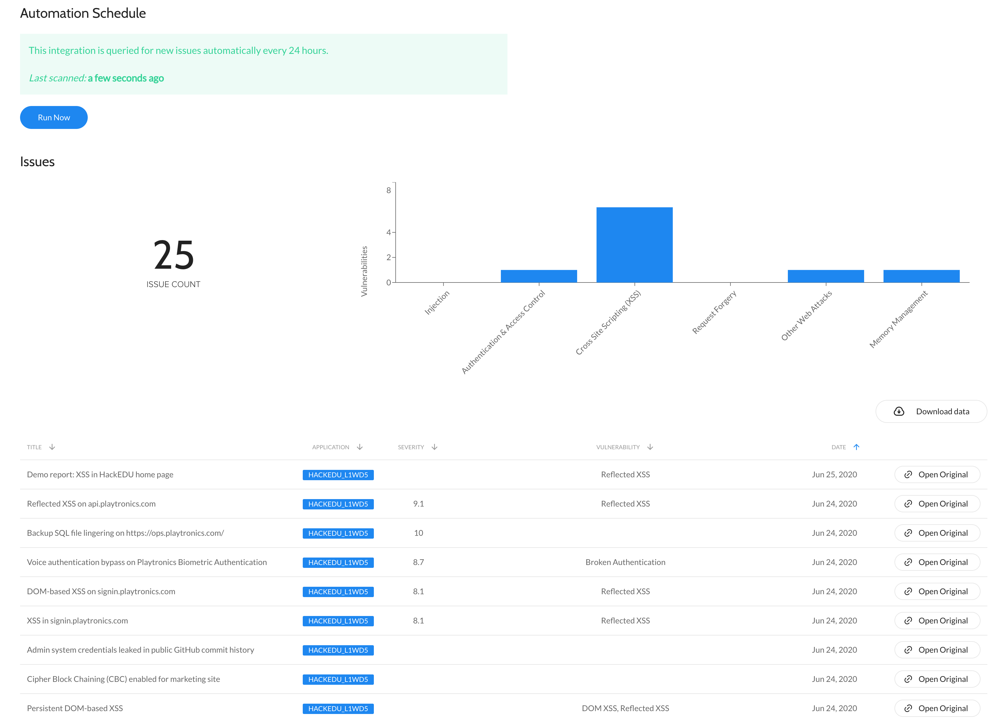

You can integrate HackEDU with HackerOne which enables your organization to automatically use the vulnerabilities found in your bug bounty programs to build dynamic training plans for your developers.

### Setup

To set up your HackEDU integration with HackerOne:

1. Log in to HackEDU with an Admin account.
2. Go to your Admin Dashboard.
3. Go to **Settings > Data Integrations** in the left menu.
4. Click **Add Integration**.

5. Select **HackerOne** from the list of integrations.
6. Choose whether to apply these vulnerabilities to your entire organization or just to specific teams. You can choose from:

Option | Details
------ | --------
Everyone | Everyone in your organization can view data from the HackerOne reports.
Specific Teams | Only specific teams in your organization can view data from the HackerOne reports.

7. Enter your HackerOne username and API Key for the integration. The API Key is the [API token](api-tokens.html) generated from HackerOne.

8. Click **Continue**.
9. Select which program you'd like to apply the integration to. (*This step is only applies if you have multiple HackerOne programs*.)
10. Confirm the details of your integration.
11. Click **Finish**.

Your integration will automatically start to sync and will re-sync once a day so that you can get access to the data of the latest reports each day for your training plans. You can click on the integration in HackeEDU to see the data that's synced and open the original Hacktivity reports.

