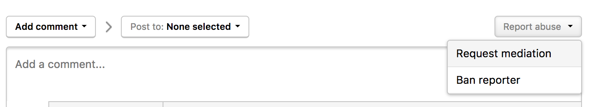

Programs can request assistance from HackerOne in cases when all normal discussions with the hacker have been attempted and there has been no satisfactory resolution. Vice versa, hackers can also request mediation when programs do not honor commitments made in their policy page. More on reasons why a hacker may request mediation [here](/hackers/hacker-mediation.html).

Hacker mediation requests commonly occur when a hacker's behavior is out of sync with what is outlined on your Security Page/Program Policy or has violated the [Code of Conduct](https://www.hackerone.com/policies/code-of-conduct).

Some examples may include:
* A HackerOne hacker used inappropriate language in communication on a report.
* A HackerOne hacker communicates with your team outside of HackerOne such as personal emails, social media accounts, or other private connections.
* A HackerOne hacker has tested out of scope.
* A HackerOne hacker disclosed report information without your consent

### Requesting Mediation Assistance
There are a couple of ways to request Mediation:
1. If applicable, contact your CSM
1. Request mediation independently
    * Open the report you'd like to request HackerOne mediation support for.
    * Scroll to the bottom of the report.
    * Click **Report Abuse**.
    * Select **Request mediation**. This will trigger a workflow for the Mediation Team to reach out to both you and the relevant hacker.

### Mediation Triggers
When a program requests Mediation, the steps Mediation takes include:
* Reviewing the specific concern reported
* Reviewing relevant report(s)
* Reviewing hacker history
* Making an informed decision as to whether or not something falls under the Code of Conduct
* Determining appropriate actions to take based on the ban matrix in our Code of Conduct and based on Code of Conduct history

>Note: Mediation uses a certain amount of discretion to encourage good behavior by hackers on the platform. Example: A new hacker on the platform who uses borderline unprofessional language may receive a discretionary educational message (FYI) rather than a Warning.

Mediation will keep requesters of Mediations in the loop about any actions proposed and taken (in program mediations this is the CSM)

As a reminder, HackerOne won't be able to mediate for reports that have been closed for over 3 months. Please respect the guidelines above and only request mediation if it's deemed absolutely necessary.

### Tutorial Video
<iframe id="ytplayer" type="text/html" width="640" height="360" src="https://www.youtube-nocookie.com/embed/Ie5nuTJrMNA" frameborder="0" allowfullscreen></iframe>
