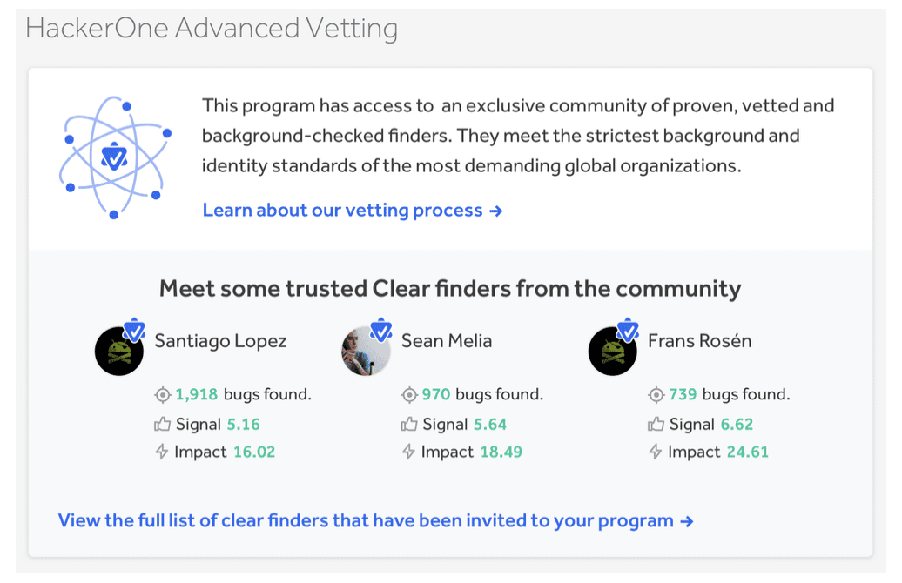

HackerOne Clear enables your program to have access to an exclusive community of background-checked finders. Background-checked finders are active, high performing members of the HackerOne community that have satisfied strict background checks. Having these finders participate in your program ensures that trusted finders are partnered with you in finding vulnerabilities.

> **Note:** HackerOne Clear is available as an add-on. To opt-in to Clear, contact your account manager.

To access your HackerOne Clear settings:
1. Go to: **Program Settings > Program > Hacker Management > Clear**.
2. Click **View the full list of Clear finders that have been invited to your program** to see which invited finders are Clear verified. Clear verified finders will be marked with this icon:

Clear verified finders are invited to your program through the [invitation](https://docs.hackerone.com/organizations/invitations.html) process in which invites are geared specifically toward background-checked finders.

Members in your program, as well as the invited Clear finders to your program, will be invited to join a group Slack channel together so that you can better communicate while using Slack. *(The shared Slack channel is currently in beta. If you'd like to take part in the beta, please reach out to your program manager)*.

We require all Clear programs to set your [bounty tables](bounty-tables.html) so that the minimum for a high vulnerability is $2000 and $5000 for a critical.

### How background checks work
HackerOne partners with First Advantage to conduct all global background checks and Berbix for ID verification. For all countries, the maximum criminal background check allowed by law is performed. Countries where it’s illegal to perform criminal background checks, unfortunately, won’t be eligible to participate in HackerOne Clear programs.

For finders based in the United States, these investigations are performed:

Investigation | Details
------------- | --------
Social Security Number Trace | Identifies residential address history and aliases.
Country Criminal Records Check | Identifies addresses and jurisdictions, including felony and misdemeanor criminal records.
State Criminal Records Check | Identifies addresses and jurisdictions, including felony and misdemeanor criminal records in Puerto Rico and 46 states.
Federal Criminal Records Check | Identifies addresses and jurisdictions, including felony and misdemeanor criminal records.
Enhanced Nationwide Records Check | Searches nationwide databases to identify potential jurisdictions in which the applicant may have worked, lived, gone to school, or committed a crime.
Sex Offender Records Check | Searches the US Department of Justice Sex Offender Registry to identify registered sex offenders, convictions, and/or infractions in 49 states.
Office of Foreign Assets Control (OFAC) Watchlist Check | Searches the U.S. Treasury Department watchlist to identify potential threats to national security.

### Digital Customizable Agreements
As finders invited to your program will have to review and sign an agreement before joining your program, with Clear, you can also opt-in to manage your digital custom agreements and view which finders have accepted your terms.

To manage your Digital Customizable Agreements:
1. Click **View document** to view your Digital Custom Agreement.
2. *(Optional)* Contact your program manager to edit or update your agreement.
3. Click **Download list of finders that have accepted terms (.CSV)** to view all the finders that have accepted your program agreements. For each finder you can view their:
<ul><li>Full name
<li>Username
<li>HackerOne Clear status
<li>Address (Optional)
<li>Country
<li>Date they signed the agreement

