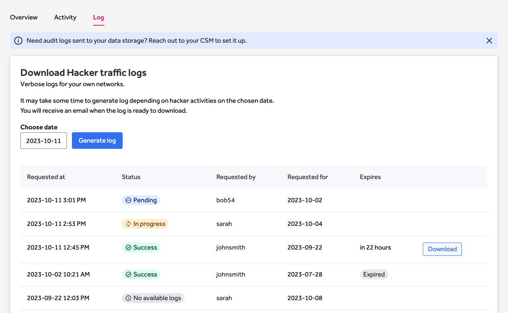

This page refers to V2 of Gateway, for documentation of V1 Legacy Gateway solution, please refer to [this page](https://docs.hackerone.com/organizations/hackerone-vpn-v1.html).

The HackerOne Gateway (VPN) enables access to public and firewalled assets as well as allows IP whitelisting per program. It also provides the ability to control hackers access at both a high and granular level.  

> Gateway (VPN) is available as an add-on. To learn more about adding HackerOne Gateway (VPN) to your program, contact your account manager.

### Managing Gateway settings 

1. Go to **Program Settings > Program > Hacker Management > Gateway** to manage your Gateway settings.
2. To pause or resume the Gateway program, click on the Online/Offline toggle on the top left as shown below.

### Allowlisted IPs

1. To view a list of the Allowlisted IPs provided by HackerOne Gateway, click on the **Allowlisted IPs** button in the top right corner of the page.

### Manage Hacker Access In Bulk

You can pause or resume access of multiple hackers at the same time.

1. Select the Hackers you want to manage access of by using the checkboxes. 
2. **Pause Access** and **Resume access** buttons will show. Simply click on the desired action to block/unblock a Hacker.
3. You can easily view blocked hackers by clicking on the **Blocked** tab on the top.

### Manage Individual Hacker Access

You can pause or resume access of individual hackers by:

1. Clicking on the 3 dots at the far right of the Hacker's name, as indicated below. 

### Activity Overview

The activity overview shows what actions are being performed by Hackers while on the Gateway solution. It is possible to customize the results by using the filters available, such as **Date**, **Month**, **Year** and **start-end** time, or by using the search box.
Please note that it can take up to 20 minutes to display the latest activity logs. 

### Download Hacker Traffic Logs

The log page allows you to download verbose logs of your network activities for the selected date at UTC (Coordinated Universal Time). 
It might take some time to generate logs depending on the hacker traffic volume on the given date.
You will be notified by email once the logs are ready to download. 

The links to download logs are valid for 24 hours. When expired, you can request logs for the same date again and a new link will be generated quickly. You can request a maximum of 5 logs at the same time.

You can view all log requests that have been made for the given program. The table shows request details such as request time, status, requester, the date the log was requested for, expiration time of the download link and a download link if available.

### Sync Hacker Traffic Logs

To sync logs directly to your selected data storage, please reach out to your CSM. Logs are pushed in batches 
as soon as possible. Usually it takes 3-4 minutes for the logs to be available in your data storage.    

