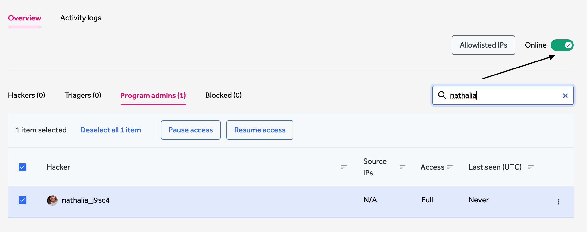
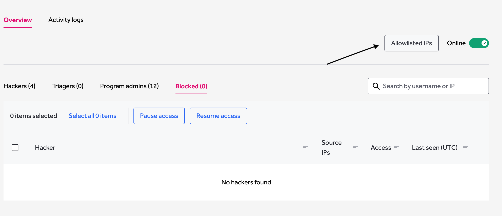
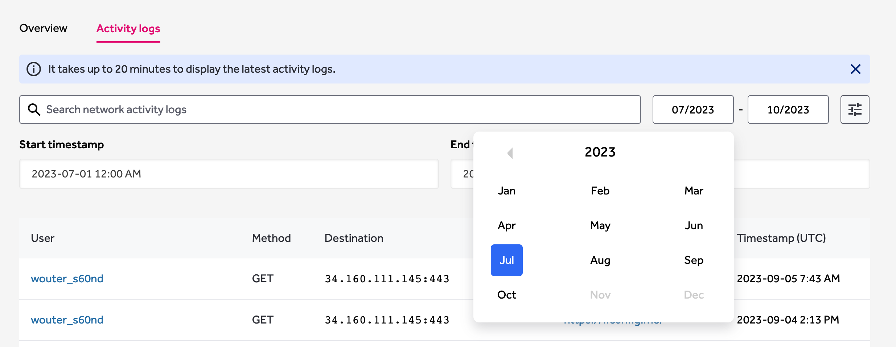

This page refers to V2 of Gateway, for documentation of V1 Legacy Gateway solution, please refer to [this page](https://docs.hackerone.com/organizations/hackerone-vpn-v1.html).

The HackerOne Gateway (VPN) enables access to public and firewalled assets as well as allows IP whitelisting per program. It also provides the ability to control hackers access at both a high and granular level.  

> Gateway (VPN) is available as an add-on. To learn more about adding HackerOne Gateway (VPN) to your program, contact your account manager.

### Managing Gateway settings 

1. Go to **Program Settings > Program > Hacker Management > Gateway** to manage your Gateway settings.
2. To pause or resume the Gateway program, click on the Online/Offline toggle on the top left as shown below.

### Allowlisted IPs

1. To view a list of the Allowlisted IPs provided by HackerOne Gateway, click on the **Whitelisted IPs** button in the top right corner of the page.

### Manage Hacker Access In Bulk

You can pause or resume access of multiple hackers at the same time.

1. Select the Hackers you want to manage access of by using the checkboxes. 
2. **Pause Access** and **Resume access** buttons will show. Simply click on the desired action to block/unblock a Hacker.
3. You can easily view blocked hackers by clicking on the **Blocked** tab on the top.

### Manage Individual Hacker Access

You can pause or resume access of individual hackers by:

1. Clicking on the 3 dots at the far right of the Hacker's name, as indicated below. 

### Activity logs

The activity logs show what actions are being performed by Hackers while on the Gateway solution. It is possible to customize the results by using the filters available, such as **Date**, **Month**, **Year** and **start-end** time, or by using the search box.
Please note that it can take up to 20 minutes to display the latest activity logs. 

