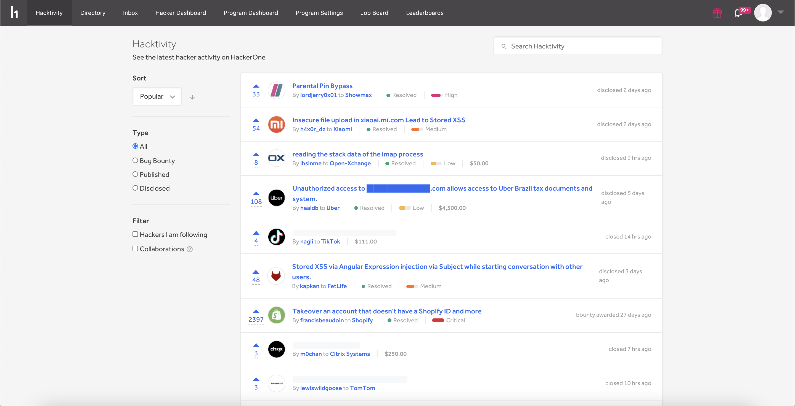
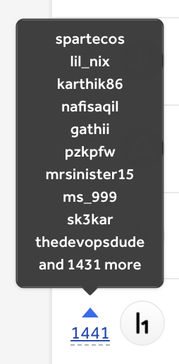

[Hacktivity](https://hackerone.com/hacktivity?sort_type=popular&filter=type%3Aall&page=1&range=forever) is HackerOne's community feed that showcases hacker activity on HackerOne. It also serves as a resource that enables hackers to search for reports regarding programs and weaknesses they're interested in so that they can see how specific weaknesses were exploited in various programs.

You can sort your Hacktivity feed by:

Option | Details
---- | --------
Popular | Activities are listed based what's currently trending. They are ranked on the page primarily by their aggregated upvotes. The vote is weighted slightly more if it comes from a hacker with high [signal](signal-and-impact.html). Additionally, each activity gets an initial boost if it is resolved and/or receives an above average bounty.
New | Activities are ordered chronologically with the latest activity being listed on top. A previously appeared vulnerability goes back to the top when there is new activity on the report.

You can also filter the activity you want to see by these filters:

Filter Option | Details
------------- | --------
All | Shows all activities that appear on Hacktivity.
Bug Bounty | Only shows activities on reports that are submitted to programs that provide bounties.
Published | Only shows activities on reports that are from external sources outside of HackerOne. See: [Publishing External Vulnerabilities](/hackers/publishing-external-vulnerabilities.html)
Disclosed | Only shows activities on reports that have been disclosed to the public. You can view contents and details of the vulnerabilities of each report.  
Hackers I am following | Only shows the activities associated with hackers that you're following.
Collaborations | Only shows the activities associated with reports that were collaborated on with multiple hackers.  

### How do activities appear on Hacktivity?
Hacktivity only showcases activity for public programs. Hacker activity populates on the Hacktivity feed when disclosed and undisclosed reports are marked as:
* Closed
* Disclosed
* Bounty awarded
* Swag awarded

> **Note:** Undisclosed reports appear with a redacted title.

Hackers can also publish their findings from external sources outside of HackerOne. To learn more, see: [Publishing External Vulnerabilities](/hackers/publishing-external-vulnerabilities.html).

### Upvoting
You can upvote hacker activities that you find interesting by clicking on the arrow next to the activity. Your upvotes help members of the platform discover what the most popular hacker activities are. Anyone with an account can upvote, but you can only upvote once on each activity. When you hover over the upvote count, you can see the top 10 hackers (ranked by signal) that voted on the activity.

There is currently no downvoting capability, but you can retract your upvote by clicking on the arrow again.

