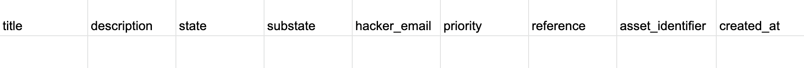

Before launching a program with HackerOne, it’s important that known un-remediated issues are imported into the platform to properly identify duplicate reports when they are reported. To import these un-remediated vulnerabilities, you’ll need to provide a correctly formatted CSV file with details of each vulnerability to your program manager. Enterprise customers have the option to perform a continuous import of vulnerabilities.

> **Note:** All vulnerabilities to be imported should currently be un-remediated and be in scope for your program.

Your CSV file should follow the format listed below:

> **Note:** You don't need to include all columns when importing your vulnerabilities, unless you want to provide the additional details. But, be sure to include all of the required columns as shown in the image above.  

Here’s a table to help you see which fields are required and what should go underneath each field:

Field | Details | Accepted Values | Example
----------- | ------- | --------------- | --------
title | *(Required)* The title of the vulnerability report | Any string < 150 characters | Reflected XSS on q parameter at search.example.com
description | *(Required)* All information required in order to reproduce the vulnerability and understand the impact. Include any relevant endpoints and parameters. As this is a multi-line field, wrap your input in quotes. | Any multi-line string | "# Summary 

The endpoint at `xxx` is vulnerable to reflected cross-site scripting on the `xxx` parameter. 

 # Steps to reproduce <li>Go to `xxx.com`<li>Notice the alert"
state | *(Required)* Whether the report is open or closed | The word *Open* or *Closed* | Open  
substate | *(Required)*  The specific [substate](report-states.html) of the report - whether the report is *new, triaged, resolved,* etc. | You can choose from: *new, triaged, needs-more-info, resolved, not applicable, duplicate* | triaged
hacker_email | *(Optional)* The email address of the hacker. By including the email address, HackerOne is able to send an invite to the hacker to claim any report they've submitted. | A valid email address | user@example.com
severity_score | *(Optional)* The [severity](severity.html) rating of the report. | A decimal number between 0-10 | 7.2
priority | *(Optional)* The severity rating description label. | You can choose from: *none, low, medium, high, critical* | medium
view\_reference\_url | *(Optional)* The link to the report in your ticketing system (when the reference URL integration is not set up). | A valid URL | https://example.jira.com/eng/BBP-1234
reference | *(Optional)* The reference to the report in your ticketing system. | A string | BBP-1234
asset_identifier | *(Optional)* The asset identifier that can be linked to an asset defined on HackerOne. | A string | ".hackerone.com"
weakness_name | *(Optional)* The name of the [weakness](/hackers/weakness.html) for the vulnerability. You can choose from HackerOne's subset list from the Common Weakness Enumeration (CWE)list. | A string matching the name from the CWE list | Cross-Site Request Forgery (CSRF)
created_at | *(Required field if the report state isn't closed)* The timestamp of when the report was submitted | Timestamp in the format: YYYY-MM-DD 

You can also include hours/minutes in 24-hour format: HH:MM | 2020-09-18
triaged_at | *(Required field if the report state isn't closed)* The timestamp of when the submission was triaged. | Timestamp in the format: YYYY-MM-DD 

You can also include hours/minutes in 24-hour format: HH:MM | 2020-09-18
closed_at | *(Optional)* The timestamp the submission was closed. | Timestamp in the format: YYYY-MM-DD 

You can also include hours/minutes in 24-hour format: HH:MM | 2020-09-18
