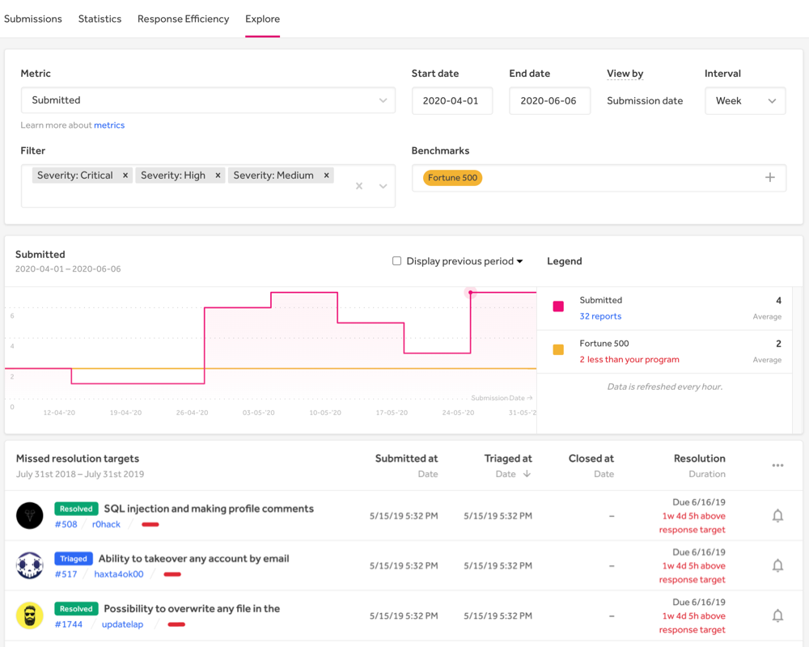
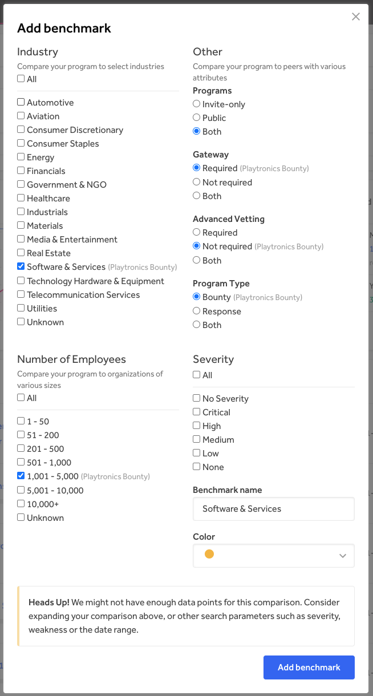

HackerOne’s peer benchmarking can help organizations understand and act on vulnerability trends, compare themselves to similar, best-in-class security programs, and garner insights on best practices for future improvements. Benchmarks can be important in helping you understand where you fall amongst industry peers and demonstrate that you’re on par or ahead of other players on HackerOne's platform, the largest and richest dataset in the industry.

> <b>Note:</b> Industry benchmarking is only available to customers with an Enterprise subscription.

Use peer benchmarking to drive industry leadership across meaningful security metrics and KPIs (Key Performance Indicators) such as time to first response, time to triage, time to remediation, and more.

There are many filters available for your organization can choose to measure itself against, including industry verticals, key HackerOne program filters (public or private, bounties offered, etc.), company size, and more.

