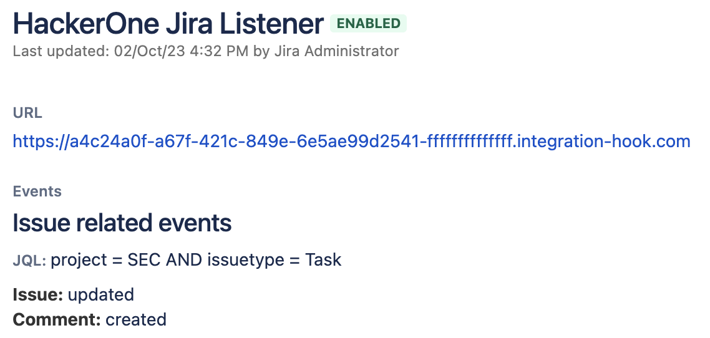

Question | Answer
-------- | ------
The HackerOne markdown doesn't convert correctly to Jira. How can I convert the markdown correction to Jira? | You can use a Jira optimized template by setting the escalation template to: `{{details_custom_jira}}`.
What fields are supported in the bi-directional Jira integration? | We support all fields that have the type: `string`, `number`, `date`, `Radio Buttons`, or `Select List (single choice)`.
What do the different variables mean? | Please refer to the [Integration variables](integration-variables.html) page to see examples and descriptions of each variable.
I have multiple HackerOne programs. Can I integrate each of these programs to the same Jira instance? | Yes, you can integrate multiple HackerOne programs to the same Jira instance. Take a look at our [Setting Multiple Jira Integrations](/organizations/jira-setup.html#multiple-integrations) article.
I have multiple Jira instances. Can I integrate each of these to the same HackerOne program? | This feature is available for **Enterprise programs only.** If you want to integrate the same program to multiple Jira instances, you can follow the same steps as for a single integration. 
My Jira is behind a firewall and is not externally accessible. How can I integrate with Jira? | To use the bi-directional Jira integration, you need to make sure your Jira instance is accessible from the HackerOne system. You can allowlist HackerOne’s IP addresses in your firewall to only open it up to the HackerOne application. Contact your program manager to request our IP addresses to allowlist in your firewall.  If you don't want to expose your Jira to HackerOne, [contact us](https://support.hackerone.com) to get a work-around that enables you to only escalate to Jira.
I'm getting the following error when creating a Jira issue: `JIRA returned the following error: "You must specify a summary of the issue."` What do I do? | This means that you didn't specify a value for the `summary` field in your Jira integration settings. Please review the field mapping in your Jira integration settings and make sure values are provided for all required fields.
Why is it that I'm using a reverse proxy and can't connect to Jira? | To use the Jira integration, you need to configure Jira to allow this. You can follow the documentation provided by [Atlassian](https://confluence.atlassian.com/kb/reverse-proxy-and-application-link-troubleshooting-guide-719095279.html). More documentation on troubleshooting application links can be found [here](https://confluence.atlassian.com/kb/application-links-troubleshooting-guide-718668765.html).
I don't want to give this integration permission to view all my Jira projects. Can I restrict the integration to only specific projects/spaces? | Yes, you can. The easiest way to do this is by creating a new "h1-integration" user that only has access to the projects you want to expose to the integration with HackerOne.
Why is that after installing the Jira Cloud add-on, Jira is giving me the following error: `App is not responding`? | The plugin is trying to redirect you to HackerOne's website to finalize the setup. However, some browsers are blocking redirects and the plugin won't be able to redirect you. If this happens, try installing the plugin with a different browser.
How come I'm not seeing the option to create a Jira issue on the report? | You can only escalate a report to Jira if you have the right permissions. You will need "Report Management" permissions in order to escalate a report to Jira.
What do I do if I don't see the issue type I need listed? | To make sure you can select the right issue types for your integration, you need to meet these 2 requirements:   1. You have the proper permissions to see the issue type.  2. The issue type is [associated](https://confluence.atlassian.com/adminjiraserver/associating-issue-types-with-projects-938847092.html) with the project you selected.    Issue types are fetched based on the linked project, and even though not all issue types will be supported, all available issue types that are linked and can be viewed by the authenticated user will show.
 I have configured events from Jira to HackerOne, but why are they not synchronizing? | To synchronize events from Jira to HackerOne a webhook must be configured in Jira. This webhook will be automatically created in your Jira instance during setup. If for some reason the creation of the webhook fails you can [create a webhook manually](https://developer.atlassian.com/server/jira/platform/webhooks/).   You can find the `URL` for the webhook in the configuration wizard. Set the `Scope` of the webhook to the Project and Issue type configured during the setup. Set the events to `Issue updated` and `Comment created`.  
