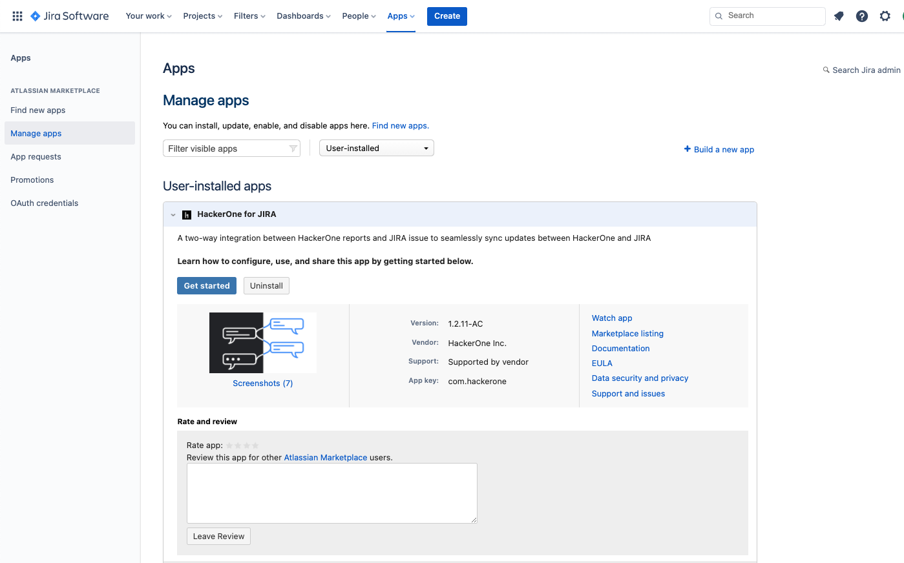
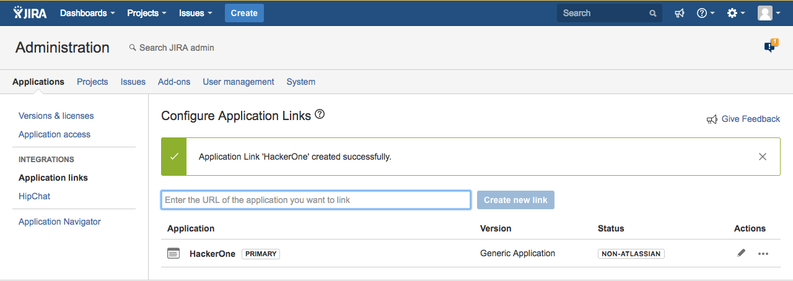

Follow these steps to migrate your current Jira integration to the new version.

> <b>Warning:</b> This migration will stop current event synchronization between the escalated HackerOne reports and the linked Jira issues. You can re-link the reports with the Jira issues after migration.

## Jira Cloud

1. Navigate to the Manage Apps console of Jira by going to <strong>Apps > Manage Apps</strong>.
   
2. Uninstall the HackerOne for JIRA app.

3. Follow the instructions on the [Jira Setup page](/organizations/jira-setup.html) to set up new Jira integration. 

## Jira Server

1. Disconnect your current Jira integration on HackerOne by going to <strong>Program Settings > Program > Integrations > Jira > Edit</strong>.

2. Navigate to the Application Links console of Jira by going to <strong>Jira Administration > Applications > Application Links</strong>. Remove the current HackerOne Application Link.
   

3. Follow the instructions on the [Jira Setup page](/organizations/jira-setup.html) to set up new Jira integration. 

