> <b>Note:</b> In order to configure your Jira integration, you must be an admin on Jira in order to properly have webhooks installed. After your integration has properly been set up, you can go back to regular access on Jira.  

You can integrate with Jira in order to sync information between your HackerOne report and your Jira issue.

To integrate with Jira:

1. Go to **Program Settings > Program > Integrations.**
2. Click the **Connect with Jira link.**


3. Click the **Set up new integration** button.
4. Enter **Name** and **Description** for your new integration and click **Next.**

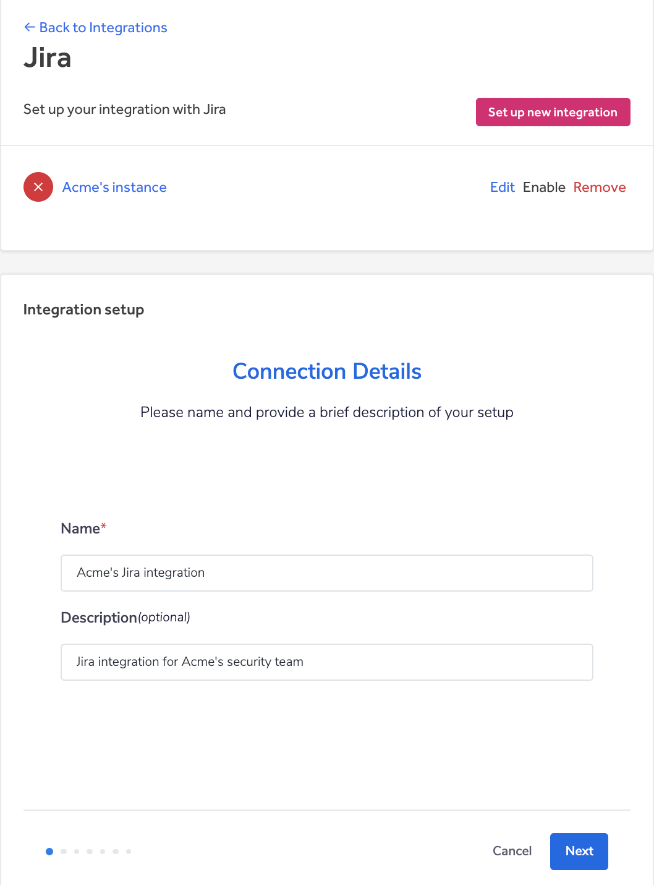

5. Navigate to the Application Links console of Jira by going to **Settings > Products > Application Links.**

> **Note:** You must be a Jira administrator in order to set up and access the Jira integration settings. After you set up your integration, you can go back to regular access on Jira.

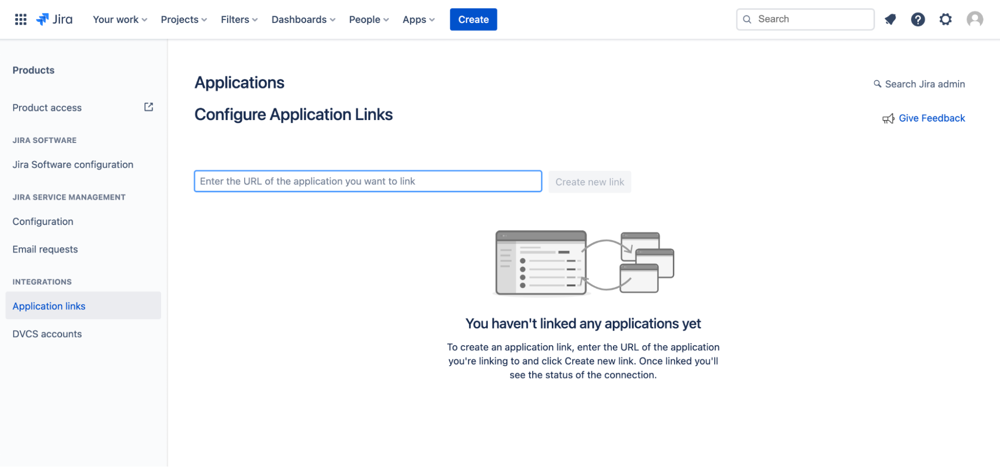

6. Enter `https://hackerone.com` and click **Create new link.**

7. Enter `https://hackerone.com` in the New URL field in the Configure Application URL window.

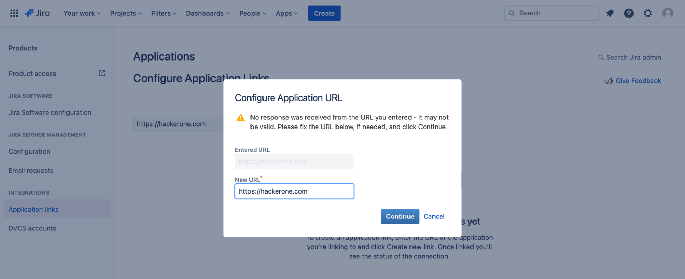

8. Enter the following information on the Link applications window and click **Continue.**
Fields | Details
------ | -------
Application Name | HackerOne
Application Type | Generic Application
Service Provider Name | HackerOne
Consumer key | HackerOne JIRA Client
Shared secret | Enter any string and save it for later use (case-sensitive).
Request token URL | `https://hackerone.com`
Access token URL | `https://hackerone.com`
Authorize URL | `https://hackerone.com`
Create incoming link | Check the checkbox

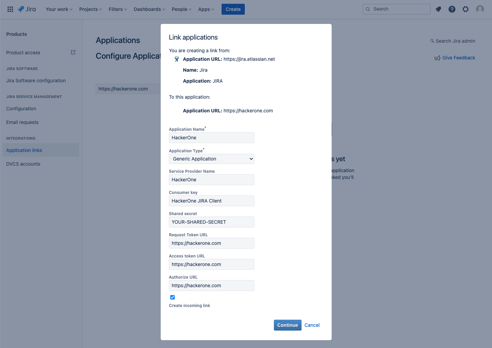

9. Enter the following information on the next **Link applications** window:
Fields | Details
------ | -------   
Consumer Key | HackerOne JIRA Client
Consumer Name | HackerOne
Public Key | Copy and paste from the key below

**HackerOne Jira public key**
```
-----BEGIN PUBLIC KEY-----
MIGfMA0GCSqGSIb3DQEBAQUAA4GNADCBiQKBgQDuK1KHVbY7BsmqtNT2iawWLm0b
19kAMZRJLhTv6TgJfyzRSktTa18pvp30B3X4T1DVggrMjmzYvAYtvnSpCOn4nI2W
qQQ1Bes+Gh1FpciFHZc3t8abVKF+ZFHRz7nILmx3isQJ05sojgDOyf481KvWk8hY
Ee69GuatJo5veIMeDwIDAQAB
-----END PUBLIC KEY-----
```
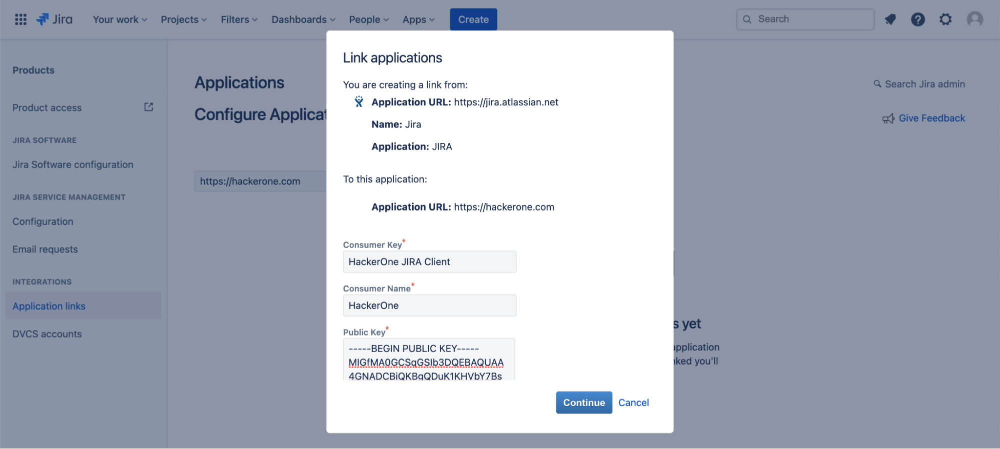


10. Click **Continue.**
11. Navigate back to HackerOne and click **Add a new account** in the Jira authentication window.
12. Enter your Jira instance URL and the shared secret from step 8 in the **Create a new authentication window** and click **Create.**

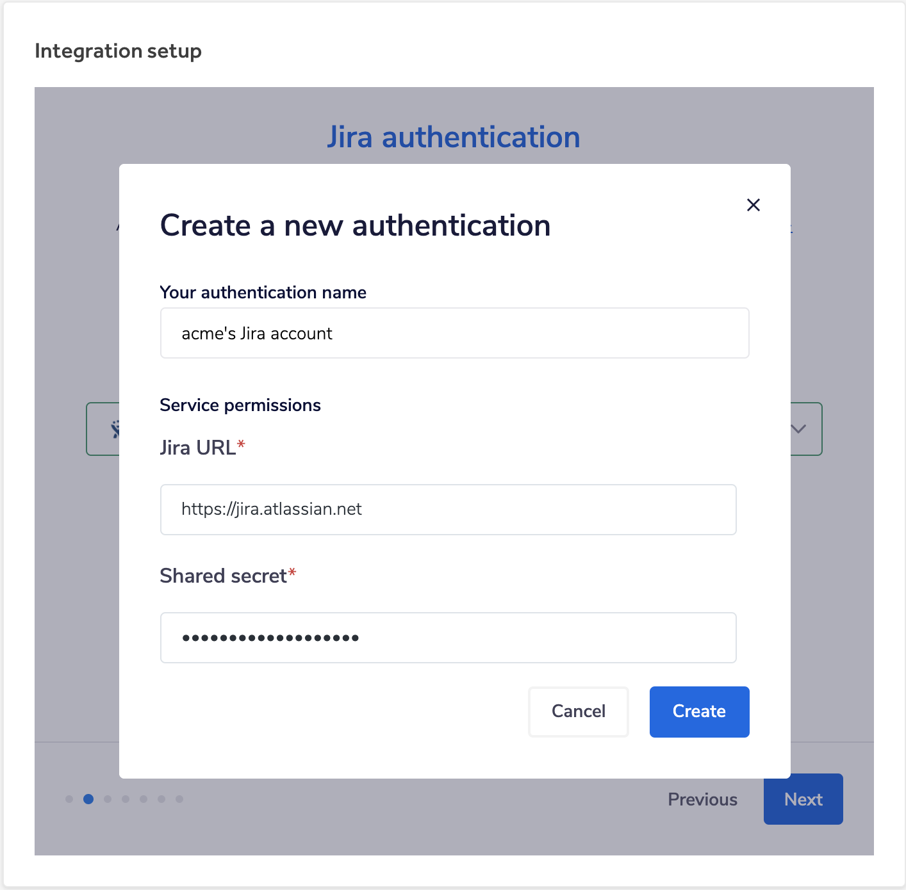

13. Click **Next** to finalize the setup between HackerOne and your Jira instance.
14. Configure which Jira project and issue type you'd like to escalate HackerOne reports to in the **Jira project and issue type** window and click **Next.**

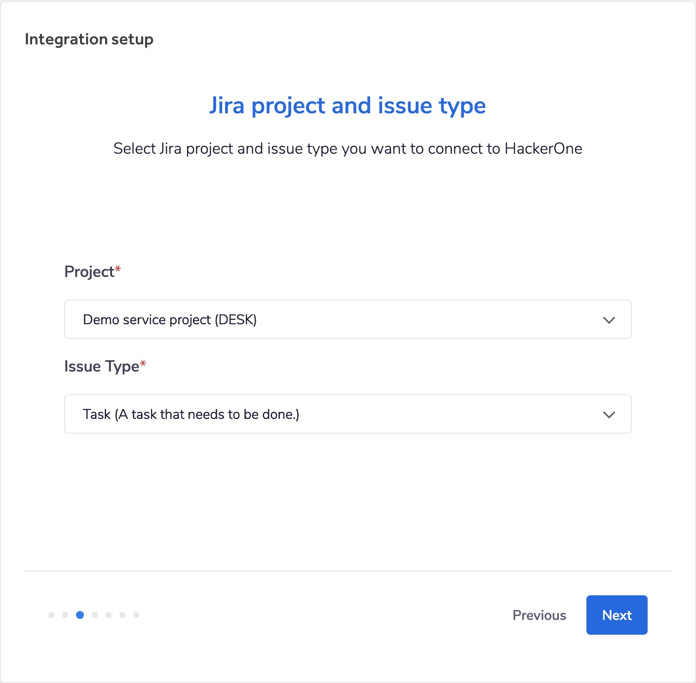

15. Select the HackerOne fields you want to map to the corresponding Jira fields. As alternative, enter any text using [integration variables](/organizations/integration-variables.html). Click **Next**.

> **Note**: only [supported Jira field types](/organizations/jira-faqs.html) are shown.

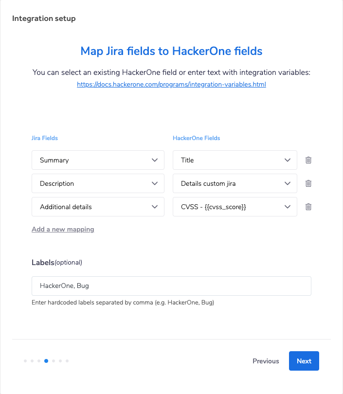

> **Note**: alternatively you can manually set the mapping to a single field or combination of fields from the [integration variables](/organizations/integration-variables.html). For example: `{{triage_summary}} \\ Link: {{report_link}} \\ Date: {{submission_date}} \\ Reporter: {{reporter_name}} \\ Weakness: {{weakness}}` Would create a combination of the triage summare, a link to the report the submission date, the reporter name and the weakness of their report and map that to a single field.

16. *(Optional)* Select Jira Priorities you want to map to the corresponding HackerOne Severities. This enables the right priority to be set when escalating a HackerOne report to Jira.

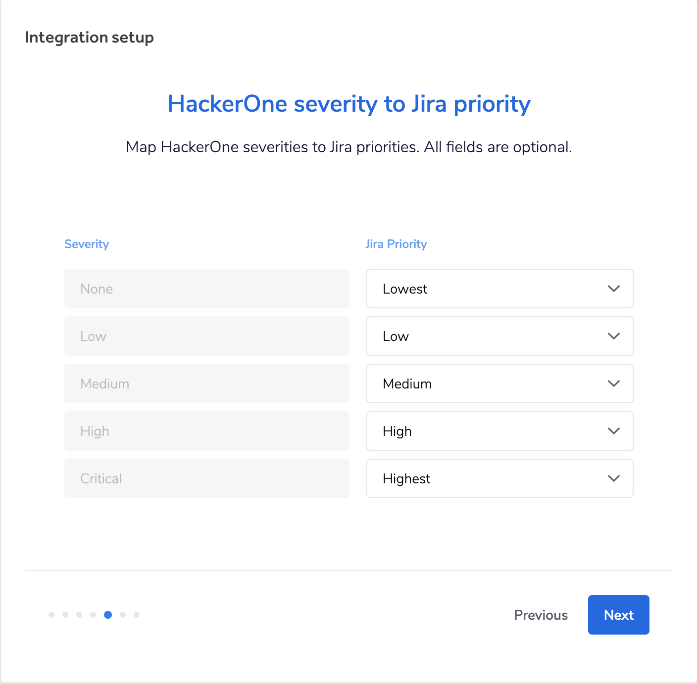

17. *(Optional)* Select which actions in HackerOne you'd like to post to Jira in the **Select HackerOne to Jira events** window. You can choose from:

Option | Detail
------ | -------
Comments | When someone comments on a report, post an update on the associated Jira issue.
State changes | When someone changes the state of a report, post an update on the associated Jira issue.
Rewards | When someone awards or suggests a bounty and/or bonus, post an update on the associated Jira issue.
Assignee changes | When someone assigns a user/group to a report, post an update on the associated Jira issue.
Disclosure | When disclosure is requested or a report becomes public, post an update on the associated Jira issue.
Synchronize attachments | Synchronize attachments linked with reports and comments to the associated Jira issue.

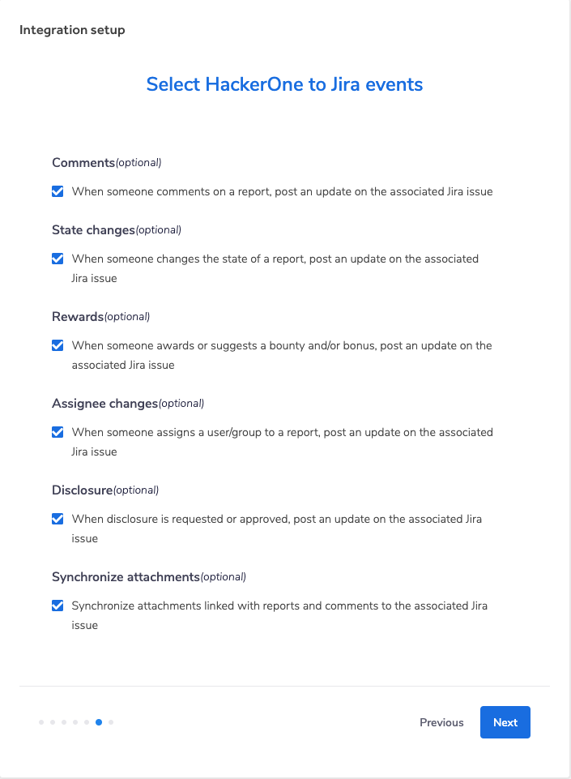

18. *(Optional)* Select which Jira actions you'd like to post onto HackerOne in the **Select Jira to HackerOne events** window. You can choose from:

Option | Detail
------ | -------
Status changed | Post an internal comment when an issue changes status.
Resolution changed | Post an internal comment when an issue changes resolution.
Closed issue status | Resolve the report when an issue is closed with the selected status.
Priority changed | Post an internal comment when an issue changes priority.
Assignee changed | Post an internal comment when an issue changes assignee.
Comment added | Post an internal comment when someone comments on an issue.

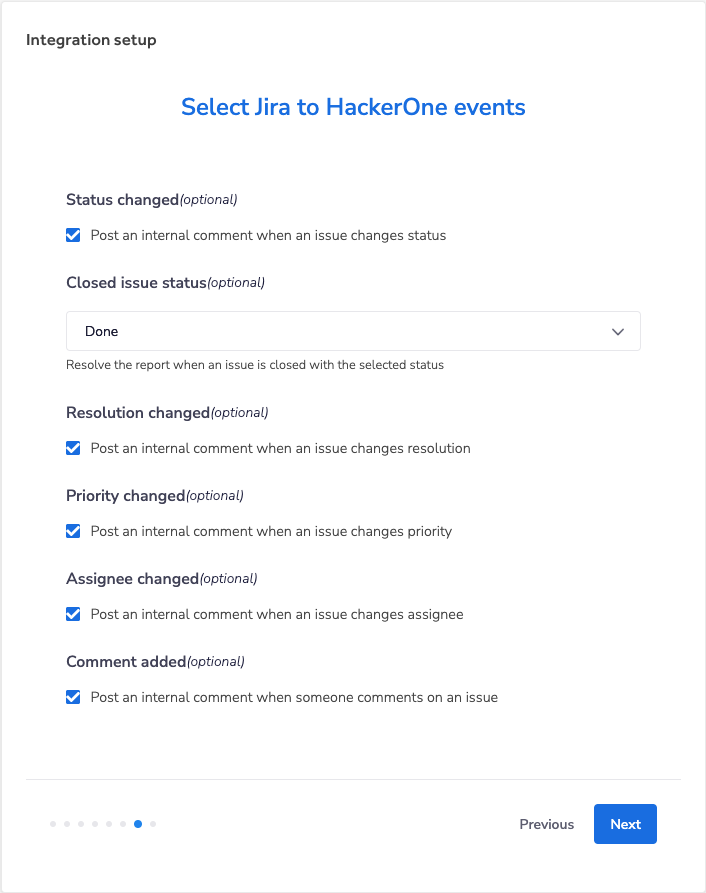

19. (Optional) Once you complete this integration, a Jira webhook will be automatically created in your Jira instance. If there is no webhook created, you can use this Webhook URL to [create a webhook manually](/organizations/jira-faqs.html#jira-create-webhook) with the Issue Updated and Comment Created events.
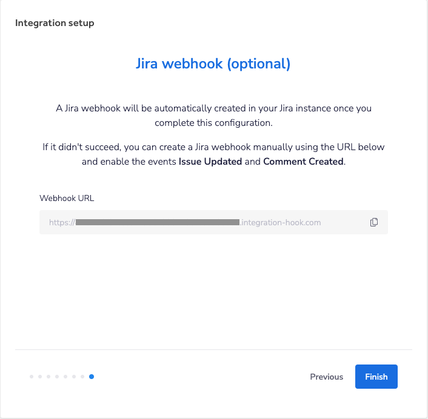


20. Click **Finish**. Once the screen disappears, click **Enable** to enable the integration.

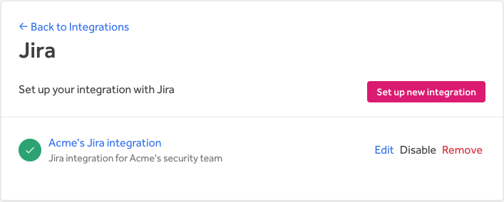

You're all set! Now that you've finished setting up the Jira integration, you can [create Jira issues](/organizations/jira-integration.html#creating-a-jira-issue) right from your HackerOne report.

### Multiple integrations

If you have multiple HackerOne programs, you can integrate them to the same Jira instance. Follow steps 11-19 for each subsequent program you need to add an integration for.

*Note: You only need to follow steps 11-20 for your other programs because the application link has already been created when integrating with your first program, and only 1 application link is needed to set up a Jira integration.*

### Multiple Jira instances per program
This feature is available for **Enterprise programs only**. If you want to integrate the same program to multiple Jira instances, you can follow all the steps above for each integration.
