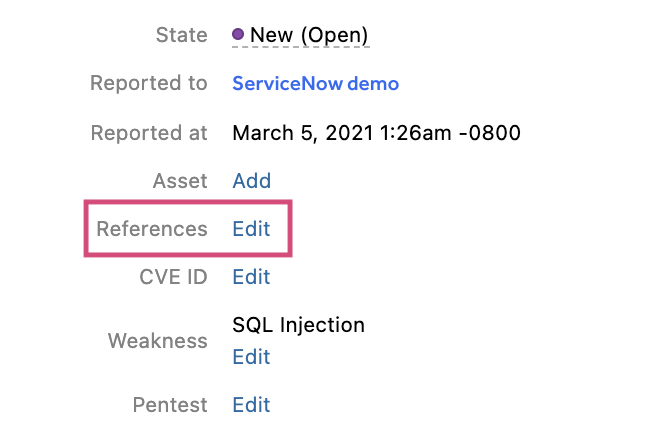

With the Linear integration, HackerOne makes it easy for you to track Linear issues as references on the platform. Linear only supports directly linking to the issue creation form on a per-project basis, so if you use multiple projects, there currently isn’t a good way of pre-filling data as a report could affect different projects. If most of your reports only affect one project, issue creation can be much easier.

In order to configure the Linear integration for your team, [contact HackerOne](https://support.hackerone.com) with the following information:

- The linear project name

With the provided information, HackerOne will be able to set up your requested integration. You’ll get an email notification letting you know that your integration has been set up within 1-2 business days.

### How the Integration Works
After your Linear integration has been set up:
1. Click **Edit** next to the **References** field.

2. Click **Add reference to issue tracker**.
3. Make sure you select Manual integration is selected.

4. Click **Generate escalation**. You’ll be taken to your Linear account where the report is pre-populated.
3. Submit the issue to create the report in Linear.
4. Copy the Linear report issue number and paste it in the **Reference ID** field back in the HackerOne.
5. Click **Create** to create a direct reference link to the issue in Linear.  
