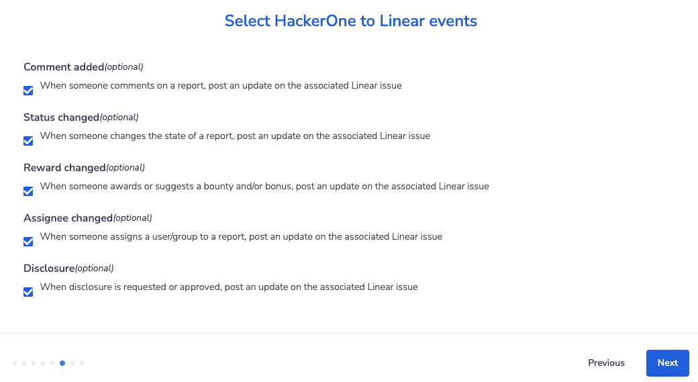

HackerOne offers a bidirectional Linear integration that syncs information between your HackerOne report and the Linear issue. Linear users can sync specific workflows from Linear to HackerOne and vice versa. This integration helps your development and security teams stay aligned and contributes to a better workflow to process security vulnerabilities as it minimizes the back and forth between Linear and HackerOne.

### Creating a Linear issue
You can create new Linear issues for reports you receive on HackerOne.

To create a new Linear issue from your HackerOne report:
1. Go to the HackerOne report in your inbox.
2. Click on <i>References</i>.

3. Select the Linear integration in the dropdown.
4. Click **Create**.

5. Add comments or change the state of the report in Linear.

When you perform an action on the Linear report such as adding a comment or changing the status of the report, Hackbot will generate an internal comment on the HackerOne report to reflect the changes.

### Linking HackerOne Reports to Existing Linear Issues
You can link your HackerOne reports to existing Linear issues.

To link your reports:
1. Go to the HackerOne report in your inbox that you want to link to Linear.
2. Click **References** in the report sidebar.

3. Select *Link issue* and enter the Linear issue ID in the **Reference ID** field.
4. Click **Create**.

The HackerOne report will now be linked to the Linear issue, and all activities that are performed on the report will sync to the corresponding issue.

There's also another way you can link your HackerOne reports to Linear. You can:
1. Go to the bottom of your HackerOne report.
2. Select **Change state > Triaged** in the action picker
3. Click **Add reference to issue tracker**.

4. Enter the Linear issue ID in the **Reference ID** field.
5. Click **Create**.

### Syncing updates from HackerOne to Linear

With the Linear integration, you can sync these report updates to Linear:
- Report comments
- State changes
- Rewards
- Assignee changes
- Public disclosure

All updates on a report are synced as a comment to Linear. Additionally, all actions are configurable and can be toggled from the Linear integration settings page.

If you've configured your own [custom fields](/organizations/custom-fields.html), you can use them in the Linear integration. All custom fields automatically appear as available variables that you can use to set up the field mapping between HackerOne and Linear.

### Syncing updates from Linear to HackerOne

To ensure your security team stays up to date with changes in Linear, you can sync back activities from Linear to the HackerOne report. All updates from Linear will be reflected in HackerOne as an internal comment on the associated report.

We currently support these activities from Linear to HackerOne:
- Comments
- State changes
- Assignee changes
- Priority changes

You can choose which events you want to sync.

### Automatically resolving a HackerOne report

You can set your integration to automatically close a HackerOne report as *Resolved* when a Linear issue closes. This notifies the hacker immediately. In the **Select Linear to HackerOne events** section of the integration setup, select the Linear issue status that will trigger the closure of the HackerOne report.

### HackerOne Severity to Linear Priority Mapping

You can map HackerOne severity ratings to the Linear priority fields when configuring your integration. This enables the right priority to be set when escalating a report to Linear.

### Configure Linear issue labels

You have the option to choose a specific set of labels that have been configured in Linear. These selected labels will be automatically assigned to a new Linear issue when a report is escalated.

It's important to note that **labels must be created before they can be assigned**. You can create labels by following the steps outlined in the [Linear integration's label creation process](https://linear.app/docs/labels#create-labels).

### Installing the Linear integration

See the [Linear Setup](linear-setup.html) page.
