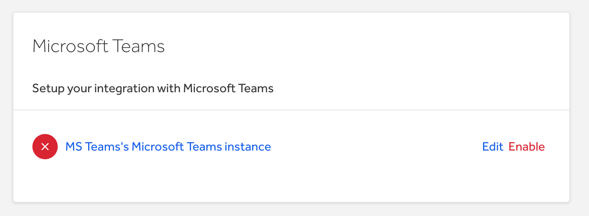

With the Microsoft Teams integration, you can keep track of activities happening on HackerOne in your Microsoft Teams interface. You’ll be able to receive notifications in selected channels of all your report activities on HackerOne which includes: status changes, bounties being paid, new comments, and more.

> **Note:** This integration is only available to HackerOne Enterprise customers.

### Setup
To set up the Microsoft Teams integration, you’ll need to follow these 2 steps:
1. Configure an incoming webhook in Microsoft Teams
2. Configure the integration in HackerOne

### Configure an incoming webhook
To configure an incoming webhook in Microsoft Teams:
1. Go to your Microsoft Teams application.
2. Find the team you want to use for the integration under **Your teams**.
3. Click on the 3 dots next to the channel you want to use for the integration underneath your chosen team. (*The image in step 4 exemplifies that the channel called "General" underneath the HackerOne team will be used for this webhook. Please be sure to select the channel and team that you want to use.*)
4. Select **Connectors**.

5. Click **Add** next to **Incoming Webhook**.

6. Click on **Add** in the top left corner on the Incoming Webhook page.

7. Enter a name for the webhook in the field. For example, you can put *HackerOne*.

8. (*Optional*) Click **Upload Image** to associate an image for your incoming webhook. You can download the HackerOne logo [here](https://www.hackerone.com/branding).  

9. Click **Create** to add your webhook to the channel.
10. Copy the webhook URL and store it somewhere for the next phase of the setup.

11. Click **Done**.

### Configure the integration on HackerOne
Once you’ve set up an incoming webhook in Microsoft Teams, you can configure the integration on HackerOne. To configure the integration on HackerOne:
1. Navigate to **Program Settings > Program > Integrations** on HackerOne.
2. Select **Connect with Microsoft Teams**.

3. Click on **Edit** to configure the integration.

4. Paste the webhook URL that you created in the first phase of the setup (from step 10 above).

5. Click **Finish** to complete the configuration.
6. Click **Enable** to start the Microsoft Teams integration.

New report activities will now post notifications to the configured Microsoft Teams channel.

### Disable the integration
To disable the Microsoft Teams integration:
1. Navigate to **Program Settings > Program > Integrations > Microsoft Teams** on HackerOne.
2. Click **Disable** next to Microsoft Teams.

