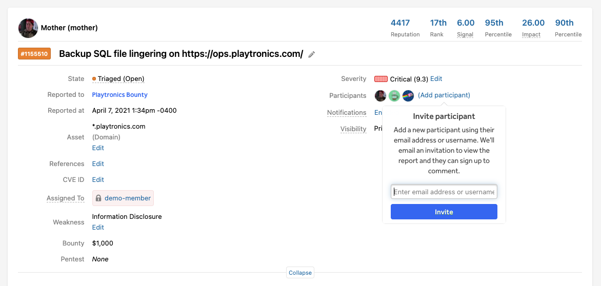

Sometimes individual reports, disclosed or undisclosed, must be shared with 3rd parties that are not your program team members or a hacker participating in your program. This could be for many purposes such as patch development, information sharing, etc.

The only requirement to use this feature is for the report participant being added to have an email address. If your intended report participant already has a HackerOne account they will be notified of their addition to the report. If not, they will be prompted to sign up for a HackerOne account to view the report. Current HackerOne users may also be added via username instead of email address.

Report participants have read access only to the report(s) they are added to and may write comments visible to all parties on the report.

