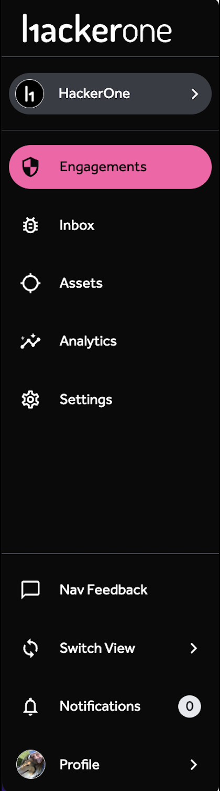

Starting point: Engagements Page

1. [Organization Dropdown](organization-dropdown.html)
2. Engagements
    * All
    * Bounty
    * Response
    * Pentest
    * Challenge
    * Campaigns
    * Asset

    Selecting an engagement will take you to the program [Dashboards](dashboards.html)
        * Overview
        * [Submissions & Bounty](submissions-bounty-dashboard.html)
        * Hacker Engagement
        * [Statistics](statistics-dashboard.html)
        * Response Efficiency
        * [Explore](explore.html)
3. [Inbox](inbox.html)
3. Assets
    * [Asset Inventory](asset-inventory.html)
    * Attack Surface Coverage
    * [Asset Submissions](asset-inventory.html#advanced-features)
4. [Dashboards](dashboards.html)
    * Overview
    * [Submissions & Bounty](submissions-bounty-dashboard.html)
    * Hacker Engagement
    * [Statistics](statistics-dashboard.html)
    * Response Efficiency
    * [Explore](explore.html)
5. [Engagements](engagements.html)
6. Settings
    * Program Settings
        * General
        * Program
    * Organization Settings
        * Profile
        * Users
        * API Tokens
        * Groups
        * Programs
7. Intelligence
    * CVE Discovery
    * Global Top Weaknesses
    * Industry Top Weaknesses
8. [Notifications](notifications.html)
9. Profile Menu
    * HackerOne Views (Switch between Organization and Hacker View)
    * Profile
    * Settings
    * Docs
    * Support
    * Sign Out
