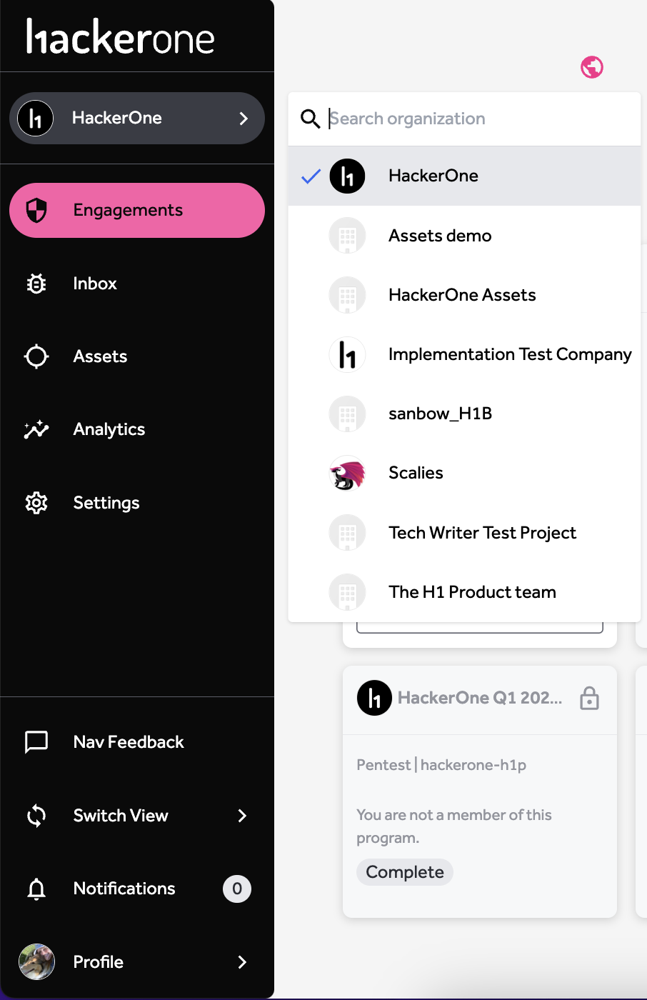

The organization dropdown in the top navigation lets users switch between organizations. All other pages, including the home page, will show content for that organization.
If you are only a member of one organization then you will see the name and logo of that organization without the need for the dropdown.

