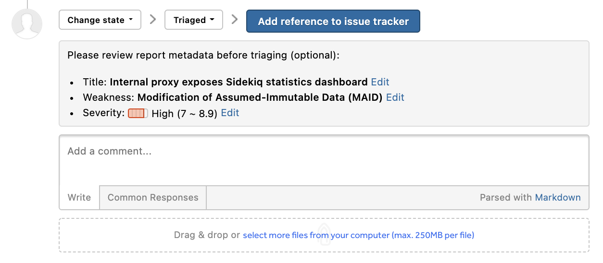
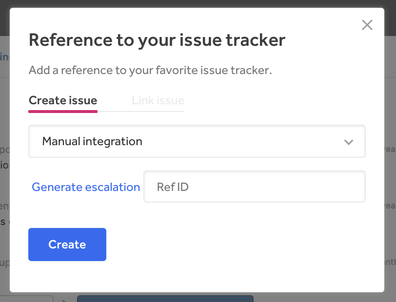

With the OTRS integration, HackerOne makes it easy for you to track OTRS issues as references on the platform.

In order to configure the OTRS integration for your team, [contact HackerOne](https://support.hackerone.com) with the following information:   

- The base URI of the OTRS instance (e.g. https://otrs.company.com/otrs/)
- The queue you'd like issues to default to. You must provide both the numeric queue ID and the queue name string.
- The numeric user ID you'd like issues to be reported by default
- Any other custom keywords/fields you'd like prepopulated. Some of the various options are described here: http://otrs-treff.de/en/otrs-preset-field-values-url-parameters-create-new-phone-tickets-cti-integration

With all of the provided information, HackerOne will be able to set up your requested integration. You’ll get an email notification letting you know that your integration has been set up within 1-2 business days.

### How the Integration Works
After your OTRS integration has been set up:
1. Change the action picker to **Change state > Triaged** in your report.

2. Click **Add reference to issue tracker**.
3. Make sure your OTRS integration is selected.

4. Click **Generate escalation**. You’ll be taken to your OTRS account where the report is pre-populated.
3. Submit the issue to create the report in OTRS.
4. Copy the OTRS report issue number and paste it in the **Reference ID** field back in the HackerOne.
5. Click **Create** to create a direct reference link to the issue in OTRS.
